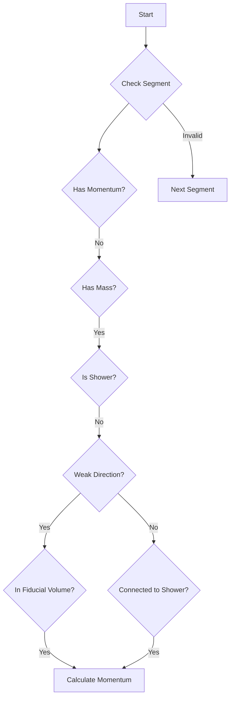
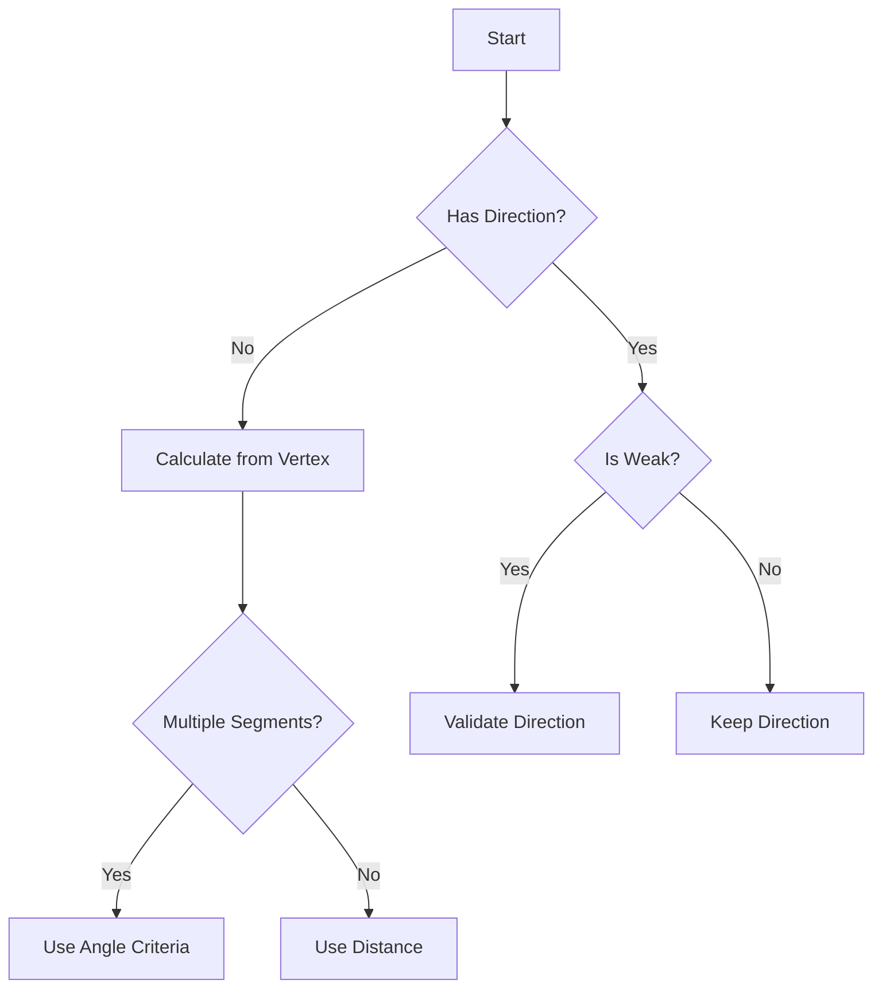

# NeutrinoID examine_direction Function Analysis

## Overview

The `examine_direction` function is a critical component of the NeutrinoID class that analyzes and determines the directionality of particle tracks emanating from a vertex in a neutrino interaction. It performs several key tasks:

1. Validates track/shower classifications
2. Updates particle directions and types
3. Handles Michel electron identification 
4. Manages long muon track candidates

## Key Steps

### 1. Initial Analysis
```cpp
bool flag_only_showers = true;
double max_vtx_length = 0;
double min_vtx_length = 1e9;
int num_total_segments = 0;
```

The function begins by analyzing vertex characteristics:
- Tracks maximum and minimum segment lengths
- Counts total segments
- Determines if vertex has only shower-like segments

### 2. Flags for Shower-Only Events

The function sets `flag_only_showers = false` if any of these conditions are met:
- Main vertex has 2 segments and either:
  - Max length > 30cm 
  - Min length > 15cm
- Main vertex has >2 segments and total segments >4
- Main vertex has >3 segments

### 3. Direction and Particle Type Updates

For each segment connected to the vertex, the function:

1. Updates direction flags if:
   - Direction is unset (flag_dir == 0)
   - Direction is weak (is_dir_weak == true)
   - Segment is shower-like
   - Final processing flag is set

2. Updates particle types based on topology:
```cpp
if (flag_shower_in && current_sg->get_flag_dir()==0 && (!current_sg->get_flag_shower())){
    current_sg->set_particle_type(11);  // electron
    current_sg->set_particle_mass(mp.get_mass_electron());
}
```

### 4. Long Muon Track Identification

The function identifies long muon candidates using these criteria:
- Total length > 45cm
- Maximum segment length > 35cm
- Multiple connected segments
- Medium dQ/dx below proton threshold

```cpp
if (total_length > 45*units::cm && max_length > 35*units::cm && acc_segments.size()>1){
    for (auto it1 = acc_segments.begin(); it1!=acc_segments.end(); it1++){
        (*it1)->set_particle_type(13);  // muon
        (*it1)->set_flag_shower_trajectory(false);
        (*it1)->set_particle_mass(mp.get_mass_muon());
        segments_in_long_muon.insert(*it1);
    }
}
```

### 5. Michel Electron Identification

The function identifies Michel electrons (from muon decay) by looking for:
- Segments with unset momentum but defined mass
- Not shower-like topology
- Either:
  - Weak direction and endpoints in fiducial volume
  - Connected to shower-like segments



### 6. Particle Type Corrections

The function performs final corrections for particle types:
1. Identifies main muon candidate (longest muon-like track)
2. Converts other muon-like tracks to pions
3. Updates proton candidates based on dQ/dx values

## Key Algorithms

### Long Muon Finding
```cpp
std::vector<WCPPID::ProtoSegment*> acc_segments;
std::vector<WCPPID::ProtoVertex*> acc_vertices;
acc_segments.push_back(sg);
acc_vertices.push_back(vtx);

auto results = find_cont_muon_segment(sg, vtx);
while(results.first != 0){
    acc_segments.push_back(results.first);
    acc_vertices.push_back(results.second);
    results = find_cont_muon_segment(results.first, results.second);
}
```

The algorithm recursively:
1. Starts from a segment
2. Finds connected segments that align directionally
3. Accumulates total track length
4. Tags segments as muon if criteria met

### Direction Resolution


## Important Parameters

- Muon Track Length: >45cm total, >35cm max segment
- Shower vs Track dQ/dx threshold: 1.3 * (43e3/units::cm)
- Angle matching for continuous tracks: <10° or <15° for short segments
- Fiducial volume cuts: defined by detector geometry

## Error Handling

The function returns a boolean indicating successful direction assignment and mapping consistency. It validates:
- No multiple particles into single vertex
- No shower inputs with track outputs
- Consistent directional flow

## Function Dependencies

### Key Function Calls

1. `examine_main_vertex_candidate(ProtoVertex* vertex)` [more details](./examine_main_vertex_candidate.md)
   - Purpose: Evaluates if a vertex is a potential main vertex
   - Returns: Tuple containing:
     - bool: flag indicating if particles flow into vertex
     - int: number of tracks
     - int: number of showers
   ```cpp
   auto results = examine_main_vertex_candidate(vtx);
   bool flag_in = std::get<0>(results);
   int ntracks = std::get<1>(results);
   int nshowers = std::get<2>(results);
   ```

2. `find_vertices(ProtoSegment* sg)` [more details](../NeutrinoID/find_vertices.md)
   - Purpose: Gets both vertices connected to a segment
   - Returns: Pair of ProtoVertex pointers
   ```cpp
   auto pair_vertices = find_vertices(sg);
   WCPPID::ProtoVertex* start_vertex = pair_vertices.first;
   WCPPID::ProtoVertex* end_vertex = pair_vertices.second;
   ```

3. `find_other_vertex(ProtoSegment* sg, ProtoVertex* v1)` [more details](../NeutrinoID/find_other_vertex.md)
   - Purpose: Gets the vertex at the other end of a segment
   - Returns: ProtoVertex pointer
   ```cpp
   WCPPID::ProtoVertex* other_vertex = find_other_vertex(sg, vtx);
   ```

4. `calculate_num_daughter_showers(ProtoVertex* vtx, ProtoSegment* sg, bool flag_count_shower = true)` [more details](./calculate_num_daughter_showers.md)
   - Purpose: Counts number of shower-like segments downstream
   - Returns: Pair containing:
     - int: number of shower segments
     - double: total length of shower segments
   ```cpp
   auto pair_result = calculate_num_daughter_showers(vertex, segment);
   int num_showers = pair_result.first;
   double total_length = pair_result.second;
   ```

5. `find_cont_muon_segment(ProtoSegment* sg, ProtoVertex* vtx, bool flag_ignore_dQ_dx = false)` [more details](./find_cont_muon_segment.md)
   - Purpose: Finds muon track segments that continue in same direction
   - Returns: Pair of next segment and its far vertex
   ```cpp
   auto results = find_cont_muon_segment(sg, vtx);
   ProtoSegment* next_segment = results.first;
   ProtoVertex* next_vertex = results.second;
   ```

### ProtoSegment Member Functions Called  [ProtoSegment](../protosegment.md)

1. `cal_dir_3vector(Point& pt, double dis)`
   - Purpose: Calculates 3D direction vector at a point
   - Returns: TVector3 direction vector

2. `get_length()`
   - Purpose: Gets total length of segment
   - Returns: Double length in cm

3. `get_flag_shower()`
   - Purpose: Checks if segment is shower-like
   - Returns: Boolean

4. `get_medium_dQ_dx()`
   - Purpose: Gets median charge deposition
   - Returns: Double dQ/dx value

5. `get_particle_type()`
   - Purpose: Gets PDG code of particle type
   - Returns: Integer PDG code

6. `cal_4mom()`
   - Purpose: Calculates 4-momentum of segment
   - Returns: void

7. `get_direct_length()`
   - Purpose: Gets straight-line length of segment
   - Returns: Double length in cm

### Geometry Helper Functions Called

1. `inside_fiducial_volume(Point& pt, double offset_x)`
   - Purpose: Checks if point is within fiducial volume
   - Returns: Boolean

2. `TVector3::Angle(const TVector3& v)`
   - Purpose: Calculates angle between two vectors
   - Returns: Double angle in radians

## Usage Example

```cpp
WCPPID::ProtoVertex* vertex = /* ... */;
bool success = examine_direction(vertex);
if (!success) {
    std::cout << "Inconsistent track directions in cluster " 
              << vertex->get_cluster_id() << std::endl;
}
```