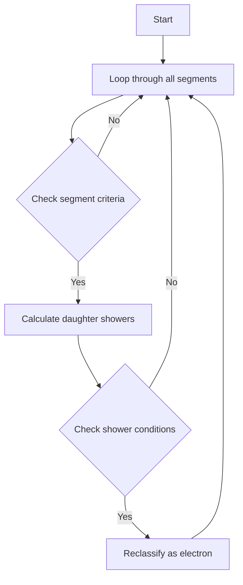

# Analysis of examine_good_tracks Function

## Overview
The `examine_good_tracks` function is part of the Wire-Cell neutrino identification system. Its main purpose is to examine tracks in a cluster and potentially reclassify them as electron tracks based on certain geometric and physical criteria.

## Function Signature
```cpp
void WCPPID::NeutrinoID::examine_good_tracks(int temp_cluster_id)
```

## Key Function Calls
The function makes use of several helper functions:

1. `get_cluster_id()` - Gets the cluster ID for a segment
2. `get_flag_shower()` - Checks if a segment is marked as a shower
3. `get_flag_dir()` - Gets direction flag of a segment
4. `is_dir_weak()` - Checks if direction determination is weak
5. `find_vertices()` - Returns pair of vertices for a segment 
6. `calculate_num_daughter_showers()` - Calculates number and length of daughter showers [see details](./calculate_num_daughter_showers.md)
7. `cal_dir_3vector()` - Calculates direction vector
8. `get_length()` - Gets length of segment

## Main Logic Flow



## Detailed Logic Steps

1. **Initial Filtering**
   - Loops through all segments in the cluster
   - Skips segments that:
     - Don't match the target cluster ID 
     - Are marked as showers
     - Have no direction or weak direction

2. **Track Analysis**
   ```cpp
   if (sg->get_flag_shower()) continue;
   if (sg->get_flag_dir()==0 || sg->is_dir_weak()) continue;
   ```

3. **Vertex and Direction Analysis**
   - Finds start and end vertices
   - Calculates direction vectors
   - Example:
   ```cpp
   auto pair_vertices = find_vertices(sg);
   TVector3 dir1 = sg->cal_dir_3vector(end_vertex->get_fit_pt(), 15*units::cm);
   ```

4. **Shower Pattern Recognition**
   - Calculates number of daughter showers and their total length
   - Examines angles between tracks
   ```cpp
   auto result_pair = calculate_num_daughter_showers(start_vertex, sg);
   int num_daughter_showers = result_pair.first;
   double length_daughter_showers = result_pair.second;
   ```

5. **Reclassification Criteria**
   The function will reclassify a track as an electron (particle_type = 11) if:
   - It has 4+ daughter showers OR
   - It has 2+ daughter showers with total length > 50cm AND
   - One of these angle conditions is met:
     - Maximum angle > 155° OR
     - Track is parallel to drift direction (angle < 15°) OR
     - Track length < 15cm

## Reclassification Code
```cpp
if ((num_daughter_showers >=4 || length_daughter_showers > 50*units::cm 
     && num_daughter_showers >=2) && 
    (max_angle > 155 || 
     fabs(drift_dir.Angle(dir1)/3.1415926*180.-90.) < 15 && 
     min_para_angle < 15 && 
     min_para_angle + fabs(drift_dir.Angle(dir1)/3.1415926*180.-90.) < 25) && 
    sg->get_length() < 15*units::cm) {
        sg->set_particle_type(11);
        sg->set_particle_mass(mp.get_mass_electron());
        sg->set_flag_dir(0);
        sg->set_dir_weak(1);
}
```

## Physical Interpretation
The function looks for track segments that:
1. Initially appear to be muon/proton tracks
2. Have multiple shower-like daughter segments
3. Show geometric patterns typical of electron interactions:
   - Wide angle scattering
   - Multiple branching
   - Short track length with many daughters

These patterns suggest the track might actually be an electron rather than a muon/proton, leading to reclassification.