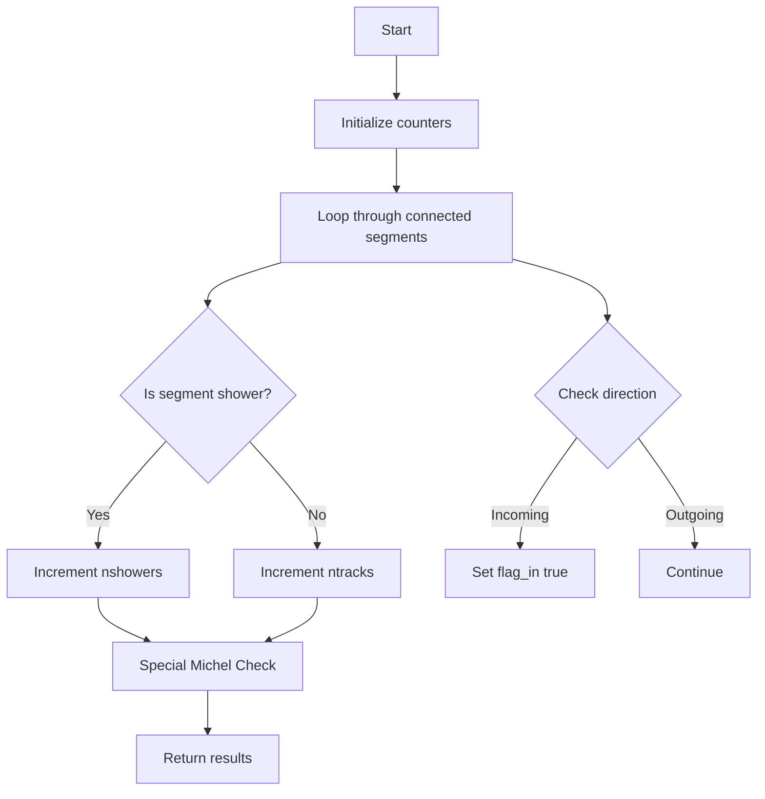

# Understanding examine_main_vertex_candidate Function

## Overview

The `examine_main_vertex_candidate` function is a key component in the Wire-Cell particle identification system that analyzes potential neutrino interaction vertices. It evaluates vertex candidates by examining the connected segments (particle tracks and showers) and their directionality.

## Function Signature

```cpp
std::tuple<bool, int, int> WCPPID::NeutrinoID::examine_main_vertex_candidate(WCPPID::ProtoVertex *vertex)
```

The function returns a tuple containing:
1. `bool flag_in`: Indicates if there are any particles going into the vertex
2. `int ntracks`: Number of tracks connected to the vertex
3. `int nshowers`: Number of showers connected to the vertex

## Core Logic Flow



## Detailed Logic Steps

### 1. Initial Variable Setup
```cpp
bool flag_in = false;
int ntracks = 0;
int nshowers = 0;
WCPPID::ProtoSegment *shower_cand = 0;
WCPPID::ProtoSegment *track_cand = 0;
```

### 2. Main Segment Analysis
The function loops through all segments connected to the vertex and:
- Classifies them as tracks or showers
- Keeps track of potential shower and track candidates
- Counts total numbers

```cpp
for (auto it1 = map_vertex_segments[vertex].begin(); 
     it1 != map_vertex_segments[vertex].end(); it1++) {
    WCPPID::ProtoSegment *sg = *it1;
    if (sg->get_flag_shower()) {
        nshowers++;
        shower_cand = sg;
    } else {
        ntracks++;
        track_cand = sg;
    }
    // Direction analysis follows...
}
```

### 3. Direction Analysis
For each segment, the function determines if it's incoming or outgoing:

```cpp
bool flag_start;
if (sg->get_wcpt_vec().front().index == vertex->get_wcpt().index)
    flag_start = true;
else if (sg->get_wcpt_vec().back().index == vertex->get_wcpt().index)
    flag_start = false;

// Check for incoming particles
if ((flag_start && sg->get_flag_dir()==-1 && !sg->is_dir_weak()) ||
    (!flag_start && sg->get_flag_dir()==1 && !sg->is_dir_weak())) {
    flag_in = true;
}
```

### 4. Michel Electron Special Case
The function includes special handling for Michel electrons (electrons from muon decay):

```cpp
if (map_vertex_segments[vertex].size()==2 && ntracks==1 && nshowers==1) {
    auto pair_result = calculate_num_daughter_showers(vertex, shower_cand);
    if (pair_result.first <= 3 && pair_result.second < 30*units::cm) {
        // Check track direction for Michel topology
        bool flag_start;
        // ... direction checking code ...
        if (flag_start && track_cand->get_flag_dir()==-1 || 
            (!flag_start) && track_cand->get_flag_dir()==1)
            flag_in = true;
    }
}
```

## Key Conditions

1. **Track/Shower Classification**:
   - Segments are classified based on their `get_flag_shower()` property
   - Maintains separate counts for tracks and showers

2. **Direction Determination**:
   - Uses segment endpoints to determine direction relative to vertex
   - Considers both geometric position and segment's internal direction flag

3. **Michel Electron Identification**:
   - Specifically looks for vertices with exactly 2 segments
   - One must be a track and one a shower
   - The shower must have limited daughter showers (≤3)
   - Total shower length must be < 30 cm

## Usage Example

Here's a typical usage example:

```cpp
WCPPID::ProtoVertex* vertex = /* ... */;
auto results = examine_main_vertex_candidate(vertex);

bool has_incoming = std::get<0>(results);
int num_tracks = std::get<1>(results);
int num_showers = std::get<2>(results);

if (has_incoming && num_tracks > 0) {
    // Potential neutrino interaction vertex
}
```

## Important Considerations

1. **Direction Reliability**:
   - Only considers non-weak directions (`!sg->is_dir_weak()`)
   - Direction determination is critical for neutrino interaction identification

2. **Michel Electron Cases**:
   - Special handling helps identify muon decay topology
   - Important for distinguishing neutrino interactions from cosmic rays

3. **Vertex Complexity**:
   - Handles both simple (2-segment) and complex (multi-segment) vertices
   - Different criteria for different topologies

## Implications for Neutrino Identification

The function plays a crucial role in:
1. Identifying potential neutrino interaction vertices
2. Distinguishing between different interaction types
3. Separating signal from background (especially cosmic rays)
4. Supporting particle flow reconstruction

This information feeds into the larger neutrino event reconstruction chain and helps determine the final event classification.

## Function Dependencies

### Direct Function Calls

1. `calculate_num_daughter_showers(vertex, shower_cand)`
   - Purpose: Calculates the number and total length of shower-like segments connected to a vertex
   - Returns: `std::pair<int, double>` containing:
     - Number of daughter showers
     - Total length of daughter showers
   - Used in Michel electron identification

### Called By Functions

1. `determine_main_vertex(PR3DCluster* temp_cluster, bool flag_print)`
   - Uses results to evaluate vertex candidates
   - Primary consumer of vertex candidate information

2. `examine_main_vertices()` [see details](../NeutrinoID/examine_vertices.md)
   - Uses results to help determine the primary neutrino interaction vertex

3. `examine_structure_final(PR3DCluster* temp_cluster)` [see details](../NeutrinoID/NeutrinoID_final_structure.md)
   - Uses vertex candidate information for final structure validation

### Required Object Methods

1. From ProtoSegment: [ProtoSegment](../protosegment.md)
   - `get_flag_shower()`: Checks if segment is shower-like
   - `get_wcpt_vec()`: Gets trajectory points
   - `get_flag_dir()`: Gets direction flag
   - `is_dir_weak()`: Checks if direction determination is weak

2. From ProtoVertex: [ProtoVertex](../protovertex.md)
   - `get_wcpt()`: Gets vertex position
   - `get_fit_pt()`: Gets fitted vertex position

3. From Map Container:
   - `map_vertex_segments`: Maps vertices to connected segments