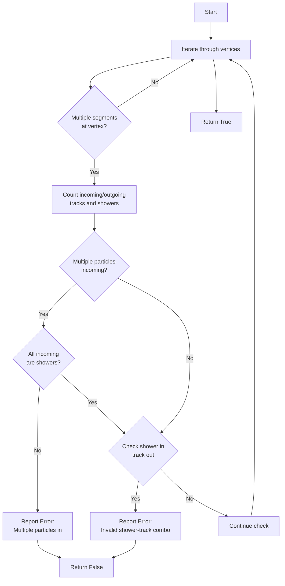

# Examine Maps Functions

This document describes the `examine_maps` function family in the NeutrinoID class that checks consistency of particle track and shower directions at vertices.

## Function Overview

Three overloaded versions of `examine_maps`:
1. Main version: `examine_maps(int temp_cluster_id)`
2. Vertex version: `examine_maps(ProtoVertex* temp_vertex)`
3. Cluster version: `examine_maps(PR3DCluster* temp_cluster)`

## Logical Flow



## Detailed Logic

### Main Function (`examine_maps(int temp_cluster_id)`)

**Purpose**: Validates track/shower topology at each vertex in a cluster.

**Key Checks**:
1. Multiple particles entering a vertex
   - Only allowed if all incoming particles are showers
   - Error if mixed shower/track incoming
2. Shower-track compatibility
   - Cannot have shower entering and track exiting vertex
   - Enforces shower propagation rules

**Algorithm Steps**:
1. Iterate through all vertices in cluster
2. For each vertex with multiple segments:
   - Count incoming/outgoing tracks and showers
   - Check for topology violations
   - Print debugging info if violations found

**Example Violation Check**:
```cpp
// Check for multiple incoming particles
if (n_in > 1 && n_in != n_in_shower) {
    std::cout << "Wrong: Multiple (" << n_in << ") particles into a vertex!" << std::endl;
    flag_return = false;
}

// Check for invalid shower-track combinations
if (n_in_shower > 0 && n_out_tracks > 0) {
    std::cout << "Wrong: " << n_in_shower << " showers in and " 
              << n_out_tracks << " tracks out!" << std::endl;
    flag_return = false;
}
```

### Helper Functions

1. `examine_maps(ProtoVertex* temp_vertex)`
   - Calls main function with vertex's cluster ID
   - Simple wrapper for vertex-specific checks

2. `examine_maps(PR3DCluster* temp_cluster)`
   - Calls main function with cluster's ID
   - Simple wrapper for cluster-specific checks

## Called Functions/Members

### Core Functions
- `get_cluster_id()`: From ProtoVertex and PR3DCluster classes
- `get_wcpt_vec()`: From ProtoSegment class
- `get_flag_dir()`: From ProtoSegment class
- `get_flag_shower()`: From ProtoSegment class
- `print_segs_info()`: Prints detailed segment information

### Class Members Used
- `map_vertex_segments`: Maps vertices to their connected segments

## Key Variables

- `n_in`: Counter for incoming particles at vertex
- `n_in_shower`: Counter for incoming shower segments
- `n_out_tracks`: Counter for outgoing track segments
- `flag_start`: Boolean indicating segment orientation relative to vertex
- `flag_return`: Overall validity status of examined topology

## Error Conditions

1. Multiple Incoming Particles:
```
n_in > 1 && n_in != n_in_shower
```
- Triggers when multiple particles enter a vertex and not all are showers

2. Invalid Shower-Track Combination:
```
n_in_shower > 0 && n_out_tracks > 0
```
- Triggers when showers enter a vertex and tracks exit

## Summary

The `examine_maps` functions ensure physical consistency of particle track and shower directions within a neutrino interaction reconstruction. They enforce rules about how particles can interact at vertices and flag violations that would represent unphysical topologies.
