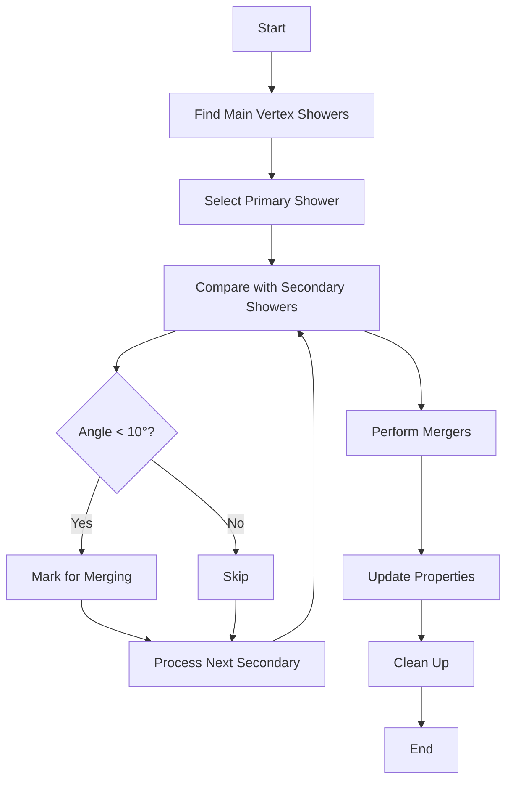

# NeutrinoID Function Documentation

## examine_merge_showers()

This function handles the merging of showers that originate from the main neutrino vertex. It specifically deals with identifying and combining showers that are likely part of the same particle interaction but were initially reconstructed as separate objects.

### Data Structures

- `map_vertex_to_shower`: Maps vertex to associated showers
- `used_showers`: Set of showers that have been processed for merging
- `map_shower_merge_showers`: Maps primary showers to their mergeable secondary showers

### Algorithm Details

1. **Main Vertex Shower Selection**
   - Retrieves all showers connected to the main neutrino vertex
   - Primary selection criteria:
     * Excludes muon-type particles (particle_type == 13)
     * Primary showers must have vertex connection type 1 (direct connection)
     * Secondary showers must have vertex connection type 2 (indirect connection)

2. **Direction Analysis**
   - For each shower pair:
     * Calculates directional vectors using `cal_dir_3vector`
     * Uses 100 cm distance for direction calculation
     * Compares shower directions using angle between vectors
   - Merging criteria:
     * Angle between showers must be < 10 degrees
     * Secondary shower must not be already used in another merger

3. **Shower Merging Process**
```cpp
// Example merger logic
if (angle < 10°) {
    primary_shower.add_shower(secondary_shower)
    // Update kinematics and properties
}
```

4. **Post-Merge Updates**
   - For each successful merger:
     * Adds secondary showers to primary shower
     * Updates particle type classification
     * Recalculates kinematics
     * Updates kinetic charge
   - System-wide updates:
     * Removes merged showers from main shower collection
     * Updates all shower maps if any mergers occurred

### Implementation Flow



### Key Considerations

1. **Vertex Connection Types**
   - Type 1: Direct connection to vertex (primary showers)
   - Type 2: Indirect connection (candidate for merging)

2. **Angular Threshold**
   - Fixed 10-degree threshold for merger decisions
   - Helps identify showers likely from same particle

3. **Property Updates**
   - Particle type reevaluation after merging
   - Kinematics recalculation
   - Charge updates based on merged shower properties

4. **Collection Management**
   - Maintains shower collection integrity
   - Updates all relevant mapping structures
   - Removes redundant shower objects

This algorithm effectively reduces shower overclustering while maintaining physical consistency in the reconstruction.

