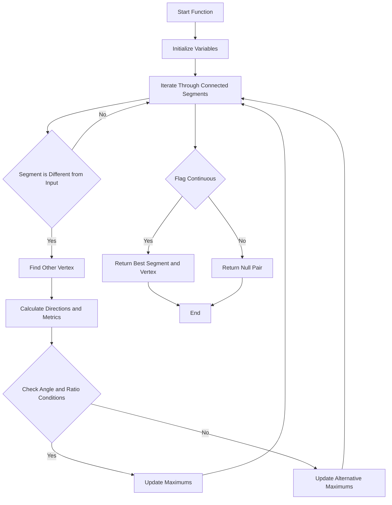

# Find Continuous Muon Segment Functions

This document describes the `find_cont_muon_segment` function family in the `NeutrinoID` class. These functions identify continuous muon segments connected to a given segment and vertex, aiding in the reconstruction of muon trajectories within a cluster.

## Function Overview

1. `find_cont_muon_segment(ProtoSegment* sg, ProtoVertex* vtx, bool flag_ignore_dQ_dx)`: Finds a continuous muon segment connected to a specified segment and vertex.
2. `find_cont_muon_segment_nue(ProtoSegment* sg, ProtoVertex* vtx, bool flag_ignore_dQ_dx)`: Similar to the above but tailored for neutrino-electron (nue) interactions with adjusted angle thresholds.

## Logical Flow



## Detailed Logic

### `find_cont_muon_segment(ProtoSegment* sg, ProtoVertex* vtx, bool flag_ignore_dQ_dx)`

```cpp
std::pair<ProtoSegment*, ProtoVertex* > NeutrinoID::find_cont_muon_segment(ProtoSegment* sg, ProtoVertex* vtx, bool flag_ignore_dQ_dx){
    // Initialize variables to track the best segment and vertex
    ProtoSegment *sg1 = 0;
    double max_length = 0;
    double max_angle = 0;
    double max_ratio = 0;
    ProtoVertex *vtx1 = 0;

    bool flag_cont = false;

    double max_ratio1 = 0;
    double max_ratio1_length = 0;

    double sg_length = sg->get_length();

    // Iterate through all segments connected to the vertex
    for (auto it = map_vertex_segments[vtx].begin(); it != map_vertex_segments[vtx].end(); it++){
        ProtoSegment* sg2 = *it;
        if (sg2 == sg) continue; // Skip the input segment
        ProtoVertex* vtx2 = find_other_vertex(sg2, vtx);

        // Calculate directions and metrics
        TVector3 dir1 = sg->cal_dir_3vector(vtx->get_fit_pt(), 15*units::cm);
        TVector3 dir2 = sg2->cal_dir_3vector(vtx->get_fit_pt(), 15*units::cm);

        double length = sg2->get_length();
        double angle = (3.1415926 - dir1.Angle(dir2)) / 3.1415926 * 180.;
        double ratio = sg2->get_medium_dQ_dx() / (43e3 / units::cm);

        double angle1 = angle;
        if (length > 50*units::cm){
            TVector3 dir3 = sg->cal_dir_3vector(vtx->get_fit_pt(), 50*units::cm);
            TVector3 dir4 = sg2->cal_dir_3vector(vtx->get_fit_pt(), 50*units::cm);
            angle1 = (3.1415926 - dir3.Angle(dir4)) / 3.1415926 * 180.;
        }

        // Check if segment meets angle and dQ/dx ratio conditions
        if ( (angle < 10. || angle1 < 10 || (sg_length < 6*units::cm && (angle < 15 || angle1 < 15))) &&  
             (ratio < 1.3 || flag_ignore_dQ_dx) ){
            flag_cont = true;
            if (length * cos(angle / 180. * 3.1415926) > max_length){
                max_length = length * cos(angle / 180. * 3.1415926);
                max_angle = angle;
                max_ratio = ratio;
                sg1 = sg2;
                vtx1 = vtx2;
            }
        }
        else{
            if (ratio > max_ratio1){
                max_ratio1 = ratio;
                max_ratio1_length = length;
            }
        }
    }

    // Return the best segment and vertex if conditions are met
    if (flag_cont){
        return std::make_pair(sg1, vtx1);
    }
    else{
        return std::make_pair<ProtoSegment*, ProtoVertex*>(0, 0);
    }
}
```

**Purpose**: Identifies the most suitable continuous muon segment connected to a given segment and vertex based on angle and dQ/dx ratio criteria.

**Algorithm Steps**:
1. **Initialization**: Set variables to track the best matching segment (`sg1`) and its corresponding vertex (`vtx1`).
2. **Iteration**: Loop through all segments connected to the provided vertex (`vtx`).
3. **Exclusions**: Skip the input segment (`sg`) to avoid self-comparison.
4. **Direction Calculation**: For each connected segment (`sg2`), calculate the direction vectors relative to the vertex.
5. **Metric Computation**:
    - **Length**: Length of `sg2`.
    - **Angle**: Angle between `sg` and `sg2`.
    - **Ratio**: dQ/dx ratio of `sg2`.
6. **Extended Angle Calculation**: If `sg2` is longer than 50 cm, recalculate the angle using a longer segment portion.
7. **Condition Checking**:
    - **Angle Conditions**: Segment must have an angle less than 10° or 15°, depending on length.
    - **Ratio Conditions**: dQ/dx ratio must be below 1.3 unless `flag_ignore_dQ_dx` is `true`.
8. **Updating Best Match**: If conditions are met and the segment length (adjusted by angle) is the longest so far, update `sg1` and `vtx1`.
9. **Alternative Metrics**: Track the maximum dQ/dx ratio and corresponding length for potential fallback.
10. **Return**: If a suitable segment is found (`flag_cont` is `true`), return the best segment and vertex pair. Otherwise, return a null pair.

**Called Functions/Methods**:
- `find_other_vertex(ProtoSegment* sg, ProtoVertex* vtx)`: Finds the vertex on the opposite end of a segment.
- `ProtoSegment::get_length()`: Retrieves the length of a segment.
- `ProtoSegment::cal_dir_3vector(Point, double)`: Calculates the direction vector of a segment from a given point over a specified distance.
- `ProtoSegment::get_medium_dQ_dx()`: Gets the medium dQ/dx value for the segment.

**Relevant Variables**:
- `map_vertex_segments`: Maps each vertex to its connected segments.
- `sg_length`: Length of the input segment.
- `flag_cont`: Indicates if a continuous segment satisfying conditions was found.
- `max_length`, `max_angle`, `max_ratio`: Track the best matching segment metrics.
- `max_ratio1`, `max_ratio1_length`: Track the highest dQ/dx ratios for segments not meeting main conditions.

### `find_cont_muon_segment_nue(ProtoSegment* sg, ProtoVertex* vtx, bool flag_ignore_dQ_dx)`

```cpp
std::pair<ProtoSegment*, ProtoVertex* > NeutrinoID::find_cont_muon_segment_nue(ProtoSegment* sg, ProtoVertex* vtx, bool flag_ignore_dQ_dx){
    // Initialize variables to track the best segment and vertex
    ProtoSegment *sg1 = 0;
    double max_length = 0;
    double max_angle = 0;
    double max_ratio = 0;
    ProtoVertex *vtx1 = 0;

    bool flag_cont = false;

    double max_ratio1 = 0;
    double max_ratio1_length = 0;

    double sg_length = sg->get_length();

    // Iterate through all segments connected to the vertex
    for (auto it = map_vertex_segments[vtx].begin(); it != map_vertex_segments[vtx].end(); it++){
        ProtoSegment* sg2 = *it;
        if (sg2 == sg) continue; // Skip the input segment
        ProtoVertex* vtx2 = find_other_vertex(sg2, vtx);

        // Calculate directions and metrics
        TVector3 dir1 = sg->cal_dir_3vector(vtx->get_fit_pt(), 15*units::cm);
        TVector3 dir2 = sg2->cal_dir_3vector(vtx->get_fit_pt(), 15*units::cm);

        double length = sg2->get_length();
        double angle = (3.1415926 - dir1.Angle(dir2)) / 3.1415926 * 180.;
        double ratio = sg2->get_medium_dQ_dx() / (43e3 / units::cm);

        double angle1 = angle;
        // Adjust angle calculation for longer segments
        if (length > 30*units::cm || sg_length > 30*units::cm){
            TVector3 dir3 = sg->cal_dir_3vector(vtx->get_fit_pt(), 30*units::cm);
            TVector3 dir4 = sg2->cal_dir_3vector(vtx->get_fit_pt(), 30*units::cm);
            angle1 = (3.1415926 - dir3.Angle(dir4)) / 3.1415926 * 180.;
        }

        // Check if segment meets angle and dQ/dx ratio conditions with adjusted thresholds
        if ( (angle < 12.5 || angle1 < 12.5 || (sg_length < 6*units::cm && (angle < 15 || angle1 < 15))) &&  
             (ratio < 1.3 || flag_ignore_dQ_dx) ){
            flag_cont = true;
            if (length * cos(angle / 180. * 3.1415926) > max_length){
                max_length = length * cos(angle / 180. * 3.1415926);
                max_angle = angle;
                max_ratio = ratio;
                sg1 = sg2;
                vtx1 = vtx2;
            }
        }
        else{
            if (ratio > max_ratio1){
                max_ratio1 = ratio;
                max_ratio1_length = length;
            }
        }
    }

    // Return the best segment and vertex if conditions are met
    if (flag_cont){
        return std::make_pair(sg1, vtx1);
    }
    else{
        return std::make_pair<ProtoSegment*, ProtoVertex*>(0, 0);
    }
}
```

**Purpose**: Similar to `find_cont_muon_segment`, this function is tailored for neutrino-electron (nue) interactions by adjusting angle thresholds to better identify continuous muon segments in this context.

**Algorithm Steps**:
1. **Initialization**: Set variables to track the best matching segment (`sg1`) and its corresponding vertex (`vtx1`).
2. **Iteration**: Loop through all segments connected to the provided vertex (`vtx`).
3. **Exclusions**: Skip the input segment (`sg`) to avoid self-comparison.
4. **Direction Calculation**: For each connected segment (`sg2`), calculate the direction vectors relative to the vertex.
5. **Metric Computation**:
    - **Length**: Length of `sg2`.
    - **Angle**: Angle between `sg` and `sg2`.
    - **Ratio**: dQ/dx ratio of `sg2`.
6. **Adjusted Angle Calculation**: If either the input or connected segment exceeds 30 cm, recalculate the angle using a longer segment portion.
7. **Condition Checking**:
    - **Adjusted Angle Conditions**: Segment must have an angle less than 12.5° or 15°, depending on length.
    - **Ratio Conditions**: dQ/dx ratio must be below 1.3 unless `flag_ignore_dQ_dx` is `true`.
8. **Updating Best Match**: If conditions are met and the segment length (adjusted by angle) is the longest so far, update `sg1` and `vtx1`.
9. **Alternative Metrics**: Track the maximum dQ/dx ratio and corresponding length for potential fallback.
10. **Return**: If a suitable segment is found (`flag_cont` is `true`), return the best segment and vertex pair. Otherwise, return a null pair.

**Differences from `find_cont_muon_segment`**:
- **Angle Thresholds**: The nue version uses a higher angle threshold (12.5° instead of 10°) for flexibility in nue interactions.
- **Length Thresholds**: Adjusted the length check from 50 cm to 30 cm for recalculating angles, accommodating different interaction scales.

**Called Functions/Methods**:
- `find_other_vertex(ProtoSegment* sg, ProtoVertex* vtx)`: Finds the vertex on the opposite end of a segment.
- `ProtoSegment::get_length()`: Retrieves the length of a segment.
- `ProtoSegment::cal_dir_3vector(Point, double)`: Calculates the direction vector of a segment from a given point over a specified distance.
- `ProtoSegment::get_medium_dQ_dx()`: Gets the medium dQ/dx value for the segment.

**Relevant Variables**:
- `map_vertex_segments`: Maps each vertex to its connected segments.
- `sg_length`: Length of the input segment.
- `flag_cont`: Indicates if a continuous segment satisfying conditions was found.
- `max_length`, `max_angle`, `max_ratio`: Track the best matching segment metrics.
- `max_ratio1`, `max_ratio1_length`: Track the highest dQ/dx ratios for segments not meeting main conditions.

## Helper Functions

### `find_other_vertex(ProtoSegment* sg, ProtoVertex* vtx)`

```cpp
ProtoVertex* NeutrinoID::find_other_vertex(ProtoSegment* sg, ProtoVertex* vtx){
    // ...existing code...
}
```
**Purpose**: Retrieves the vertex at the opposite end of a given segment relative to the provided vertex.

## Variables and Data Structures

- **`map_vertex_segments`**: A map linking each `ProtoVertex` to its associated `ProtoSegment` objects.
- **`TVector3`**: A class from ROOT for handling 3D vectors, used here for direction calculations.
- **`units::cm`**: Unit definitions for consistent measurement scaling.

## Summary

The `find_cont_muon_segment` functions are essential for identifying continuous muon segments connected to specific segments and vertices within a cluster. By evaluating angles and dQ/dx ratios, these functions ensure that only physically consistent and relevant segments are considered in the reconstruction process. The nue-specific version adjusts thresholds to accommodate the nuances of neutrino-electron interactions, enhancing the accuracy of muon tracking in varied interaction scenarios.
