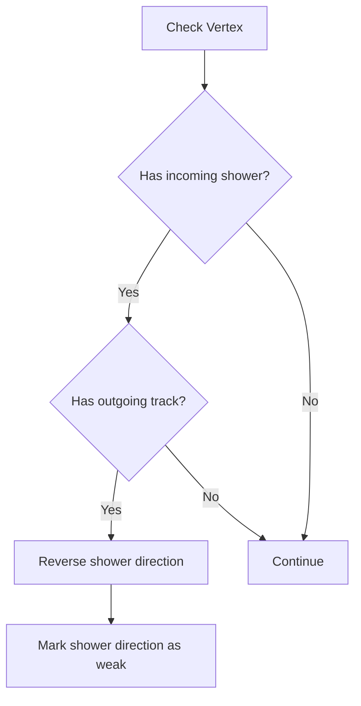
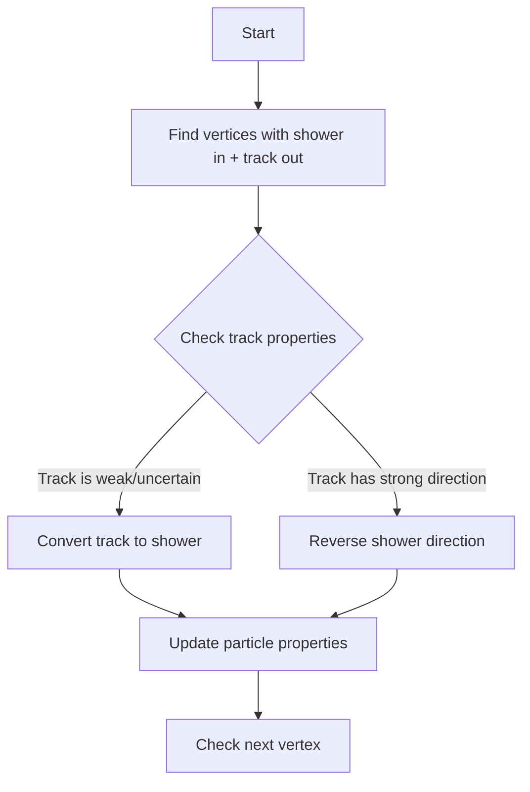

# Understanding the fix_maps Functions in NeutrinoID

The fix_maps_* functions in NeutrinoID are responsible for correcting and maintaining consistency in particle track and shower mappings in neutrino interactions. Let's analyze each function:

## 1. fix_maps_multiple_tracks_in

### Purpose
This function handles cases where multiple tracks are entering a vertex, which is physically impossible in a neutrino interaction (there should only be one incoming particle at a vertex).

### Logic Flow
1. Iterates through all vertices in the cluster
2. For each vertex, counts:
   - Number of incoming tracks (n_in)
   - Number of incoming showers (n_in_shower)
3. If there are multiple incoming tracks (n_in > 1) and not all incoming particles are showers:
   - Resets direction flags for all incoming tracks to 0
   - Marks tracks as having weak direction

Example situation:
```
Before:                   After:
    →                        ⊗
    ↘  vertex                ↘  vertex
    →                        ⊗
    
→ = incoming track         ⊗ = direction reset
```

## 2. fix_maps_shower_in_track_out

### Purpose
Handles inconsistent cases where there's a shower going into a vertex and tracks coming out, which violates particle physics conservation rules.

### Logic Flow
1. Examines each vertex
2. Identifies:
   - Incoming showers
   - Outgoing tracks with non-weak direction
3. If both exist at same vertex:
   - Reverses direction of incoming showers
   - Marks them with weak direction flag



## 3. improve_maps_multiple_tracks_in [see details](./improve_maps.md)

### Purpose
More sophisticated version of fix_maps_multiple_tracks_in that not only fixes directions but also attempts to reclassify particles.

### Logic Flow
1. Iterative process continues until no more changes needed
2. At each vertex:
   - Counts incoming tracks and showers
   - If multiple incoming non-shower tracks:
     - Changes track type to electron (11)
     - Updates particle mass
     - Recalculates 4-momentum

### Example Code Demonstrating Key Logic:
```cpp
if (n_in > 1 && n_in != n_in_shower) {
    for (auto it1 = in_tracks.begin(); it1!=in_tracks.end(); it1++){
        WCPPID::ProtoSegment *sg1 = *it1;
        sg1->set_particle_type(11);  // Change to electron
        sg1->set_particle_mass(mp.get_mass_electron());
        if (sg1->get_particle_4mom(3)>0) 
            sg1->cal_4mom();
        flag_update = true;
    }
}
```

## 4. improve_maps_shower_in_track_out [see details](./improve_maps.md)

### Purpose
Enhanced version of fix_maps_shower_in_track_out that includes particle reclassification and handles edge cases.

### Logic Flow


### Key Features
1. Uses iterative approach until no more changes needed
2. Handles weak direction tracks differently
3. Updates particle properties including:
   - Particle type
   - Mass
   - 4-momentum
4. Considers particle scores and confidences

## 5. improve_maps_one_in [see details](./improve_maps.md)

### Purpose
Ensures consistency when there is one definite incoming particle at a vertex by fixing directions of other connected particles.

### Key Logic:
1. Finds vertices with one clear incoming particle
2. Updates direction of connected segments based on the known incoming particle
3. Maintains weak/strong direction flags
4. Updates until system is consistent

## Common Patterns Across Functions

1. **Iterative Approach**
   - Most functions use while loops to continue until no more changes needed
   - Prevents cascade effects from single changes

2. **Particle Property Updates**
   - Direction flags
   - Particle types
   - Mass values
   - 4-momentum recalculation

3. **Consistency Checks**
   - Multiple incoming particles
   - Shower/track conflicts
   - Direction conflicts

4. **Physics Rules Enforced**
   - Conservation of energy/momentum
   - Particle decay rules
   - Track/shower behavior

These functions work together to maintain physical consistency in the particle tracking system while handling real-world detector data uncertainties.

## Function Dependencies

### fix_maps_multiple_tracks_in
Function calls:  [ProtoSegment](../protosegment.md)  [ProtoVertex](../protovertex.md)
- `ProtoSegment::set_flag_dir(int)` - Sets direction flag for track
- `ProtoSegment::set_dir_weak(bool)` - Sets whether direction determination is weak
- `ProtoSegment::get_wcpt_vec()` - Gets vector of points in segment
- `ProtoVertex::get_wcpt()` - Gets vertex point
- `ProtoVertex::get_cluster_id()` - Gets cluster ID

### fix_maps_shower_in_track_out
Function calls:
- `ProtoSegment::is_dir_weak()` - Checks if direction determination is weak
- `ProtoSegment::get_flag_dir()` - Gets direction flag
- `ProtoSegment::get_flag_shower()` - Checks if segment is shower-like
- `ProtoSegment::set_flag_dir(int)` - Sets direction flag
- `ProtoSegment::set_dir_weak(bool)` - Sets weak direction flag
- `ProtoVertex::get_cluster_id()` - Gets cluster ID
- `ProtoSegment::get_wcpt_vec()` - Gets segment points
- `ProtoVertex::get_wcpt()` - Gets vertex point

### improve_maps_multiple_tracks_in
Function calls:
- `ProtoSegment::set_particle_type(int)` - Sets particle type
- `ProtoSegment::set_particle_mass(double)` - Sets particle mass
- `ProtoSegment::get_particle_4mom(int)` - Gets 4-momentum component
- `ProtoSegment::cal_4mom()` - Calculates 4-momentum
- `ProtoSegment::get_flag_shower()` - Checks if shower-like
- `ProtoSegment::get_wcpt_vec()` - Gets segment points 
- `ProtoVertex::get_wcpt()` - Gets vertex point
- `ProtoVertex::get_cluster_id()` - Gets cluster ID

### improve_maps_shower_in_track_out
Function calls:
- `ProtoSegment::set_particle_type(int)` - Sets particle type
- `ProtoSegment::set_particle_mass(double)` - Sets particle mass
- `ProtoSegment::cal_4mom()` - Calculates 4-momentum
- `ProtoSegment::get_particle_4mom(int)` - Gets 4-momentum component
- `ProtoSegment::set_flag_dir(int)` - Sets direction flag
- `ProtoSegment::set_dir_weak(bool)` - Sets weak direction flag
- `ProtoSegment::get_flag_shower()` - Checks if shower-like
- `ProtoSegment::is_dir_weak()` - Checks weak direction
- `ProtoVertex::get_cluster_id()` - Gets cluster ID
- `ProtoVertex::get_wcpt()` - Gets vertex point

### improve_maps_one_in
Function calls:
- `ProtoSegment::set_flag_dir(int)` - Sets direction flag
- `ProtoSegment::set_dir_weak(bool)` - Sets weak direction flag 
- `ProtoSegment::cal_4mom()` - Calculates 4-momentum
- `ProtoSegment::get_flag_dir()` - Gets direction flag
- `ProtoSegment::is_dir_weak()` - Checks weak direction
- `ProtoVertex::get_cluster_id()` - Gets cluster ID
- `ProtoSegment::get_wcpt_vec()` - Gets segment points
- `ProtoVertex::get_wcpt()` - Gets vertex point

These dependencies show how the functions interact with the Proto* classes' methods to modify and check particle properties, directions, and kinematics.