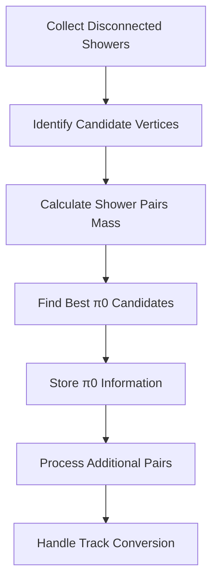

# Analysis of id_pi0_with_vertex Function

## Overview
The `id_pi0_with_vertex` function is designed to identify potential π0 (pi-zero) particle decay events in particle detector data. π0 particles typically decay into two photons, creating electromagnetic showers. This function attempts to find and pair these showers based on their geometric and kinematic properties.

## Key Data Structures

1. **Disconnected Showers Set**
```cpp
std::set<WCPPID::WCShower*> disconnected_showers;
std::map<WCShower*, TVector3> map_shower_dir;
```
- Tracks showers that aren't directly connected to the primary vertex
- Maps each shower to its direction vector

2. **Candidate Vertices Set**
```cpp
std::set<WCPPID::ProtoVertex*> candidate_vertices;
```
- Contains potential vertex points where π0 decay might have occurred
- Includes the main vertex and vertices associated with showers

## Algorithm Flow



## Detailed Steps

### 1. Initial Collection (Disconnected Showers)
- Gathers showers that have connection type 2 (displaced vertex)
- Records shower directions for later angle calculations
```cpp
if ((*it1)->get_start_vertex().second == 2 && fabs((*it1)->get_particle_type())!=13) {
    disconnected_showers.insert(*it1);
    map_shower_dir[*it1] = (*it1)->cal_dir_3vector(...);
}
```

### 2. Vertex Collection
- Identifies potential π0 decay vertices
- Includes:
  - Main interaction vertex
  - Vertices connected to existing showers
  - Excludes vertices already part of identified showers

### 3. Mass Calculation
For each vertex and shower pair:
1. Calculate angles between shower directions
2. Use the formula for π0 invariant mass:
```cpp
double mass_pio = sqrt(4 * shower_1->get_kine_charge() * 
                      shower_2->get_kine_charge() * 
                      pow(sin(angle/2.), 2));
```

### 4. π0 Candidate Selection
The function uses several criteria to identify good π0 candidates:
- Mass near π0 mass (~135 MeV)
- Reasonable opening angles between showers
- Energy requirements for both showers
- Geometric constraints

Selection code example:
```cpp
if (mass_diff < 35*units::MeV && mass_diff > -25*units::MeV) {
    // Store π0 candidate
    pi0_showers.insert(shower_1);
    pi0_showers.insert(shower_2);
    // Record mass and relationship
    map_pio_id_mass[pio_id] = std::make_pair(mass_save, 1);
}
```

### 5. Track Reclassification
After π0 identification, the function examines tracks connected to π0 vertices:
- Non-muon tracks are converted to pion tracks
- Updates particle IDs and masses
```cpp
if ((flag_start && sg->get_flag_dir()==-1 || (!flag_start) && 
    sg->get_flag_dir()==1) && (fabs(sg->get_particle_type())==13 || 
    sg->get_particle_type()==0)) {
    // Convert to pion
    sg->set_particle_type(211);
    sg->set_particle_mass(mp.get_mass_pion());
}
```

## Key Physics Concepts

### π0 Mass Window
- Nominal π0 mass: 135 MeV
- Acceptance window: 110-170 MeV
- Additional offset of 10 MeV applied to account for detector effects

### Angular Considerations
- Checks opening angles between shower pairs
- Uses both:
  1. Direct angles between shower directions
  2. Angles relative to vertex position

### Energy Requirements
- Both showers must have sufficient energy
- Energy balance between paired showers is considered
- Total energy must be consistent with π0 decay

## Output Data

The function stores identified π0 information in several data structures:
1. `pi0_showers`: Set of showers identified as part of π0 decays
2. `map_shower_pio_id`: Maps showers to their π0 ID
3. `map_pio_id_mass`: Stores the calculated mass for each π0
4. `map_pio_id_showers`: Groups showers by π0 ID

## Special Cases

1. **Vertex Association**
- Showers can be reassigned to new vertices if better matching is found
- Vertex positions may be adjusted based on shower geometry

2. **Track Conversion**
- Connected tracks may be reinterpreted as pions
- Direction and momentum are preserved during conversion

## Performance Considerations
- Iterative process removes identified pairs from consideration
- Early exit conditions when good candidates are found
- Geometric calculations optimized for speed

## Function Calls

### Geometric and Vector Calculations 
1. `cal_dir_3vector(Point, double)` [see details](../pattern_recognition/wcshower_kinematics.md)
   - Called on WCShower objects
   - Calculates direction vector from a point with specified length
   - Used for determining shower directions

2. `get_closest_point(Point)`
   - Called on WCShower objects
   - Returns pair containing closest distance and point
   - Used for finding shower-vertex associations

3. `get_init_dir()`
   - Gets initial direction vector of shower
   - Used for shower orientation analysis

### Shower Property Access [WCShower](../wcshower.md)
1. `get_start_vertex()`
   - Returns pair containing vertex pointer and connection type
   - Used to identify shower start points

2. `get_start_point()`
   - Returns starting point of shower
   - Used in geometric calculations

3. `get_kine_charge()`
   - Gets kinematic charge/energy of shower
   - Used in π0 mass calculations

### Particle Management
1. `set_particle_type(int)`
   - Sets particle ID for segments
   - Used when converting tracks to pions

2. `set_particle_mass(double)`
   - Sets particle mass
   - Used when updating particle properties

3. `cal_4mom()`
   - Recalculates 4-momentum after particle type changes
   - Used after particle conversions

### Map Management
1. `find_other_vertex(ProtoSegment*, ProtoVertex*)`
   - Finds other vertex connected to segment
   - Used in track topology analysis

### Vector Operations (TVector3)
1. `Angle(TVector3)`
   - Calculates angle between vectors
   - Used for shower opening angles

2. `Mag()`
   - Gets vector magnitude
   - Used in direction calculations

3. `SetXYZ(double, double, double)`
   - Sets vector components
   - Used when creating direction vectors

### Math/Unit Conversions
1. `sqrt()`
   - Standard math function
   - Used in mass calculations

2. `pow()`
   - Standard math function
   - Used in mass calculations

3. `units::MeV`, `units::cm`
   - Unit conversion constants
   - Used throughout for consistent units