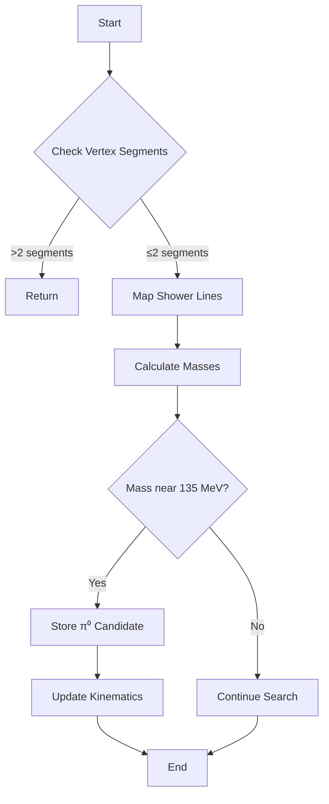

# Understanding the id_pi0_without_vertex Function

This document explains the logic and implementation details of the `id_pi0_without_vertex` function from the WireCell PID framework, which identifies π⁰ particles without relying on a vertex.

## Overview

The function attempts to identify π⁰ particles by looking for pairs of electromagnetic showers that could have originated from a π⁰ decay. The π⁰ particle primarily decays into two photons, which then create electromagnetic showers in the detector.

## Main Steps

### 1. Initial Validation

The function first performs some basic validation:

```cpp
if (map_vertex_segments[main_vertex].size()>2) return; // more than one shower
if (map_segment_in_shower.find(*map_vertex_segments[main_vertex].begin()) == map_segment_in_shower.end() &&
    map_segment_in_shower.find(*map_vertex_segments[main_vertex].rbegin()) == map_segment_in_shower.end()
    || segments_in_long_muon.find(*map_vertex_segments[main_vertex].begin()) != segments_in_long_muon.end()
    || segments_in_long_muon.find(*map_vertex_segments[main_vertex].rbegin()) != segments_in_long_muon.end() 
    ) return;
```

- Checks if there are more than 2 segments from the main vertex
- Ensures the segments are part of a shower and not part of a muon track

### 2. Shower Direction Mapping

The function then creates a mapping between showers and their directional information:

```cpp
std::map<WCPPID::WCShower*, WCP::Line *> map_shower_line;
for (auto it = map_vertex_to_shower[main_vertex].begin(); it!= map_vertex_to_shower[main_vertex].end(); it++){
    if ((*it)->get_start_segment()->get_particle_type()==13) continue; // Skip muons
    if ((*it)->get_total_length() < 3*units::cm) continue; // Skip short showers
    if (pi0_showers.find(*it) != pi0_showers.end()) continue; // Skip already identified π⁰s
    
    Point test_p = (*it)->get_start_point();
    TVector3 dir = (*it)->cal_dir_3vector(test_p, 15*units::cm);
    WCP::Line *line = new Line(test_p, dir);
    map_shower_line[*it] = line;
}
```

### 3. π⁰ Mass Reconstruction

For each pair of showers, the function:

1. Calculates the closest approach points between shower directions
2. Computes the opening angle between showers
3. Calculates the reconstructed π⁰ mass using the formula:

```cpp
double angle = dir1.Angle(dir2);
double mass_pio = sqrt(4*shower_1->get_kine_charge()* shower_2->get_kine_charge()*pow(sin(angle/2.),2));
```

This formula comes from the relativistic kinematics of π⁰ decay:
- E₁, E₂: energies of the two photons
- θ: opening angle between them
- m_π⁰ = √(2E₁E₂(1-cos θ)) = √(4E₁E₂sin²(θ/2))

### 4. Pair Selection

The function selects shower pairs based on several criteria:

```cpp
if (mass_diff < 60*units::MeV){
    pi0_showers.insert(shower_1);
    pi0_showers.insert(shower_2);
    int pio_id = acc_segment_id++;
    map_shower_pio_id[shower_1] = pio_id;
    map_shower_pio_id[shower_2] = pio_id;
    map_pio_id_mass[pio_id] = std::make_pair(mass_save,2);
}
```

Key criteria include:
- Mass should be close to the π⁰ mass (around 135 MeV)
- Showers should have reasonable energies
- Opening angle should be consistent with π⁰ decay

## Flow Diagram



## Key Features

1. **Displaced Vertex Handling**: The function can identify π⁰s even when the reconstruction point is displaced from the true vertex by looking at shower direction intersections.

2. **Mass Window**: Uses a mass window around the π⁰ mass (135 MeV) with some offset (typically 10 MeV) to account for detector resolution effects.

3. **Energy Cuts**: Implements various energy thresholds to reduce background:
   ```cpp
   if (energy_1 + energy_2 > max_energy){
       kine_pio_flag = 2;
       kine_pio_mass = mass_save;
       kine_pio_energy_1 = energy_1;
       kine_pio_energy_2 = energy_2;
   }
   ```

4. **Angular Analysis**: Performs detailed angular analysis between shower pairs to ensure consistency with π⁰ decay kinematics.

## Output Information

The function stores several pieces of information for identified π⁰s:
- Reconstructed mass
- Energy of each photon shower
- Opening angle
- Vertex displacement
- Directional information (θ, φ) for each shower

This information is stored in member variables like:
```cpp
kine_pio_mass      // reconstructed mass
kine_pio_energy_1  // energy of first shower
kine_pio_energy_2  // energy of second shower
kine_pio_angle     // opening angle
kine_pio_vtx_dis   // vertex displacement
```

## Error Handling

The function includes several safeguards:
- Checks for muon contamination
- Validates shower lengths and energies
- Ensures proper angular relationships
- Handles cases with missing or incomplete information

This robust error handling helps ensure reliable π⁰ identification even in complex event topologies.

## Function Dependencies

The function makes calls to several other methods throughout its execution:

### Core Physics Calculations
- `cal_dir_3vector(Point, double)`: Calculates a direction vector from a point with given length [more details](../pattern_recognition/wcshower_pattern.md)
- `get_closest_point(Point)`: Returns closest point and distance between geometric objects
- `get_kine_charge()`: Gets kinematic charge information for showers
- `cal_4mom()`: Calculates 4-momentum 

### Shower Management [WCshower](../wcshower.md)
- `add_segment(ProtoSegment*, map_segment_vertices)`: Adds a segment to a shower
- `add_shower(WCShower*)`: Merges one shower into another
- `set_start_vertex(ProtoVertex*, int)`: Sets the starting vertex for a shower
- `set_start_point(Point)`: Sets the starting point for a shower
- `calculate_kinematics()`: Updates kinematic calculations for a shower
- `update_particle_type()`: Updates the particle type classification

### Geometry Classes
- `Line(Point, TVector3)`: Constructor for line objects used in direction calculations
- `Line::closest_dis_points(Line)`: Finds closest approach points between two lines
- `Line::closest_dis(Line)`: Calculates distance of closest approach between lines
- `TVector3::Angle(TVector3)`: Calculates angle between two vectors
- `Point::get_fit_pt()`: Gets fitted point coordinates

### Map/Container Management
- `map_segment_vertices.find()`: Searches segment-vertex associations
- `map_segment_in_shower.find()`: Checks if segment is part of a shower
- `pi0_showers.insert()`: Adds shower to π⁰ candidate collection
- `segments_in_long_muon.find()`: Checks if segment is part of a muon track
- `update_shower_maps()`: Updates internal shower mapping structures [see details](./update_shower_maps.md)

### Helper Functions
- `find_vertices(ProtoSegment*)`: Finds vertices associated with a segment [see details](../NeutrinoID/find_vertices.md)
- `get_start_end_vertices(ProtoSegment*)`: Gets start and end vertices of a segment
- `find_other_vertex(ProtoSegment*, ProtoVertex*)`: Finds the other vertex given one vertex

These function calls are essential for:
1. Computing geometric relationships between showers
2. Managing shower and segment associations
3. Performing physics calculations for π⁰ identification
4. Maintaining data structures for particle tracking