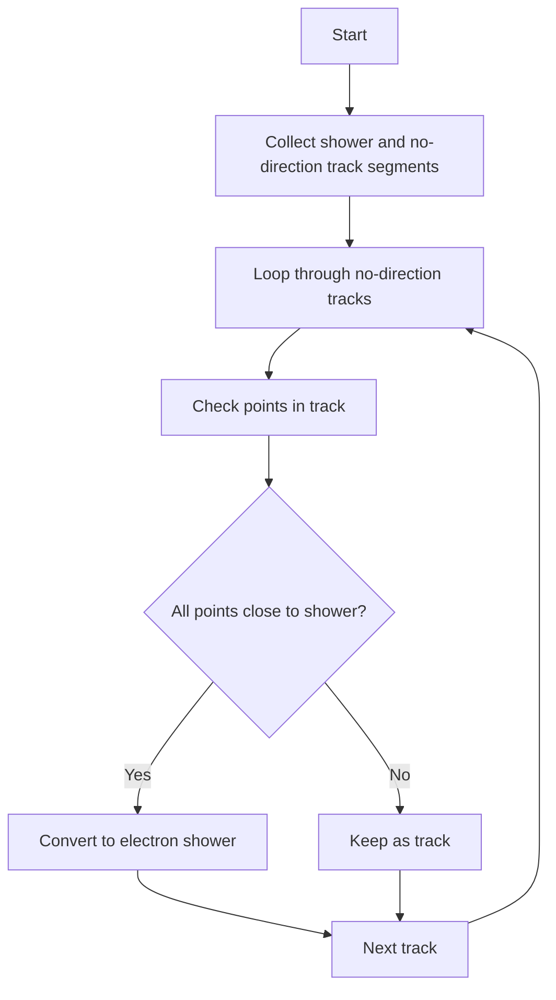

# NeutrinoID::judge_no_dir_tracks_close_to_showers Function Documentation

## Purpose
This function examines tracks without direction information and determines if they should be reclassified as showers based on their proximity to existing shower segments.

## Logic Flow



## Detailed Steps

1. **Collection Phase**
   - Create two sets:
     - `shower_set`: Contains all shower segments
     - `no_dir_track_set`: Contains all track segments without direction

2. **Track Analysis**
   - For each track without direction:
     - Examine every point in the track's point vector
     - Calculate minimum 2D distances to all showers in three wire planes (U,V,W)
     - Check if point is "close" to any shower (within 0.6 cm in all planes)

3. **Decision Making**
   - Track is converted to shower (electron) if:
     - ALL points in track are within 0.6 cm of a shower in all three planes
   - Track remains unchanged if:
     - ANY point is further than 0.6 cm from showers in any plane

## Key Parameters
- Proximity threshold: 0.6 cm in each plane
- Must be close in all three planes (U, V, W)

## Called Functions

1. `get_closest_2d_dis()`
   - Parameters: Point
   - Returns: Tuple<double, double, double> containing:
     - Closest distance in U plane
     - Closest distance in V plane
     - Closest distance in W plane

2. `set_particle_type()`
   - Parameters: particle type (11 for electron)

3. `set_particle_mass()`
   - Parameters: mass (electron mass)

## Property Changes When Converting to Shower
When a track is reclassified:
1. Particle type set to 11 (electron)
2. Particle mass set to electron mass

## Important Notes

- Function relies on 2D distance measurements in all three wire planes
- All points must satisfy proximity criteria for conversion
- Only processes tracks that have no direction information
- Conversion is binary - either all points qualify or none do

## Example Distance Check
```cpp
if (min_u_dis > 0.6*units::cm || 
    min_v_dis > 0.6*units::cm || 
    min_w_dis > 0.6*units::cm) {
    flag_change = false;
}
```
