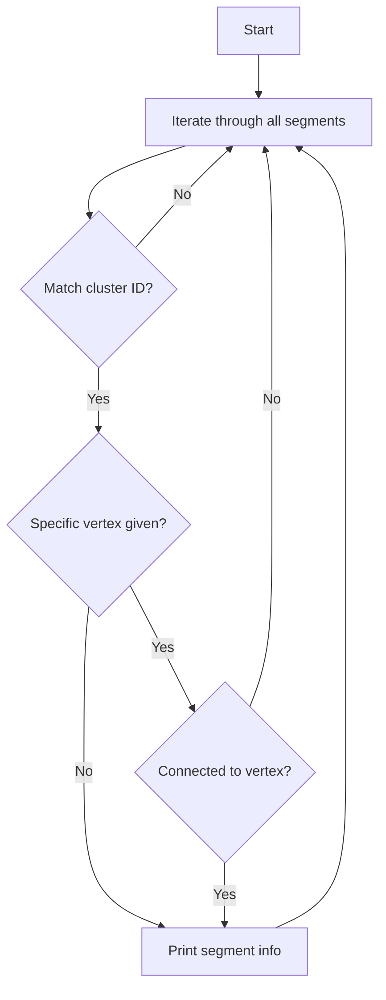

# Print Segment Information Functions

This document describes the `print_segs_info` function family in the NeutrinoID class that prints detailed information about segments.

## Function Overview

Three overloaded versions of `print_segs_info`:
1. Main version: `print_segs_info(int temp_cluster_id, ProtoVertex* spec_vertex = 0)`
2. Vertex version: `print_segs_info(ProtoVertex* temp_vertex)`
3. Cluster version: `print_segs_info(PR3DCluster* temp_cluster)`

## Logical Flow



## Main Function Details

### Parameters
- `temp_cluster_id`: ID of the cluster to filter segments
- `spec_vertex`: Optional specific vertex to filter connected segments

### Key Logic Steps
1. Iterate through all segments in `map_segment_vertices`
2. Filter segments by cluster ID
3. If specific vertex provided:
   - Check if segment is connected to vertex
   - Determine segment direction relative to vertex
4. Print segment information based on type:
   - Shower topology
   - Shower trajectory
   - Track

### Output Format for Each Segment
```
<segment_id> <length_cm> <type> <direction> <particle_type> <mass_MeV> <KE_MeV> <is_dir_weak> <in_vertex>
```

Where:
- `type`: "S_topo" (shower topology), "S_traj" (shower trajectory), or "Track"
- `in_vertex`: Direction indicator (-1: in, 1: out, 0: no direction)

### Direction Determination Logic
```cpp
if (spec_vertex != 0) {
    bool flag_start = (sg->get_wcpt_vec().front().index == spec_vertex->get_wcpt().index);
    
    // Determine in_vertex value
    if ((flag_start && sg->get_flag_dir()==-1) || 
        (!flag_start && sg->get_flag_dir()==1)) {
        in_vertex = -1;  // incoming
    } else if ((flag_start && sg->get_flag_dir()==1) || 
               (!flag_start && sg->get_flag_dir()==-1)) {
        in_vertex = 1;   // outgoing
    }
}
```

## Helper Functions

### Vertex Version
```cpp
void print_segs_info(ProtoVertex* temp_vertex)
```
- Calls main function with vertex's cluster ID
- Used for printing segments in vertex's cluster

### Cluster Version
```cpp
void print_segs_info(PR3DCluster* temp_cluster)
```
- Calls main function with cluster's ID
- Used for printing segments in a specific cluster

## Called Functions/Members
- `get_cluster_id()`: From ProtoSegment, ProtoVertex, and PR3DCluster classes
- `get_wcpt_vec()`: From ProtoSegment class
- `get_wcpt()`: From ProtoVertex class
- `get_flag_dir()`: From ProtoSegment class
- `get_length()`: From ProtoSegment class
- `get_particle_type()`: From ProtoSegment class
- `get_particle_mass()`: From ProtoSegment class
- `get_particle_4mom()`: From ProtoSegment class
- `is_dir_weak()`: From ProtoSegment class
- `get_flag_shower_topology()`: From ProtoSegment class
- `get_flag_shower_trajectory()`: From ProtoSegment class

## Class Members Used
- `map_segment_vertices`: Maps segments to their vertices
- `map_vertex_segments`: Maps vertices to their connected segments
