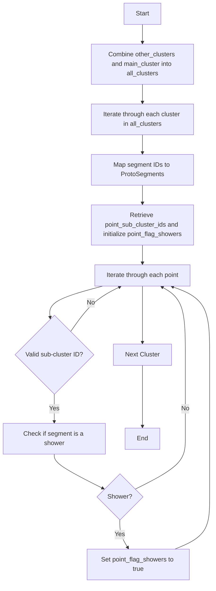

# Separate Track and Shower Functions

This document describes the `separate_track_shower` function family in the `NeutrinoID` class, which distinguishes between track and shower segments within a cluster.

## Function Overview

1. `separate_track_shower(PR3DCluster* temp_cluster)`: Separates tracks and showers within a specific cluster.
2. `separate_track_shower()`: Separates tracks and showers across all relevant clusters.

## Logical Flow

### `separate_track_shower(PR3DCluster* temp_cluster)`

```cpp
void WCPPID::NeutrinoID::separate_track_shower(WCPPID::PR3DCluster* temp_cluster){
  for (auto it = map_segment_vertices.begin(); it != map_segment_vertices.end(); it++){
    WCPPID::ProtoSegment *sg = it->first;
    if (sg->get_cluster_id() != temp_cluster->get_cluster_id()) continue;
   
    sg->is_shower_topology();
    if (!sg->get_flag_shower_topology())      
      sg->is_shower_trajectory();
  }
}
```

**Purpose**: Iterates through all segments in the provided cluster and determines whether each segment is a shower based on topology and trajectory.

**Algorithm Steps**:
1. Loop through all segments in `map_segment_vertices`.
2. Check if the segment belongs to `temp_cluster`.
3. Call `is_shower_topology()` on the segment.
4. If the segment does not satisfy shower topology, call `is_shower_trajectory()`.

**Called Functions/Methods**: [ProtoSegment](../protosegment.md)
- `ProtoSegment::get_cluster_id()`
- `ProtoSegment::is_shower_topology()`
- `ProtoSegment::get_flag_shower_topology()`
- `ProtoSegment::is_shower_trajectory()`

**Relevant Variables**:
- `map_segment_vertices`: Maps segments to their associated vertices.
- `temp_cluster`: The cluster being processed.

### `separate_track_shower()`

```cpp
void WCPPID::NeutrinoID::separate_track_shower(){
  // ...existing code...
  
  PR3DClusterSelection all_clusters = other_clusters;
  all_clusters.push_back(main_cluster);
  for (auto it = all_clusters.begin(); it!=all_clusters.end(); it++){
    WCPPID::PR3DCluster* temp_cluster = *it;

    std::map<int, WCPPID::ProtoSegment*> map_id_seg;
    for (auto it = map_segment_vertices.begin(); it!= map_segment_vertices.end(); it++){
      WCPPID::ProtoSegment *sg = it->first;
      if (sg->get_cluster_id() != temp_cluster->get_cluster_id()) continue;
      map_id_seg[sg->get_id()] = sg;
      // ...existing code...
    }
    
    std::vector<int>& point_sub_cluster_ids = temp_cluster->get_point_sub_cluster_ids();
    std::vector<bool>& point_flag_showers = temp_cluster->get_point_flag_showers();
    point_flag_showers.resize(point_sub_cluster_ids.size(), false);

        
    for (size_t i=0;i!=point_sub_cluster_ids.size();i++){ 
      if (point_sub_cluster_ids.at(i) == -1) continue;
      if (map_id_seg.find(point_sub_cluster_ids.at(i)) == map_id_seg.end()) continue;
      // ...existing code...
      if ( map_id_seg[point_sub_cluster_ids.at(i)]->get_flag_shower()) 
        point_flag_showers.at(i) = true; 
    } 
  }
  
  // ...existing code...
}
```

**Purpose**: Separates tracks and showers across all relevant clusters by analyzing each segment's properties within each cluster.

**Algorithm Steps**:
1. Combine `other_clusters` and `main_cluster` into `all_clusters`.
2. Iterate through each cluster in `all_clusters`.
3. For each cluster, create a map (`map_id_seg`) linking segment IDs to segments.
4. Retrieve `point_sub_cluster_ids` and initialize `point_flag_showers`.
5. Iterate through each point in `point_sub_cluster_ids`:
   - Skip if the sub-cluster ID is `-1` or not found in `map_id_seg`.
   - If the segment is identified as a shower (`get_flag_shower()`), set the corresponding flag in `point_flag_showers` to `true`.

**Called Functions/Methods**:
- `PR3DCluster::get_cluster_id()`
- `ProtoSegment::get_id()`
- `ProtoSegment::get_flag_shower()`
- `PR3DCluster::get_point_sub_cluster_ids()`
- `PR3DCluster::get_point_flag_showers()`

**Relevant Variables**:
- `other_clusters`: Collection of clusters excluding the main cluster.
- `main_cluster`: The primary cluster being processed.
- `map_segment_vertices`: Maps segments to their associated vertices.
- `map_id_seg`: Maps segment IDs to their corresponding segments.
- `point_sub_cluster_ids`: IDs of sub-clusters associated with points.
- `point_flag_showers`: Flags indicating whether points are part of showers.

## Helper Functions/Methods

### Segment Classification
- **`is_shower_topology()`**: Determines if a segment's topology qualifies it as a shower.
- **`is_shower_trajectory()`**: Determines if a segment's trajectory qualifies it as a shower.

## Variables and Data Structures

- **`map_segment_vertices`**: A map linking each `ProtoSegment` to its associated `ProtoVertex` objects.
- **`PR3DClusterSelection`**: A collection type that holds multiple `PR3DCluster` pointers.
- **`map_id_seg`**: Maps segment IDs to their corresponding `ProtoSegment` objects within a cluster.
- **`point_sub_cluster_ids`**: Vector containing sub-cluster IDs for each point in a cluster.
- **`point_flag_showers`**: Vector of boolean flags indicating whether each point is part of a shower segment.

## Flow Diagram



## Summary

The `separate_track_shower` functions are responsible for distinguishing between track and shower segments within nuclear clusters. The main version processes a specific cluster by evaluating each segment's topology and trajectory. The overloaded version iterates through all relevant clusters, mapping segments and flagging points associated with showers based on their classification.
