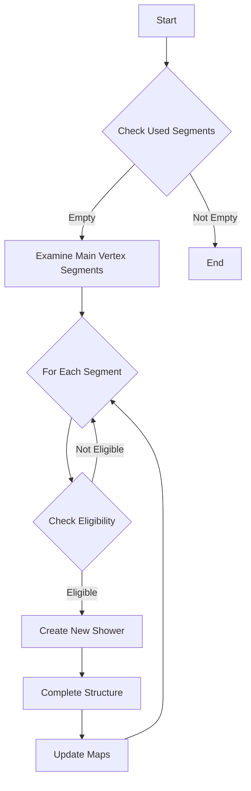

# Shower Clustering Connecting to Main Vertex Function Analysis

## Purpose
The `shower_clustering_connecting_to_main_vertex` function is designed to identify and process shower segments that are directly connected to the main neutrino interaction vertex. It handles special cases where shower segments might need to be merged or converted into electromagnetic (EM) showers.

## Key Components

### 1. Initial Used Segments Collection
```cpp
std::set<WCPPID::ProtoSegment*> used_segments;
for (auto it = showers.begin(); it != showers.end(); it++) {
    WCPPID::WCShower *shower = *it;
    if (shower->get_start_vertex().first == main_vertex) {
        Map_Proto_Segment_Vertices& map_seg_vtxs = shower->get_map_seg_vtxs();
        for (auto it1 = map_seg_vtxs.begin(); it1 != map_seg_vtxs.end(); it1++) {
            used_segments.insert(it1->first);
        }
    }
}
```
- Creates a set of segments already used in existing showers
- Only considers segments from showers connected to main vertex
- Special case: Clears used_segments if only one short segment (<8cm) exists

### 2. Shower Creation Logic

If no used segments exist, the function:

1. Examines each segment connected to main vertex:
```cpp
for (auto it = map_vertex_segments[main_vertex].begin(); 
     it != map_vertex_segments[main_vertex].end(); it++) {
    WCPPID::ProtoSegment *sg = *it;
    // Check segment eligibility
}
```

2. Evaluates segment characteristics:
   - Checks particle type (electron, proton, pion)
   - Analyzes charge deposition (dQ/dx)
   - Considers number of daughter tracks
   - Examines segment length

3. Creates new showers for eligible segments:
```cpp
WCPPID::WCShower *shower = new WCPPID::WCShower();
shower->set_start_vertex(main_vertex, 1);
shower->set_start_segment(sg);
shower->complete_structure_with_start_segment(...);
```

### 3. Quality Metrics Analysis
For each potential shower cluster:
- Counts number of tracks and showers
- Measures total length
- Evaluates vertex multiplicities
- Checks for good track characteristics

```cpp
int n_multi_vtx = 0;
int n_two_vtx = 0;
for (auto it1 = map_vtx_segs.begin(); it1 != map_vtx_segs.end(); it1++) {
    if (it1->second.size()==2) n_two_vtx++;
    else if (it1->second.size() >2) n_multi_vtx++;
}
```

### 4. Decision Flow



### 5. Shower Quality Requirements

For a segment to be converted to a shower:
1. Must not be a good track
2. Must have multiple vertices (n_multi_vtx > 0)
3. Length constraints:
   - Max length < 65cm
   - Total length per track < 27cm (if total < 85cm)
   - OR Total length per track < 18cm (if total < 95cm)
4. Limited number of two-vertex connections (n_two_vtx < 3)

### 6. Map Updates
After shower creation:
1. Updates shower maps:
   - vertex_to_shower
   - vertex_in_shower
   - segment_in_shower
2. Updates topology information
3. Recalculates kinematics

## Special Considerations

1. **Short Segment Handling**
```cpp
if (used_segments.size()==1 && 
    (*used_segments.begin())->get_length() < 8*units::cm) {
    used_segments.clear();
}
```
- Single short segments are treated specially
- Allows for potential reprocessing

2. **Maximum Shower Selection**
- Selects largest shower when multiple candidates exist
- Based on total length and quality metrics
- Preserves best candidate while removing others

3. **Vertex Constraints**
- Maintains vertex relationships
- Updates vertex positions when necessary
- Ensures proper shower topology

## Key Outputs

1. Updated shower collection with new EM showers
2. Modified vertex relationships
3. Updated segment classifications
4. Recalculated kinematics for affected showers

## Error Handling
- Checks for null pointers in vertex relationships
- Validates segment connections
- Ensures proper cleanup of removed showers

## Performance Considerations
- Uses sets for efficient lookup of used segments
- Maintains maps for quick access to relationships
- Minimizes repeated calculations of distances and angles

## Function Calls

### WCShower Class Methods [WCshower](../wcshower.md)
1. `get_start_vertex()`: Returns pair of start vertex and vertex type
2. `get_map_seg_vtxs()`: Returns map of segments to vertices
3. `set_start_vertex(vertex, type)`: Sets start vertex with type
4. `set_start_segment(segment)`: Sets starting segment
5. `complete_structure_with_start_segment()`: Builds shower structure
6. `get_total_length()`: Gets total shower length
7. `add_segment()`: Adds segment to shower
8. `calculate_kinematics()`: Updates kinematic calculations
9. `get_num_segments()`: Returns number of segments
10. `get_start_segment()`: Returns starting segment
11. `get_start_point()`: Returns starting point
12. `add_shower()`: Merges another shower into this one
13. `update_particle_type()`: Updates particle classification

### ProtoSegment Class Methods [ProtoSegment](../protosegment.md)
1. `get_length()`: Returns segment length
2. `get_medium_dQ_dx()`: Returns charge deposition
3. `get_particle_type()`: Returns particle classification
4. `is_dir_weak()`: Checks if direction is weakly determined
5. `get_id()`: Returns segment ID
6. `set_flag_avoid_muon_check()`: Sets flag to avoid muon checks
7. `set_particle_type()`: Sets particle type
8. `set_flag_dir()`: Sets direction flag

### Helper Functions
1. `find_vertices()`: Gets vertices for a segment [more details](../NeutrinoID/find_vertices.md)
2. `cal_4mom()`: Calculates 4-momentum
3. `update_shower_maps()`: Updates global shower maps [more details](./update_shower_maps.md)
- Updates map_vertex_to_shower
- Updates map_vertex_in_shower
- Updates map_segment_in_shower
- Updates used_shower_clusters

### Calculation Functions
1. `calculate_num_daughter_tracks()`: Counts daughter tracks [more details](./calculate_num_daughter_showers.md)
2. `get_dis()`: Calculates distance between components