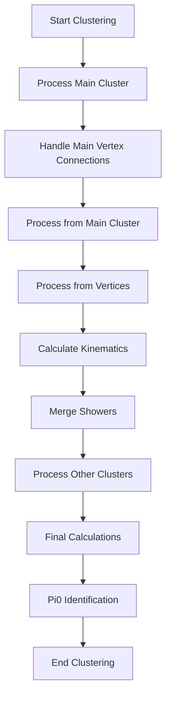

# Understanding shower_clustering_with_nv() Function

## Overview
The `shower_clustering_with_nv()` function is responsible for clustering particle showers in a neutrino interaction detector. It implements a sophisticated multi-step process to identify, classify and cluster particle showers.

## High-Level Function Flow

1. Initial cluster handling in main cluster
2. Handling connections to main vertex 
3. Processing clusters from main cluster
4. Processing clusters from vertices
5. Calculation of shower kinematics
6. Examining and merging showers
7. Clustering in other detectors
8. Final kinematic calculations
9. Pi0 identification 

## Detailed Step Analysis

### 1. Initial Main Cluster Processing [see details](./shower_clustering_with_nv_in_main_cluster.md)
The function starts by calling `shower_clustering_with_nv_in_main_cluster()` which:

- Searches for electron showers starting from the main vertex
- Builds shower trees by following particle trajectories
- Identifies and marks segments as either track-like or shower-like
- Creates initial shower objects

Example segment processing:
```cpp
for (auto it = map_vertex_segments[main_vertex].begin(); 
     it != map_vertex_segments[main_vertex].end(); it++) {
    WCPPID::ProtoVertex *other_vertex = find_other_vertex(*it, main_vertex);
    segments_to_be_examined.push_back(std::make_pair(*it, other_vertex));
}
```

### 2. Main Vertex Connection Handling  [see details](./shower_clustering_connecting_to_main_vertex.md)
The `shower_clustering_connecting_to_main_vertex()` function:

- Identifies showers connected to the main interaction vertex
- Handles special cases of vertex connections
- Updates shower topologies based on vertex connections

Key logic:
```cpp
if (shower->get_start_vertex().first == main_vertex) {
    for (auto it = map_vertex_segments[main_vertex].begin(); 
         it != map_vertex_segments[main_vertex].end(); it++) {
        WCPPID::ProtoSegment *sg = *it;
        if (sg == shower->get_start_segment()) continue;
        shower->add_segment(sg, map_segment_vertices);
    }
}
```

### 3. Main Cluster Processing [see details](./shower_clustering_with_nv_from_main_cluster.md)

The `shower_clustering_with_nv_from_main_cluster()` function:

1. Creates direction vectors for each shower
2. Uses angular information to:
   - Associate segments with showers
   - Determine shower boundaries
   - Handle shower overlaps

Key characteristics used for clustering:
- Angular separation between segments
- Distance between segments
- Energy deposition patterns
- Topological relationships

### 4. Vertex-Based Processing [see details](./shower_clustering_with_nv_from_vertices.md)

The `shower_clustering_with_nv_from_vertices()` function:

1. Maps cluster center points
2. Identifies candidate vertices
3. Associates segments with vertices
4. Creates new showers based on vertex associations

Critical distance and angle thresholds:
```cpp
if (angle/3.1415926*180. < 25 && pair_dis_point.first < 80*units::cm ||
    angle/3.1415926*180 < 12.5 && pair_dis_point.first < 120*units::cm) {
    shower->add_segment(seg1, map_segment_vertices);
}
```

### 5. Shower Merging Logic

The shower merging process:

1. Identifies potentially related showers
2. Evaluates merger candidates based on:
   - Angular alignment
   - Spatial proximity
   - Energy consistency
3. Merges showers that meet criteria

Example merging criteria:
```cpp
if ((angle < 25 && angle1 < 15) && dir2.Mag() < 80*units::cm ||
    (angle < 12.5 && angle1 < 7.5) && dir2.Mag() < 120*units::cm) {
    shower->add_shower(showers.at(i));
}
```

### 6. Pi0 Identification 

The Pi0 identification process involves:

1. Looking for shower pairs
2. Calculating invariant masses
3. Checking vertex relationships
4. Validating Pi0 candidates

Mass calculation example:
```cpp
double mass_pio = sqrt(4 * shower_1->get_kine_charge() * 
                      shower_2->get_kine_charge() * 
                      pow(sin(angle/2.), 2));
```

## Key Data Structures

1. **ProtoSegment**
   - Represents basic detector segments
   - Contains position and energy information

2. **WCShower**
   - Represents clustered shower objects
   - Contains multiple segments and vertices

3. **Maps and Containers**
   ```cpp
   map_vertex_to_shower      // Maps vertices to associated showers
   map_vertex_in_shower      // Tracks vertices used in showers
   map_segment_in_shower     // Tracks segments used in showers
   used_shower_clusters      // Tracks processed clusters
   ```

## Performance Considerations

1. **Efficiency**
   - Uses spatial indexing for fast neighbor finding
   - Maintains maps for quick lookups
   - Progressive clustering reduces search space

2. **Robustness**
   - Handles multiple particle types
   - Accounts for detector effects
   - Manages edge cases and overlaps

## Main Challenges Addressed

1. **Shower Overlap**
   - Uses angular information
   - Considers energy patterns
   - Employs topological constraints

2. **Vertex Association**
   - Multiple vertex handling
   - Distance-based clustering
   - Direction-based validation

3. **Energy Classification**
   - Energy deposit patterns
   - Track/shower discrimination
   - Particle type identification

## Function Call Hierarchy

1. **shower_clustering_with_nv_in_main_cluster()**  [see details](./shower_clustering_with_nv_in_main_cluster.md)
   - Called first to handle main cluster processing
   - Responsible for initial shower identification and clustering

2. **shower_clustering_connecting_to_main_vertex()** [see details](./shower_clustering_connecting_to_main_vertex.md)
   - Called after main cluster processing
   - Handles connections between showers and the main vertex
   - Uses helper functions:
     - get_closest_dis()
     - get_dis()
     - complete_structure_with_start_segment()
     - update_particle_type()
     - cal_dir_3vector()

3. **shower_clustering_with_nv_from_main_cluster()** [see details](./shower_clustering_with_nv_from_main_cluster.md)
   - Processes clusters from the main cluster perspective
   - Uses helper functions:
     - cal_dir_3vector()
     - get_closest_point()
     - add_segment()

4. **shower_clustering_with_nv_from_vertices()** [see details](./shower_clustering_with_nv_from_vertices.md)
   - Handles clustering from vertex perspective
   - Uses helper functions:
     - get_point_cloud()
     - get_closest_point()
     - add_segment()

5. **calculate_shower_kinematics()** [see details](./calculate_shower_kinematics.md)
   - Calculates kinematic properties of all showers
   - For each shower calls:
     - calculate_kinematics()
     - calculate_kinematics_long_muon()
     - cal_kine_charge()

6. **examine_merge_showers()** [see details](./examine_merge_showers.md)
   - Examines and merges related showers
   - Uses helper functions:
     - add_shower()
     - update_particle_type()
     - calculate_kinematics()

7. **shower_clustering_in_other_clusters()** [see details](./shower_clustering_in_other_clusters.md)
   - Handles clustering in other detectors
   - Uses helper functions:
     - get_start_end_vertices()
     - complete_structure_with_start_segment()

8. **update_shower_maps()** [see details](./update_shower_maps.md)
   - Updates tracking maps after changes
   - Called multiple times during the process

9. **id_pi0_with_vertex()** [see details](./id_pi0_with_vertex.md)
   - Identifies pi0 particles with associated vertices
   - Complex function using multiple helpers

10. **id_pi0_without_vertex()** [see details](./id_pi0_without_vertex.md)
    - Identifies pi0 particles without clear vertices
    - Uses geometric and kinematic calculations

## Summary Flow Diagram


This comprehensive flow shows how the function progressively builds up shower clusters while maintaining physical constraints and detector geometry considerations.