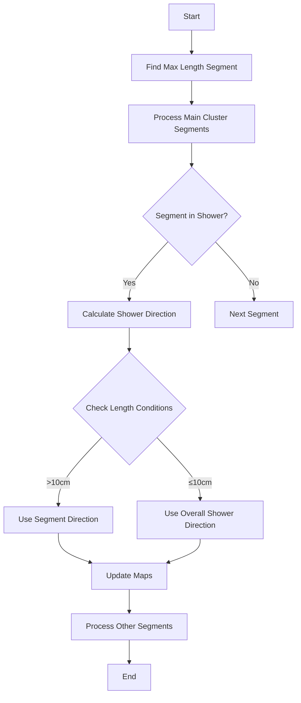

# Understanding shower_clustering_with_nv_from_main_cluster Function

## Overview

The `shower_clustering_with_nv_from_main_cluster` function is part of the neutrino reconstruction pipeline, specifically handling the clustering of shower-like segments in particle physics detector data. Its main purpose is to identify and group detector segments that belong to the same particle shower, particularly focusing on electromagnetic showers.

## Function Dependencies

### Called Functions

1. **Segment Related Functions:** [ProtoSegment](../protosegment.md)
   - `seg->get_cluster_id()` - Gets the cluster ID for a segment
   - `seg->get_length()` - Gets the length of a segment
   - `seg->get_flag_shower_topology()` - Checks shower topology flags
   - `seg->get_medium_dQ_dx(start, end)` - Gets medium dQ/dx value
   - `seg->cal_dir_3vector(point, distance)` - Calculates direction vector
   - `seg->get_closest_point(point)` - Finds closest point on segment

2. **Shower Related Functions:** [WCshower](../wcshower.md)
   - `shower->get_start_segment()` - Gets initial segment of shower
   - `shower->get_particle_type()` - Gets particle type
   - `shower->get_total_length()` - Gets total length of shower
   - `shower->get_num_segments()` - Gets number of segments
   - `shower->get_start_vertex()` - Gets starting vertex
   - `shower->cal_dir_3vector(point, distance)` - Calculates shower direction
   - `shower->add_segment(segment, vertices)` - Adds segment to shower
   - `shower->get_closest_dis(segment)` - Gets closest distance to segment

3. **Map Updates:** [see details](./update_shower_maps.md)
   - `update_shower_maps()` - Updates shower-related maps

### Internal Maps Used

```cpp
// Class member maps
map_segment_vertices      // Maps segments to vertices
map_segment_in_shower     // Maps segments to their showers
map_vertex_segments       // Maps vertices to segments

// Local maps created
map_shower_dir           // Maps showers to direction vectors
map_shower_angle_offset  // Maps showers to angle offsets
map_shower_length        // Maps showers to lengths (in fallback case)
```

## Main Algorithm Flow



### 3. Direction Calculation Logic

The function employs several criteria to calculate shower directions:

1. **Standard Shower Cases**:
```cpp
if (seg->get_flag_shower_topology() || shower->get_num_segments()>2 || 
    seg->get_medium_dQ_dx(0,100) > 43e3/units::cm * 1.5) {
    if (seg->get_length() > 10*units::cm) {
        TVector3 dir_shower = seg->cal_dir_3vector(/*...*/);
    } else {
        TVector3 dir_shower = shower->cal_dir_3vector(/*...*/);
    }
}
```

2. **Special Cases**:
- Very large showers (>100cm)
- Maximum length segments
- Segments connected to main vertex

### 4. Clustering Algorithm

The clustering phase uses these criteria:

1. **Distance Check**:
```cpp
double min_dis = 1e9;
if (angle/3.1415926*180. < 25 + angle_offset && pair_dis_point.first < 80*units::cm ||
    angle/3.1415926*180 < 12.5 + angle_offset*8/5 && pair_dis_point.first < 130*units::cm ||
    angle/3.1415926*180 < 5 + angle_offset*2 && pair_dis_point.first < 200*units::cm)
```

2. **Angle Criteria**:
- Close segments: < 25° + offset
- Medium distance: < 12.5° + scaled offset
- Far segments: < 5° + doubled offset

## Key Features

1. **Drift Correction**
   - Adjusts for drift effects near 90° to the drift direction
   - Applies angle offsets for better reconstruction

2. **Length-Based Decision Making**
   - Different handling for segments based on length
   - Special treatment for very long (>100cm) showers

3. **Topology Considerations**
   - Uses shower topology flags
   - Considers number of segments in shower
   - Accounts for charge density (dQ/dx)

## Error Handling and Edge Cases

1. **No Direction Found**:
```cpp
if (map_shower_dir.size() == 0) {
    // Falls back to length-based clustering
    std::map<WCPPID::WCShower*, double> map_shower_length;
    // ... alternative clustering logic
}
```

2. **Segment Length Validation**:
```cpp
if (seg1->get_length() > 0.75 * map_shower_length[showers.at(i)]) continue;
```

## Output and Results

The function updates several data structures:
1. Shower-segment associations
2. Shower directions
3. Cluster memberships

The results are used for:
- Particle identification
- Energy reconstruction
- Event topology analysis

## Performance Considerations

1. **Computational Efficiency**:
   - Uses maps for O(1) lookups
   - Caches calculated directions
   - Minimizes recalculations

2. **Memory Management**:
   - Stores only necessary vectors
   - Uses references where possible

## Example Usage

```cpp
// Example reconstruction workflow
WCPPID::NeutrinoID neutrino_id(/*...*/);
neutrino_id.shower_clustering_with_nv_from_main_cluster();
// Results available in internal maps and structures
```