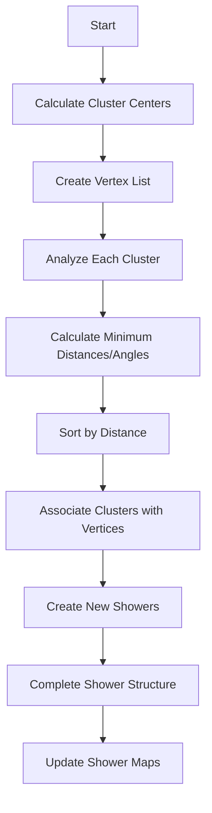

# Understanding shower_clustering_with_nv_from_vertices Function

## Overview

The `shower_clustering_with_nv_from_vertices` function is part of the neutrino identification system that handles shower clustering in particle physics detectors. Its main purpose is to identify and cluster particle showers by analyzing vertices and segments in the detector.

## Key Components

### 1. Data Structures Used

- `map_cluster_center_point`: Maps clusters to their center point and accumulated length
- `map_cluster_pi`: Maps clusters to their clustering information
- `map_shower_dir`: Maps showers to their direction vectors
- `cluster_point_info`: Structure containing clustering information:
  ```cpp
  struct cluster_point_info {
    WCPPID::PR3DCluster *cluster;
    double min_angle;
    double min_dis;
    Point min_point;
    WCPPID::ProtoVertex *min_vertex;
  };
  ```

### 2. Process Flow



## Detailed Algorithm Steps

### 1. Initial Cluster Analysis
```cpp
for (auto it = other_clusters.begin(); it!=other_clusters.end(); it++) {
    WCPPID::PR3DCluster *cluster = *it;
    double acc_length = 0;
    // Calculate accumulated length for shower-like segments
    // Store center point
}
```

### 2. Vertex Collection
The function collects vertices from:
- Main cluster vertices
- Vertices in existing showers

### 3. Cluster-Vertex Association
For each cluster:
1. Find closest main cluster vertex
2. Calculate angles between shower direction and vertex
3. Associate cluster with vertex if angle < threshold

Example angle calculation:
```cpp
TVector3 v1(result.second.x - vertices.at(i)->get_fit_pt().x,
            result.second.y - vertices.at(i)->get_fit_pt().y,
            result.second.z - vertices.at(i)->get_fit_pt().z);
double angle = v1.Angle(v2)/3.1415926*180.;
```

### 4. Shower Creation

Key thresholds:
- Angle < 30° for close associations (< 80cm)
- Angle < 15° for distant associations (< 120cm)

Shower creation process:
```cpp
WCPPID::WCShower *shower = new WCPPID::WCShower();
shower->set_start_vertex(min_vertex, connection_type);
shower->set_start_segment(sg);
// Set direction and complete structure
```

### 5. Direction Determination

The function uses several methods to determine shower direction:
1. Based on segment direction if length > 10cm
2. Using overall shower direction for shorter segments
3. Special handling for very large showers (>100cm)

```cpp
if (seg->get_length() > 10*units::cm) {
    TVector3 dir_shower = seg->cal_dir_3vector(
        shower->get_start_vertex().first->get_fit_pt(), 
        15*units::cm
    );
} else {
    TVector3 dir_shower = shower->cal_dir_3vector(
        shower->get_start_vertex().first->get_fit_pt(), 
        15*units::cm
    );
}
```

### 6. Clustering Criteria

Key factors in clustering decisions:
- Distance between segments/vertices
- Angle between directions
- Segment length
- Shower topology flags

Example criteria:
```cpp
if ((angle/3.1415926*180.< 25) && pair_dis_point.first < 80*units::cm ||
    (angle/3.1415926*180 < 12.5) && pair_dis_point.first < 120*units::cm) {
    // Associate segments
}
```

## Special Cases

### 1. Long Muons
- Separate handling for segments identified as muons
- Length and topology checks to prevent misidentification

### 2. Vertex Proximity
- Additional checks for vertices close to main vertex
- Modified angle thresholds for close vertices

### 3. Drift Direction
- Special handling for particles moving in drift direction
- Adjusted angle calculations to account for detector geometry

## Output and Updates

The function maintains several important data structures:
1. Shower collection (`showers`)
2. Vertex-shower mapping (`map_vertex_to_shower`)
3. Segment-shower mapping (`map_segment_in_shower`)

These are updated through the `update_shower_maps()` function after clustering.

## Performance Considerations

- Uses point clouds for efficient distance calculations
- Implements early termination for clearly unassociated segments
- Balances between clustering accuracy and computational efficiency

# Function Dependencies

## Key Function Calls

1. **Vertex and Segment Management**
   - `find_other_vertex(ProtoSegment*, ProtoVertex*)`: Finds the other vertex connected to a segment
   - `find_vertices(ProtoSegment*)`: Returns both vertices connected to a segment
   - `get_start_end_vertices(ProtoSegment*)`: Gets the start and end vertices of a segment

2. **Distance and Direction Calculations**
   - `get_closest_point(Point)`: Calculates closest point between geometrical objects
   - `cal_dir_3vector(Point, double)`: Calculates direction vector for a given point and distance
   - `get_closest_dis(ProtoSegment*)`: Gets minimum distance between shower and segment

3. **Shower Construction and Updates** [WCshower](../wcshower.md)
   - `set_start_vertex(ProtoVertex*, int)`: Sets the starting vertex for a shower
   - `set_start_segment(ProtoSegment*)`: Sets the starting segment for a shower
   - `add_segment(ProtoSegment*, map_segment_vertices)`: Adds segments to existing shower
   - `complete_structure_with_start_segment(map_vertex_segments, map_segment_vertices, used_segments)`: Completes shower structure
   - `update_shower_maps()`: Updates all shower-related maps after modifications

4. **Particle Properties** [ProtoSegment](../protosegment.md)
   - `get_particle_type()`: Gets the type of particle associated with a segment
   - `set_particle_type(int)`: Sets the particle type for a segment
   - `get_length()`: Gets the length of a segment
   - `is_dir_weak()`: Checks if direction determination is weak

5. **Map Updates** [see details](./update_shower_maps.md)
   - `update_shower_maps()`: Updates all shower-related maps including:
     - `map_vertex_to_shower`
     - `map_vertex_in_shower`
     - `map_segment_in_shower`
     - `used_shower_clusters`

## Common Challenges

1. **Ambiguous Associations**: When segments could belong to multiple showers
2. **Direction Determination**: Especially for short segments
3. **Boundary Cases**: Handling edges of detector and cluster boundaries