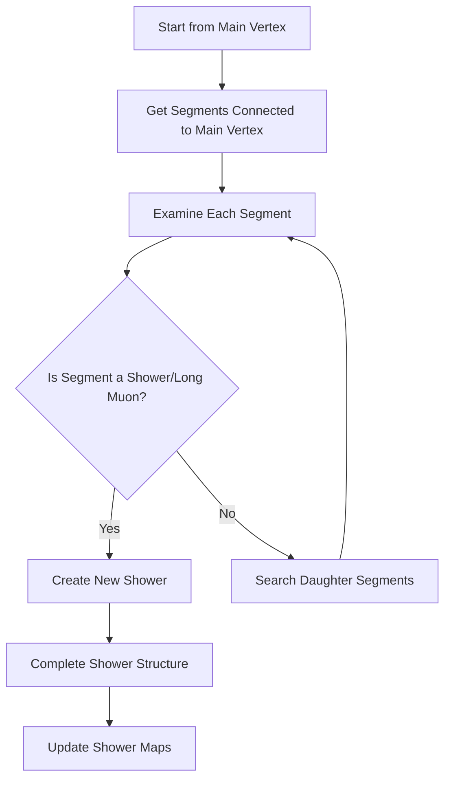

# Understanding shower_clustering_with_nv_in_main_cluster Function

## Overview
The `shower_clustering_with_nv_in_main_cluster` function is responsible for clustering showers in the main cluster of a neutrino interaction. It performs a tree-like search starting from the main vertex to identify and group segments into showers.

## Core Components

### 1. Data Structures Used
- `used_segments`: Set of segments that have been processed
- `segments_to_be_examined`: Vector of pairs containing:
  - Current segment being examined
  - Daughter vertex of that segment

### 2. Main Algorithm Flow



### 3. Detailed Process Flow

1. **Initialization**
```cpp
std::set<WCPPID::ProtoSegment*> used_segments;
std::vector<std::pair<WCPPID::ProtoSegment*, WCPPID::ProtoVertex*>> segments_to_be_examined;
```

2. **Initial Segment Collection**
```cpp
// Collect segments connected to main vertex
for (auto it = map_vertex_segments[main_vertex].begin(); 
     it != map_vertex_segments[main_vertex].end(); it++) {
    WCPPID::ProtoVertex *other_vertex = find_other_vertex(*it, main_vertex);
    segments_to_be_examined.push_back(std::make_pair(*it, other_vertex));
}
```

3. **Main Processing Loop**
```cpp
while(segments_to_be_examined.size() > 0) {
    std::vector<std::pair<WCPPID::ProtoSegment*, WCPPID::ProtoVertex*>> temp_segments;
    
    for (auto it = segments_to_be_examined.begin(); 
         it != segments_to_be_examined.end(); it++) {
        // Process each segment
        // Add to used_segments
        // Either create shower or continue searching
    }
    
    segments_to_be_examined = temp_segments;
}
```

## Key Decision Points

### 1. Shower/Long Muon Detection
The function checks if a segment is either:
- A shower segment (`get_flag_shower()`)
- Part of a long muon track (`segments_in_long_muon`)

```cpp
if (curr_sg->get_flag_shower() || 
    segments_in_long_muon.find(curr_sg) != segments_in_long_muon.end()) {
    // Create new shower
}
```

### 2. Shower Creation
When a shower segment is identified:
1. Creates new WCShower object
2. Sets starting vertex and segment
3. Adds to shower collection
4. Handles both EM showers and muon tracks differently

```cpp
WCPPID::WCShower *shower = new WCPPID::WCShower();
shower->set_start_vertex(parent_vtx, 1);
shower->set_start_segment(curr_sg);
```

### 3. Post-Processing
After shower identification:
1. Completes shower structures
2. Converts certain long muon showers to EM showers based on specific criteria
3. Updates shower maps

## Long Muon to EM Shower Conversion

The function includes logic to convert long muon tracks to EM showers based on these criteria:
- Number of non-muon segments ≥ 2 × number of muon segments
- Total length of non-muon segments > 33% of muon segments length
- At least one muon segment exists
- Maximum muon length < 60cm

```cpp
if (n_others >= 2 * n_muons && 
    length_others > 0.33 * length_muons && 
    n_muons > 0 && 
    max_muon_length < 60*units::cm) {
    // Convert to EM shower
}
```

## Example Processing Flow

Consider this example structure:
```
Main Vertex
├── Segment1 (Shower)
│   └── Creates Shower1
├── Segment2 (Track)
│   ├── Segment3 (Track)
│   └── Segment4 (Shower)
│       └── Creates Shower2
└── Segment5 (Long Muon)
    └── Creates Shower3 (potentially converted to EM)
```

## Important Considerations

1. **Memory Management**
   - Creates new shower objects dynamically
   - Requires proper cleanup in destructor

2. **Vertex Relationships**
   - Maintains parent-daughter relationships
   - Tracks vertex connections through segments

3. **Map Updates**
   - Updates various maps after shower creation
   - Maintains segment-shower relationships

## Function Output

The function produces:
1. Collection of shower objects
2. Updated segment maps
3. Modified particle type assignments
4. Updated muon/shower classifications

## Function Dependencies

### Direct Function Calls

1. **find_other_vertex(ProtoSegment* sg, ProtoVertex* vtx)**
   - Purpose: Finds the other vertex connected to a segment that isn't the provided vertex
   - Returns: ProtoVertex pointer
   - Usage: Used to find daughter vertices when traversing segments

2. **WCShower::set_start_vertex(ProtoVertex* vtx, int flag)** [WCshower](../wcshower.md)
   - Purpose: Sets the starting vertex of a shower and its connection type
   - Parameters:
     - vtx: Starting vertex
     - flag: Connection type (1 for primary connection)
   - Used when creating new showers

3. **WCShower::set_start_segment(ProtoSegment* sg)**
   - Purpose: Sets the starting segment of a shower
   - Used to establish the initial direction/properties of the shower

4. **WCShower::complete_structure_with_start_segment(map_vertex_segments, map_segment_vertices, used_segments)**
   - Purpose: Builds the complete shower structure from the starting segment
   - Parameters:
     - Vertex-segment maps
     - Set of used segments
   - Performs clustering of related segments

5. **WCShower::cal_dir_3vector(Point pt, float dis)**
   - Purpose: Calculates direction vector at a point
   - Used for determining shower direction

6. **ProtoSegment::set_flag_avoid_muon_check(bool flag)** [ProtoSegment](../protosegment.md)
   - Purpose: Sets flag to avoid checking segment as muon
   - Used during muon-to-shower conversion

7. **ProtoSegment::set_particle_type(int type)**
   - Purpose: Sets the particle type of a segment
   - Used when converting muons to electrons (type 11)

8. **ProtoSegment::set_particle_mass(float mass)**
   - Purpose: Sets the particle mass
   - Used when updating particle properties

9. **Singleton<TPCParams>::Instance()**
   - Purpose: Gets TPC parameters instance
   - Used to access particle mass constants

10. **update_shower_maps()** [see details](./update_shower_maps.md)
    - Purpose: Updates internal shower tracking maps
    - Maps updated:
      - map_vertex_to_shower
      - map_vertex_in_shower
      - map_segment_in_shower
      - used_shower_clusters

### Map Accesses
The function frequently accesses these maps:
- map_vertex_segments
- map_segment_vertices
- segments_in_long_muon
- vertices_in_long_muon
- map_segment_in_shower

## Error Handling

While not explicitly shown in the code, the function handles:
1. Invalid vertex connections
2. Missing segments
3. Incomplete shower structures

## Performance Considerations

1. **Memory Usage**
   - Stores used segments in set for quick lookup
   - Maintains temporary segment lists during processing

2. **Processing Efficiency**
   - Uses breadth-first search approach
   - Avoids reprocessing used segments