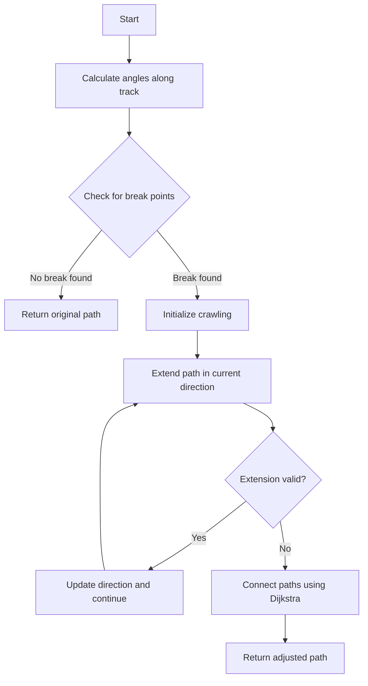
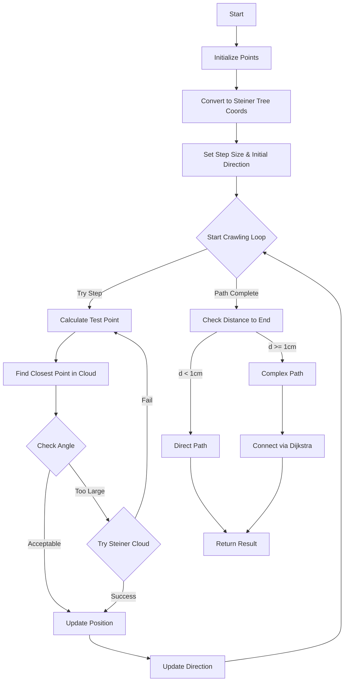

# PR3DCluster Crawl Algorithm Documentation

## Overview 

The PR3DCluster_crawl.h file implements algorithms for path finding and trajectory analysis in 3D point clouds, specifically focused on particle tracking in physics detectors. The main functions handle path crawling, path adjustment, and special trajectory handling.

## Key Functions

### 1. do_rough_path()
This function performs initial path finding between two points in the point cloud.

**Purpose:**
- Creates a rough path between first_wcp (start point) and last_wcp (end point)
- Uses Steiner tree points for path construction

**Algorithm Flow:**
1. Clear existing path points
2. Project input points onto Steiner tree point cloud
3. Calculate shortest path using Dijkstra's algorithm
4. Store path information

```cpp
// Example usage
WCP::WCPointCloud<double>::WCPoint start_point, end_point;
// Initialize points...
pr3d_cluster.do_rough_path(start_point, end_point);
```

### 2. adjust_rough_path()

# PR3DCluster::adjust_rough_path() Documentation

## Overview
The `adjust_rough_path()` function is designed to analyze and potentially adjust a rough 3D track path by identifying potential break points and recalculating the path around these breaks. It uses a combination of angular analysis and charge density information to identify where a track might need adjustment.

## Key Concepts

### 1. Angle Calculation
The function calculates two types of angles along the track:
- Reflection angles (`refl_angles`): Angles between consecutive segments
- Parallel angles (`para_angles`): Angles relative to drift direction

```cpp
// Example of angle calculation
for (int j=0; j!=6; j++) {    
    TVector3 v10(0,0,0);
    TVector3 v20(0,0,0);
    if (i>j)
        v10.SetXYZ(fine_tracking_path.at(i).x - fine_tracking_path.at(i-j-1).x,
                   fine_tracking_path.at(i).y - fine_tracking_path.at(i-j-1).y,
                   fine_tracking_path.at(i).z - fine_tracking_path.at(i-j-1).z);
    
    if (i+j+1<fine_tracking_path.size())
        v20.SetXYZ(fine_tracking_path.at(i+j+1).x - fine_tracking_path.at(i).x,
                   fine_tracking_path.at(i+j+1).y - fine_tracking_path.at(i).y,
                   fine_tracking_path.at(i+j+1).z - fine_tracking_path.at(i).z);
    
    // Calculate angles
    if (j==0) {
        angle1 = v10.Angle(v20)/3.1415926*180.;
        angle2 = std::max(fabs(v10.Angle(drift_dir)/3.1415926*180.-90.),
                         fabs(v20.Angle(drift_dir)/3.1415926*180.-90.));
    }
}
```

### 2. Break Point Detection
The function identifies break points based on three main criteria:
1. Low charge density (dQ/dx)
2. Large reflection angles
3. Significant deviation from drift direction

```cpp
// Example break point detection logic
if (min_dQ_dx < 1000 && para_angles.at(i) > 10 && refl_angles.at(i) > 25) {
    flag_crawl = true;
    save_i = i;
    break;
} else if (para_angles.at(i) > 15 && refl_angles.at(i) > 27 && sum_angles > 12.5) {
    TVector3 v10(fine_tracking_path.at(i).x - fine_tracking_path.front().x,
                 fine_tracking_path.at(i).y - fine_tracking_path.front().y,
                 fine_tracking_path.at(i).z - fine_tracking_path.front().z);
    TVector3 v20(fine_tracking_path.back().x - fine_tracking_path.at(i).x,
                 fine_tracking_path.back().y - fine_tracking_path.at(i).y,
                 fine_tracking_path.back().z - fine_tracking_path.at(i).z);
    double angle3 = v10.Angle(v20)/3.1415926*180.;
    if (angle3 < 20) continue;
    
    flag_crawl = true;
    save_i = i;
    break;
}
```

### 3. Path Crawling
Once a break point is identified, the function "crawls" along the track by:
1. Starting from the break point
2. Taking steps in the current direction
3. Looking for valid continuation points
4. Updating the direction based on found points

```cpp
// Example crawling logic
float step_dis = 1*units::cm;
bool flag_continue = true;
while(flag_continue) {
    flag_continue = false;
    for (int i=0; i!=3; i++) {
        test_p.x = curr_wcp.x + dir.X() * step_dis * (i+1);
        test_p.y = curr_wcp.y + dir.Y() * step_dis * (i+1);
        test_p.z = curr_wcp.z + dir.Z() * step_dis * (i+1);
        
        next_wcp = point_cloud->get_closest_wcpoint(test_p);
        TVector3 dir1(next_wcp.x - curr_wcp.x, 
                     next_wcp.y - curr_wcp.y, 
                     next_wcp.z - curr_wcp.z);
        
        if (dir1.Mag()!=0 && dir1.Angle(dir)/3.1415926*180. < 30) {
            flag_continue = true;
            curr_wcp = next_wcp;
            dir = dir1 + dir * 5 * units::cm;
            dir = dir.Unit();
            break;
        }
    }
}
```

## Function Calls
The function makes use of several other methods:

1. `dijkstra_shortest_paths()`
   - Purpose: Finds shortest path between points
   - Used when: Connecting path segments after break points

2. `cal_shortest_path()`
   - Purpose: Calculates specific path between points
   - Used when: Building final adjusted path

3. `point_cloud->get_closest_wcpoint()`
   - Purpose: Finds nearest point in point cloud
   - Used when: Looking for valid continuation points during crawling

4. `point_cloud_steiner->get_closest_wcpoint()`
   - Purpose: Finds nearest point in Steiner tree point cloud
   - Used when: Validating points against Steiner tree representation

## Return Value
The function returns a Point struct containing the final adjusted point where the path was modified. If no adjustment was needed, it returns the original endpoint.

# Logic Flow Diagram



### 3. do_stm_crawl()
# Understanding the do_stm_crawl() Function

The `do_stm_crawl()` function is part of the WCPPID::PR3DCluster class and implements a "crawling" algorithm to trace paths through 3D point clouds. It's primarily used for finding paths between two points while following the structure of detector data.

## Core Functionality

The function takes three main parameters:
- `first_wcp`: Starting point in the point cloud
- `last_wcp`: Target end point 
- `flag_end`: Flag to control path completion behavior

### Main Steps

1. **Initialization**
- Converts input points to the Steiner tree point cloud coordinate system
- Sets up step size (1 cm) and initializes crawling direction using Hough Transform
```cpp
float step_dis = 1*units::cm;
WCP::WCPointCloud<double>::WCPoint curr_wcp = first_wcp;
WCP::WCPointCloud<double>::WCPoint next_wcp = first_wcp;
Point p(first_wcp.x, first_wcp.y, first_wcp.z);
TVector3 dir = VHoughTrans(p, 15*units::cm); // initial direction
```

2. **Main Crawling Loop**
- Iteratively moves through space following the path structure
- Uses both regular point cloud and Steiner point cloud for path finding
- Implements angle checks to ensure smooth path progression

Example of the crawling step:
```cpp
for (int i=0; i!=3; i++){
    // Try to move in current direction
    test_p.x = curr_wcp.x + dir.X() * step_dis * (i+1);
    test_p.y = curr_wcp.y + dir.Y() * step_dis * (i+1);
    test_p.z = curr_wcp.z + dir.Z() * step_dis * (i+1);
    
    // Check both regular and Steiner point clouds
    next_wcp = point_cloud->get_closest_wcpoint(test_p);
    TVector3 dir1(next_wcp.x - curr_wcp.x, 
                 next_wcp.y - curr_wcp.y, 
                 next_wcp.z - curr_wcp.z);
                 
    // Angle checks for path continuity
    if (dir1.Mag()!=0 && (dir1.Angle(dir)/3.1415926*180. < 30 || 
       (special_drift_angle_condition))) {
        curr_wcp = next_wcp;
        dir = dir1 + dir * 5 * units::cm; // momentum trick
        dir = dir.Unit();
        break;
    }
}
```

3. **Path Completion**
- After reaching an end point, connects start to end using shortest paths
- Uses Dijkstra's algorithm for optimal path finding
- Handles special cases for distances > 1 cm

## Key Functions Called

1. `point_cloud_steiner->get_closest_wcpoint()`
   - Finds nearest point in Steiner tree point cloud
   - Used for path snap points

2. `VHoughTrans()`
   - Determines local direction using Hough transform
   - Takes point and search radius as parameters
   - Returns direction vector

3. `dijkstra_shortest_paths()`
   - Implements Dijkstra's algorithm for path finding
   - Used to connect crawled segments

4. `cal_shortest_path()`
   - Reconstructs the actual path from Dijkstra results

## Usage Example

```cpp
// Example usage
WCP::WCPointCloud<double>::WCPoint start_point = {...};
WCP::WCPointCloud<double>::WCPoint end_point = {...};

// Do crawling with default end flag
WCP::Point result = cluster->do_stm_crawl(start_point, end_point);

// Access resulting path through cluster's path_wcps member
for (auto& point : cluster->get_path_wcps()) {
    // Process path points
}
```

## Key Considerations

1. **Angle Thresholds**
   - 30° for normal direction changes
   - Special handling for drift direction (90° ± 10°)

2. **Distance Handling**
   - Basic step size: 1 cm
   - Special case for distances > 1 cm
   - Path refinement for close points

3. **Direction Momentum**
   - Uses a "momentum" trick by adding 5x the current direction
   - Helps maintain path smoothness

# Logic Flow Diagram
