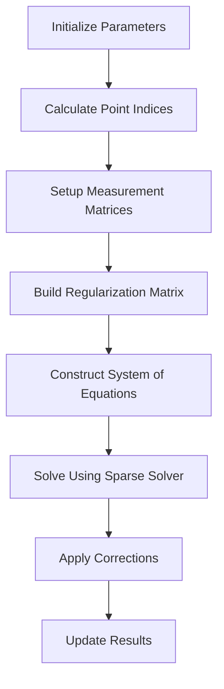

# dQ/dx Multi-Fit Function Documentation

## Overview

The `dQ_dx_multi_fit` function performs charge fitting across multiple 3D track segments in a wire chamber detector. It calculates the charge deposition (dQ/dx) along particle trajectories by fitting measurements from multiple wire planes.

## Function Signature

```cpp
void WCPPID::PR3DCluster::dQ_dx_multi_fit(
    WCPPID::Map_Proto_Vertex_Segments& map_vertex_segments,
    WCPPID::Map_Proto_Segment_Vertices& map_segment_vertices,
    std::map<int,std::map<const WCP::GeomWire*, WCP::SMGCSelection>>& global_wc_map,
    std::map<std::pair<int,int>, std::tuple<double,double,int>>& map_2D_ut_charge,
    std::map<std::pair<int,int>, std::tuple<double,double,int>>& map_2D_vt_charge, 
    std::map<std::pair<int,int>, std::tuple<double,double,int>>& map_2D_wt_charge,
    double flash_time,
    double dis_end_point_ext,
    bool flag_dQ_dx_fit_reg
)
```

## Input Parameters

- `map_vertex_segments`: Maps vertices to connected segments
- `map_segment_vertices`: Maps segments to their endpoint vertices  
- `global_wc_map`: Global wire-cell mapping
- `map_2D_ut_charge`: Charge measurements from U plane
- `map_2D_vt_charge`: Charge measurements from V plane
- `map_2D_wt_charge`: Charge measurements from W plane
- `flash_time`: Time of flash/trigger
- `dis_end_point_ext`: Extension distance for endpoints
- `flag_dQ_dx_fit_reg`: Enable/disable regularization

## Key Function Steps

1. Initialize detector geometry parameters and transformations
2. Calculate indices for each 3D point position along segments
3. Set up measurement matrices for each wire plane
4. Perform regularized least squares fit for charge values
5. Update charge measurements and errors
6. Apply corrections for electron lifetime and field effects

## Logical Flow Diagram



## Example Code

Here is a simplified example showing the key fitting steps:

```cpp
// Setup measurement matrices
Eigen::VectorXd pos_3D(n_3D_pos);
Eigen::VectorXd data_u_2D(n_2D_u), data_v_2D(n_2D_v), data_w_2D(n_2D_w);
Eigen::SparseMatrix<double> RU(n_2D_u, n_3D_pos);
Eigen::SparseMatrix<double> RV(n_2D_v, n_3D_pos);
Eigen::SparseMatrix<double> RW(n_2D_w, n_3D_pos);

// Fill measurement data
for (auto it = map_2D_ut_charge.begin(); it != map_2D_ut_charge.end(); it++) {
    double charge = std::get<0>(it->second);
    double charge_err = std::get<1>(it->second);
    data_u_2D(n_u) = charge/sqrt(pow(charge_err,2) + pow(charge*rel_uncer_ind,2));
    // Fill RU matrix...
}

// Setup regularization 
Eigen::SparseMatrix<double> FMatrix(n_3D_pos, n_3D_pos);
// Fill regularization terms...

// Solve the system
Eigen::BiCGSTAB<Eigen::SparseMatrix<double>> solver;
Eigen::VectorXd b = RUT * MU * data_u_2D + RVT * MV * data_v_2D + RWT * MW * data_w_2D;
Eigen::SparseMatrix<double> A = RUT * MU * RU + RVT * MV * RV + RWT * MW * RW + FMatrixT * FMatrix;
pos_3D = solver.solve(b);
```

## Detailed Algorithm Description

### Overview of the Fitting Process

1. **Point Index Assignment**
   - Each 3D point along segments is assigned a unique index
   - Special handling for segment endpoints that are shared between segments
   - Creates a mapping between 3D points and 2D wire measurements

2. **Measurement Matrix Construction**
   - For each wire plane (U, V, W):
     - Creates sparse matrices mapping 3D points to 2D measurements
     - Includes charge measurements and uncertainties
     - Accounts for wire response functions and drift effects

3. **Regularization Matrix Construction**
   - Builds regularization terms to handle:
     - Dead/noisy channels
     - Wire plane overlaps
     - Track smoothness constraints
   - Uses the cal_compact_matrix_multi function to optimize regularization

4. **Solver Operation**
   - Combines measurement and regularization matrices
   - Solves using BiCGSTAB sparse solver
   - Handles convergence issues with fallback options

5. **Post-Processing**
   - Applies various corrections to fitted charges
   - Updates track segment properties
   - Calculates fit quality metrics

### cal_compact_matrix_multi Function [more details](./track_fitting/cal_compact_matrix_multi.md)

```cpp
std::vector<std::vector<double>> cal_compact_matrix_multi(
    std::vector<std::vector<int>>& connected_vec,
    Eigen::SparseMatrix<double>& MW,
    Eigen::SparseMatrix<double>& RWT,
    int n_2D_w,
    int n_3D_pos,
    double cut_pos = 2
)
```

This function optimizes the regularization matrix by:

1. Analyzing connectivity between 3D points
2. Calculating overlap between wire measurements
3. Building compact representation of regularization terms
4. Handling edge cases near detector boundaries

Key steps:
```cpp
// Initialize data structures
std::vector<int> count_2D(n_2D_w, 1);
std::map<int, std::set<int>> map_2D_3D;
std::map<int, std::set<int>> map_3D_2D;

// Calculate point connectivity
for (int k = 0; k < RWT.outerSize(); ++k) {
    for (Eigen::SparseMatrix<double>::InnerIterator it(RWT,k); it; ++it) {
        map_2D_3D[it.col()].insert(it.row());
        map_3D_2D[it.row()].insert(it.col());
        // Update counts and mappings...
    }
}

// Calculate average counts and scaling factors
std::vector<std::pair<double,int>> ave_count(n_3D_pos);
for (auto it = map_3D_2D.begin(); it != map_3D_2D.end(); it++) {
    // Calculate weighted averages...
    // Determine scaling factors...
}

// Build compact matrix representation
for (auto it = map_3D_2D.begin(); it != map_3D_2D.end(); it++) {
    // Calculate overlaps...
    // Apply scaling...
    // Handle special cases...
}
```

### Fitting Mathematics

The core fitting equation is:

```
(RᵀMR + λFᵀF)x = RᵀMy
```

Where:
- R: Measurement matrices for each plane
- M: Measurement uncertainty weights
- F: Regularization matrix
- λ: Regularization strength
- x: Fitted charge values
- y: Measured charge values

Key parameters affecting the fit:

1. **Charge Uncertainties**
   ```cpp
   double rel_uncer_ind = 0.075;  // Induction plane uncertainty
   double rel_uncer_col = 0.05;   // Collection plane uncertainty
   ```

2. **Drift Effects**
   ```cpp
   double DL = 6.4 * pow(units::cm,2)/units::second;  // Longitudinal diffusion
   double DT = 9.8 * pow(units::cm,2)/units::second;  // Transverse diffusion
   ```

3. **Wire Response**
   ```cpp
   double col_sigma_w_T = 0.188060 * pitch_w * 0.2;  // Collection
   double ind_sigma_u_T = 0.402993 * pitch_u * 0.3;  // Induction U
   double ind_sigma_v_T = 0.402993 * pitch_v * 0.5;  // Induction V
   ```

## Key Functions Called

The function makes use of several supporting functions:

1. `cal_gaus_integral_seg()`: Calculates Gaussian integral for charge spread [more details](./track_fitting/cal_gaus_integral.md)
2. `get_pos_multi()`: Gets 3D position from vertex/segment [more details](./track_fitting/get_pos_multi.md)
3. `examine_point_association()`: Validates point associations [more details](./track_fitting/examine_point_association.md)
4. `form_point_association()`: Creates point-to-wire associations [more details](./track_fitting/form_point_association.md)

## Output

The function updates:

- Charge values (dQ) along track segments
- Path length measurements (dx)
- Reduced chi-square values for fit quality
- Wire plane projections (U,V,W coordinates)

## Important Implementation Details

1. Regularization term helps constrain the solution near dead channels
2. Handles multiple track segments simultaneously 
3. Accounts for:
   - Electron lifetime attenuation
   - Space charge effects
   - Diffusion effects
   - Wire response functions
   - Field non-uniformities

## Error Handling

- Uses BiCGSTAB sparse solver with fallback options
- Validates charge measurements and uncertainties
- Sets minimum thresholds for charges and errors
- Handles dead/noisy channels through regularization

## Performance Considerations

The function uses sparse matrices for efficient memory usage and computation. The main computational cost comes from:

1. Building the measurement matrices
2. Solving the sparse linear system
3. Applying various corrections

Memory usage scales with:
- Number of 3D points (n_3D_pos)
- Number of 2D measurements per plane
- Sparsity of the measurement matrices