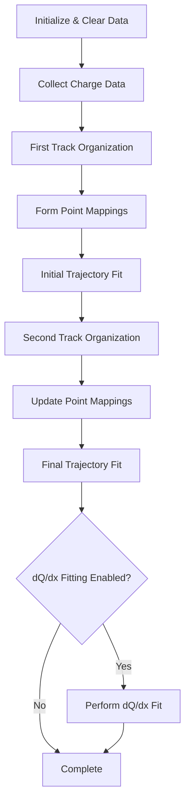

# Multi-Track Fitting Function Documentation

## Overview

The `do_multi_tracking` function is designed to perform trajectory fitting for multiple tracks in a 3D space, specifically for wire chamber detector data. The function handles complex track fitting by working with multiple segments and vertices, incorporating charge data, and performing multiple passes of refinement.

## Function Interface

```cpp
void do_multi_tracking(
    Map_Proto_Vertex_Segments& map_vertex_segments,
    Map_Proto_Segment_Vertices& map_segment_vertices,
    WCP::ToyCTPointCloud& ct_point_cloud,
    std::map<int,std::map<const WCP::GeomWire*, WCP::SMGCSelection>>& global_wc_map,
    double time = 4*units::microsecond,
    bool flag_dQ_dx_fit_reg = true,
    bool flag_dQ_dx_fit = true,
    bool flag_exclusion = false
);
```

### Input Parameters:

- `map_vertex_segments`: Maps vertices to their connected segments
- `map_segment_vertices`: Maps segments to their connected vertices
- `ct_point_cloud`: Point cloud representation of the charge data
- `global_wc_map`: Global wire chamber mapping
- `time`: Time parameter (default 4μs)
- `flag_dQ_dx_fit_reg`: Enable/disable regularization in dQ/dx fitting
- `flag_dQ_dx_fit`: Enable/disable dQ/dx fitting
- `flag_exclusion`: Enable/disable track exclusion logic

### Key Function Calls:

1. `collect_charge_multi_trajectory()` [more details](./track_fitting/collect_charge_multi_trajectory.md)
   - Purpose: Collects charge information along track trajectories
   - Input: Track segment info, point cloud data
   - Output: Charge collection map

2. `organize_segments_path()` [more details](./track_fitting/organize_segments_path.md)
   - Purpose: Organizes track segments into coherent paths
   - Input: Point cloud, vertex/segment maps
   - Output: Organized track segments

3. `form_map_multi_segments()`
   - Purpose: Creates mapping between 2D and 3D points
   - Input: Segment/vertex maps, charge data
   - Output: Various mapping structures

4. `multi_trajectory_fit()`
   - Purpose: Performs the actual trajectory fitting
   - Input: All mapping structures, charge data
   - Output: Fitted trajectory parameters

5. `dQ_dx_multi_fit()` [more details](./PR3DCluster_multi_dQ_dx_fit.md)
   - Purpose: Performs dQ/dx fitting for multiple tracks
   - Input: Segment/vertex maps, charge data
   - Output: dQ/dx values along tracks

## Processing Flow

1. **Initialization Phase**
   ```cpp
   // Clear existing data
   fine_tracking_path.clear();
   dQ.clear();
   dx.clear();
   // ... other clearings

   // Collect charge data
   collect_charge_multi_trajectory(map_segment_vertices, ct_point_cloud);
   ```

2. **First Track Organization**
   ```cpp
   // First round organization
   double low_dis_limit = 1.2*units::cm;
   double end_point_limit = 0.6*units::cm;
   organize_segments_path(ct_point_cloud, map_vertex_segments, 
                         map_segment_vertices, low_dis_limit, end_point_limit);
   ```

3. **Point Association and Mapping**
   ```cpp
   // Create mapping structures
   std::map<int, std::pair<std::set<std::pair<int,int>>, float>> map_3D_2DU_set;
   // ... other mapping structures
   
   form_map_multi_segments(map_vertex_segments, map_segment_vertices, 
                          ct_point_cloud, /* other params */);
   ```

4. **Trajectory Fitting**
   ```cpp
   multi_trajectory_fit(map_vertex_segments, map_segment_vertices,
                       /* mapping structures */);
   ```

5. **Refinement Phase**
   ```cpp
   // Second round with tighter constraints
   low_dis_limit = 0.6*units::cm;
   end_point_limit = 0.3*units::cm;
   organize_segments_path_2nd(/* params */);
   ```

6. **Final dQ/dx Fitting**
   ```cpp
   if (flag_dQ_dx) {
       dQ_dx_multi_fit(map_vertex_segments, map_segment_vertices,
                       global_wc_map, /* other params */);
   }
   ```

## Logic Flow Diagram



## Example Usage

```cpp
// Initialize required structures
Map_Proto_Vertex_Segments vertex_segments;
Map_Proto_Segment_Vertices segment_vertices;
WCP::ToyCTPointCloud ct_cloud;
std::map<int,std::map<const WCP::GeomWire*, WCP::SMGCSelection>> global_map;

// Perform multi-track fitting
cluster.do_multi_tracking(
    vertex_segments,
    segment_vertices,
    ct_cloud,
    global_map,
    4*units::microsecond,  // time
    true,                  // enable regularization
    true,                  // enable dQ/dx fitting
    false                  // disable exclusion
);
```

## Key Algorithms

### Trajectory Organization
- Uses distance-based clustering to organize track points
- Handles both endpoints and intermediate points differently
- Applies regularization to prevent overfitting

### Point Association
- Maps between 2D detector readout and 3D space points
- Handles multiple views (U, V, W planes)
- Incorporates charge information

### Fitting Process
- Iterative fitting with multiple passes
- Progressive refinement of track parameters
- Handles vertex constraints and segment connections

## Output Data

The function populates several class members:
- Track trajectories
- dQ/dx values
- Reduced chi-square values
- Point associations
- Vertex positions
- Segment parameters