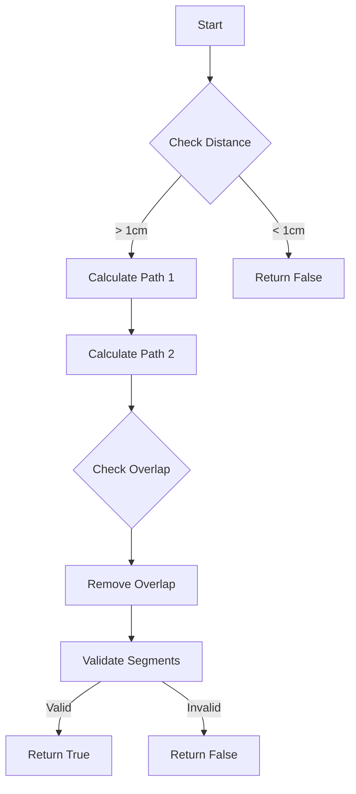
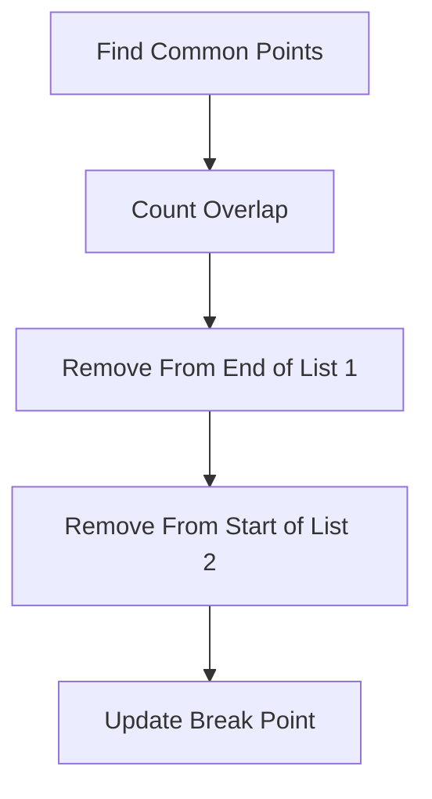
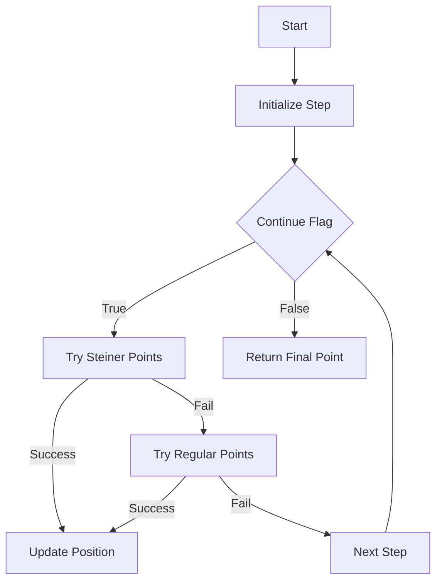
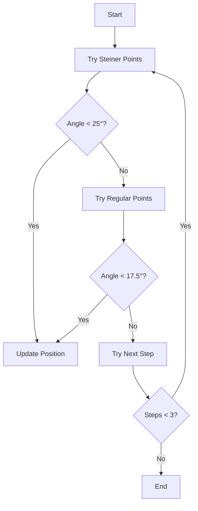
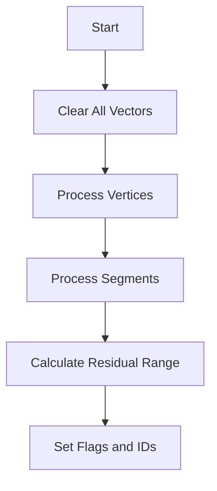

# PR3DCluster Proto Vertex Functions Analysis

## Data Structures

### Internal Data
```cpp
struct PR3DCluster {
    std::vector<Point> fine_tracking_path;     // Track points
    std::vector<double> dQ;                    // Charge deposits
    std::vector<double> dx;                    // Distance steps
    std::vector<double> pu, pv, pw, pt;       // Projections and time
    std::vector<double> reduced_chi2;          // Fit quality
    std::vector<bool> flag_vertex;            // Vertex markers
    std::vector<int> sub_cluster_id;          // Subcluster IDs
    std::vector<bool> flag_shower;            // Shower flags
    std::vector<double> sub_cluster_rr;       // Residual range
};
```

## Function Analysis

### 1. proto_break_tracks Function

**Purpose:** Breaks a track into two segments at a given point.

**Parameters:**
```cpp
bool proto_break_tracks(
    WCPoint& first_wcp,     // Start point
    WCPoint& curr_wcp,      // Break point
    WCPoint& last_wcp,      // End point
    std::list<WCPoint>& wcps_list1,  // First segment points
    std::list<WCPoint>& wcps_list2,  // Second segment points
    bool flag_pass_check    // Skip distance check
);
```

**Flow Diagram:**


**Key Steps:**
1. Checks if break point is far enough from ends
2. Calculates paths using Dijkstra algorithm
3. Removes overlapping points
4. Validates resulting segments

## proto_break_tracks Function - Detailed Algorithm

### Purpose
Splits a track at a specified point while maintaining track connectivity and topology.

### Algorithm Details

1. **Distance Validation**
```cpp
// Initial validation
double dis1 = sqrt(pow(curr_wcp.x-first_wcp.x,2) + ...); // Distance to start
double dis2 = sqrt(pow(curr_wcp.x-last_wcp.x,2) + ...);  // Distance to end
if (dis1 > 1*units::cm && dis2 > 1*units::cm || flag_pass_check) {
    // Proceed with split
} else {
    return false;
}
```

2. **Path Finding Process**
   - First segment calculation:
     ```cpp
     // Find path from start to break point
     dijkstra_shortest_paths(first_wcp, 2);
     cal_shortest_path(curr_wcp, 2);
     wcps_list1 = path_wcps;
     ```
   - Second segment calculation:
     ```cpp
     // Find path from break point to end
     dijkstra_shortest_paths(curr_wcp, 2);
     cal_shortest_path(last_wcp, 2);
     wcps_list2 = path_wcps;
     ```

3. **Overlap Removal**


### Key Thresholds
- Minimum segment length: 1 cm
- Minimum points per segment: 2
- Graph search depth: 2 (parameter in Dijkstra)

### 2. proto_extend_point Function

**Purpose:** Extends a track from a point along a direction.

**Parameters:**
```cpp
WCPoint proto_extend_point(
    Point& p,           // Starting point
    TVector3& dir,      // Direction
    TVector3& dir_other, // Alternate direction
    bool flag_continue  // Continue extension flag
);
```

**Algorithm:**
```cpp
// Simplified extension logic
while(flag_continue) {
    for(step = 1; step <= 3; step++) {
        // Try extending in steiner cloud
        test_point = current + dir * step;
        if(angle < 25°) {
            update_position();
            continue;
        }
        
        // Try extending in regular cloud
        if(angle < 17.5°) {
            update_position();
            continue;
        }
    }
}
```

**Flow Diagram:**


## proto_extend_point Function - Detailed Algorithm

### Purpose
Extends a track from a given point along a direction while maintaining physical constraints.

### Extension Algorithm

1. **Initialization**
```cpp
float step_dis = 1*units::cm;
WCPoint curr_wcp = point_cloud_steiner->get_closest_wcpoint(p);
WCPoint saved_start_wcp = curr_wcp;
TVector3 saved_dir = dir;
```

2. **Progressive Extension**


3. **Point Selection Rules**
```cpp
// For Steiner cloud points
if (dir2.Angle(dir)/3.1415926*180. < 25) {
    // Accept point
    dir = dir2 + dir * 5 * units::cm;  // Momentum-based direction update
}

// For regular cloud points
if (dir1.Angle(dir)/3.1415926*180. < 17.5) {
    // Accept point with stricter angle
}
```

### Angle Thresholds
- Steiner points: < 25 degrees
- Regular points: < 17.5 degrees
- Step sizes: 1-3 cm increments

### 3. set_fit_parameters Functions

#### 3.1 For Single Vertex
**Purpose:** Sets tracking parameters for a single vertex.

```cpp
void set_fit_parameters(ProtoVertex* vtx) {
    if (vtx->get_cluster_id() == cluster_id) {
        fine_tracking_path.push_back(vtx->get_fit_pt());
        // Add other parameters...
    }
}
```

#### 3.2 For Vertex-Segment Maps
**Purpose:** Sets parameters for entire vertex-segment structure.

**Flow:**


#### 3.3 For Individual Segments
**Purpose:** Sets parameters for a single segment with connectivity information.

**Key Features:**
1. Adds segment points to tracking path
2. Calculates residual range vector
3. Handles direction flags
4. Sets connectivity information

**Data Flow Example:**
```cpp
// Example of parameter setting
void segment_parameter_example() {
    // Track points
    fine_tracking_path.insert(end(), seg->points.begin(), seg->points.end());
    
    // Calculate residual range
    std::vector<double> rr(pts.size());
    if(seg->flag_dir == 1) {
        // Forward direction calculation
        for(int i = 0; i < pts.size(); i++) {
            rr[pts.size()-1-i] = total_length - lengths[pts.size()-1-i];
        }
    }
    
    // Set connectivity flags
    if(start_n > 1) rr.front() = -1;  // Multiple connections at start
    if(end_n > 1) rr.back() = -1;     // Multiple connections at end
}
```

## set_fit_parameters Functions - Detailed Algorithms

### 1. Single Vertex Parameter Setting

**Detailed Process:**
```cpp
void set_fit_parameters(ProtoVertex* vtx) {
    if (vtx->get_cluster_id() == cluster_id) {
        // Track geometry
        fine_tracking_path.push_back(vtx->get_fit_pt());
        
        // Charge and distance
        dQ.push_back(vtx->get_dQ());
        dx.push_back(vtx->get_dx());
        
        // Wire projections
        pu.push_back(vtx->get_pu());
        pv.push_back(vtx->get_pv());
        pw.push_back(vtx->get_pw());
        
        // Time and quality
        pt.push_back(vtx->get_pt());
        reduced_chi2.push_back(vtx->get_reduced_chi2());
        
        // Topology markers
        sub_cluster_rr.push_back(-1);
        flag_vertex.push_back(true);
        sub_cluster_id.push_back(-1);
        flag_shower.push_back(false);
    }
}
```

### 2. Vertex-Segment Map Processing

**Algorithm Steps:**
1. **Vector Initialization**
   ```cpp
   // Clear all tracking vectors
   fine_tracking_path.clear();
   dQ.clear();
   // ... clear other vectors
   ```

2. **Vertex Processing**
   ```cpp
   // Process each vertex in map
   for (auto it = map_vertex_segments.begin(); 
        it != map_vertex_segments.end(); it++) {
       set_fit_parameters(it->first);
   }
   ```

3. **Segment Processing with Connectivity**
   ```cpp
   // Process each segment
   for (auto it = map_segment_vertices.begin(); 
        it != map_segment_vertices.end(); it++) {
       // Find start/end vertices
       ProtoVertex *start_v = find_start_vertex(it);
       ProtoVertex *end_v = find_end_vertex(it);
       
       // Get connectivity
       int start_n = map_vertex_segments[start_v].size();
       int end_n = map_vertex_segments[end_v].size();
       
       // Set parameters with connectivity info
       set_fit_parameters(it->first, start_n, end_n);
   }
   ```

### 3. Residual Range Calculation

**Detailed Algorithm:**
```cpp
// Calculate residual range for segment
void calculate_residual_range(ProtoSegment* seg) {
    // 1. Calculate cumulative lengths
    std::vector<double> L(pts.size(), 0);
    double acc_length = 0;
    for (size_t i = 0; i + 1 < pts.size(); i++) {
        acc_length += point_distance(pts[i], pts[i+1]);
        L[i+1] = acc_length;
    }
    
    // 2. Calculate residual range based on direction
    std::vector<double> rr(pts.size());
    if (seg->get_flag_dir() == 1) {
        // Forward direction
        for (size_t i = 0; i < pts.size(); i++) {
            rr[pts.size()-1-i] = L.back() - L[pts.size()-1-i];
        }
    } else if (seg->get_flag_dir() == -1) {
        // Reverse direction
        rr = L;
    }
    
    // 3. Handle multiple connections
    if (start_n > 1) rr.front() = -1;
    if (end_n > 1) rr.back() = -1;
}
```

## Performance Considerations

1. **Memory Management**
   - Vectors pre-allocated when possible
   - Uses references for large data structures
   - Avoids unnecessary copying

2. **Algorithmic Efficiency**
   - Dijkstra's algorithm for path finding
   - KD-tree for point searches
   - Direct vector access for parameters

3. **Error Handling**
   - Cluster ID validation
   - Distance checks
   - Segment connectivity validation

## Performance Optimizations

### 1. Memory Management
- Pre-allocation of vectors
- Use of references for large data structures
- Efficient container operations

### 2. Algorithm Optimizations
```cpp
// Example of optimized distance calculation
inline double fast_point_distance(const Point& p1, const Point& p2) {
    return sqrt(pow(p1.x-p2.x,2) + pow(p1.y-p2.y,2) + pow(p1.z-p2.z,2));
}

// Example of optimized angle calculation
inline double fast_angle_calculation(const TVector3& v1, const TVector3& v2) {
    return acos(v1.Dot(v2)/(v1.Mag()*v2.Mag()));
}
```

### 3. Critical Parameters
- Distance thresholds: 1 cm for track breaks
- Angle thresholds: 25° and 17.5° for extensions
- Connection counts: Multiple vertex handling
- Step sizes: 1-3 cm for track extension

## Output
- Track parameters including:
  - 3D points (fine_tracking_path)
  - Charge deposits (dQ)
  - Step lengths (dx)
  - Wire projections (pu, pv, pw)
  - Time information (pt)
  - Quality metrics (reduced_chi2)
  - Topology flags (flag_vertex, flag_shower)
  - Organization IDs (sub_cluster_id)
  - Range information (sub_cluster_rr)