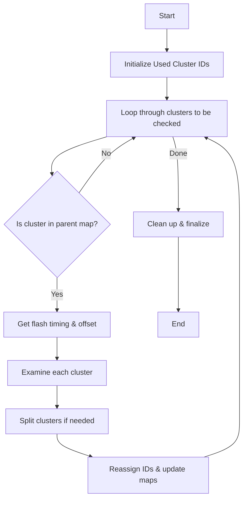

# Protect Over Clustering Documentation

## Overview

The `Protect_Over_Clustering` function is designed to prevent over-clustering in particle track reconstruction. It examines clusters that need to be checked and potentially splits them if they were incorrectly merged, while maintaining proper cluster IDs and parent-child relationships.

## Core Logic Flow



## Key Components

1. **Initialization**
   - Creates set of used cluster IDs
   - Sets up temporary storage for new clusters

2. **Main Processing Loop** 
   - Processes each cluster in `to_be_checked`
   - Examines relationship with optical flash
   - Potentially splits clusters based on topology

3. **Cluster Management**
   - Maintains parent-child relationships
   - Assigns new IDs to split clusters
   - Updates relevant maps and collections

## Function Calls

The function makes calls to several helper functions:

1. `get_next_cluster_id()`
   - Gets next available cluster ID
   - Ensures no ID conflicts

2. `compare_pe_pattern()`
   - Compares photoelectron patterns
   - Used for light-based validation

3. `Examine_graph()` (from PR3DCluster) [more details](./graph/examine_graph.md)
   - Analyzes cluster connectivity
   - Returns potential sub-clusters

## Example Usage

Here's a simplified example of how the function is used:

```cpp
// Initialize clusters and maps
WCPPID::PR3DClusterSelection live_clusters;
std::map<WCPPID::PR3DCluster*, int> map_cluster_parent_id;
std::map<int, std::vector<WCPPID::PR3DCluster*>> map_parentid_clusters;

// Create clusters to check
std::vector<std::pair<int, Opflash*>> to_be_checked;
to_be_checked.push_back(std::make_pair(cluster_id, flash));

// Run protection
WCPPID::Protect_Over_Clustering(
    eventTime,
    to_be_checked,
    live_clusters,
    map_cluster_parent_id,
    map_parentid_clusters,
    ct_point_cloud,
    true,  // flag_match_data
    run_no,
    time_offset,
    nrebin,
    time_slice_width,
    false  // flag_timestamp
);
```

## Detailed Processing Steps

1. **Cluster Examination**
```cpp
// For each cluster to be checked
for (size_t i = 0; i != to_be_checked.size(); i++) {
    int curr_main_cluster_id = to_be_checked.at(i).first;
    auto it = map_parentid_clusters.find(curr_main_cluster_id);
    if (it == map_parentid_clusters.end()) continue;
    
    // Get flash timing info
    WCP::Opflash* flash = to_be_checked.at(i).second;
    double offset_x = (flash->get_time() - time_offset) 
                     * 2./nrebin * time_slice_width;
```

2. **Split Detection**
```cpp
// Examine cluster for potential splits
std::vector<WCP::SMGCSelection> vec_mcells = temp_cluster->Examine_graph(ct_point_cloud);

// Find main cluster component
int max_number_cells = vec_mcells.front().size();
int second_max = 0;
int main_id = 0;
for (size_t j = 1; j < vec_mcells.size(); j++) {
    if (vec_mcells.at(j).size() > max_number_cells) {
        main_id = j;
        second_max = max_number_cells;
        max_number_cells = vec_mcells.at(j).size();
    }
}
```

3. **Cluster Recreation**
```cpp
// Create new cluster with main component
WCPPID::PR3DCluster *new_cluster = new WCPPID::PR3DCluster(curr_main_cluster_id);
for (auto it2 = vec_mcells.at(main_id).begin(); 
     it2 != vec_mcells.at(main_id).end(); it2++) {
    new_cluster->AddCell(*it2, (*it2)->GetTimeSlice());
}

// Add to collections and update maps
temp_live_clusters.push_back(new_cluster);
map_cluster_parent_id[new_cluster] = curr_main_cluster_id;
map_parentid_clusters[curr_main_cluster_id].push_back(new_cluster);
```

## Important Considerations

1. **Memory Management**
   - Function handles deletion of examined clusters
   - Creates new cluster objects as needed

2. **ID Management**
   - Maintains unique cluster IDs
   - Preserves main cluster ID for largest component

3. **Parent-Child Relationships**
   - Updates relationship maps
   - Maintains hierarchy after splitting

4. **Flash Matching**
   - Uses photoelectron patterns for validation
   - Considers timing offsets and detector geometry

## Edge Cases

1. **Small Clusters**
   - Handles clusters with few cells
   - Maintains minimum size thresholds

2. **Complex Topologies**
   - Handles multiple split points
   - Preserves connectivity information

3. **Boundary Cases**
   - Manages clusters at detector boundaries
   - Handles timing edge cases