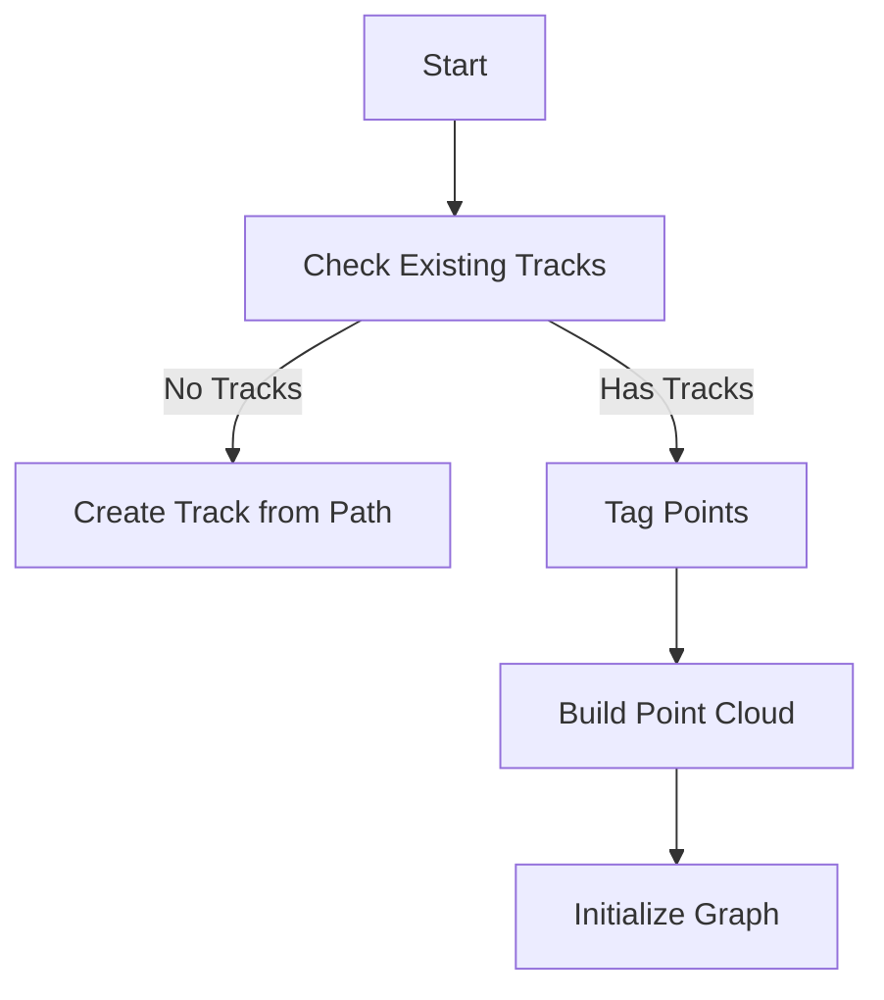
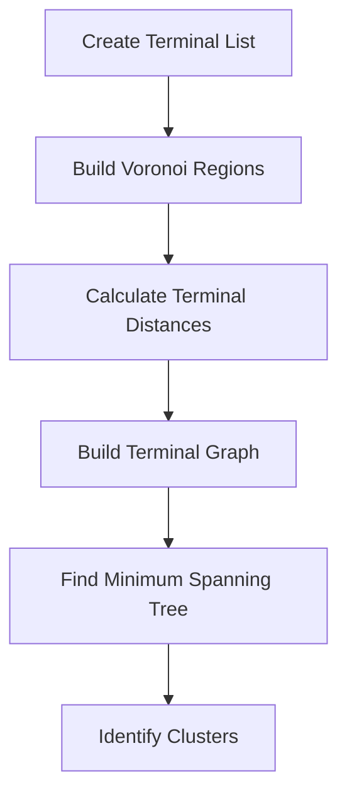

# PR3DCluster::search_other_tracks Function Analysis

## Purpose
Searches for additional tracks in the point cloud that are not part of the main fitted track, using a combination of spatial clustering and graph theory approaches.

## Function Parameters
```cpp
void search_other_tracks(
    WCP::ToyCTPointCloud& ct_point_cloud,           // Point cloud with dead channel info
    std::map<int,std::map<const WCP::GeomWire*, WCP::SMGCSelection>>& global_wc_map,
    double flash_time,                              // Time of flash
    double search_range,                            // 3D search radius
    double scaling_2d                               // 2D projection scaling
);
```

## Key Data Structures

### 1. Track Information
```cpp
struct TrackInfo {
    std::vector<Point> tracking_path;    // 3D points along track
    std::vector<double> dQ;              // Charge deposits
    std::vector<double> dx;              // Distance steps
    std::vector<double> pu, pv, pw, pt;  // Projections in U,V,W views
    double reduced_chi2;                 // Track fit quality
};
```

### 2. Point Cloud and Graph Structures
```cpp
struct ClusterData {
    WCP::WCPointCloud<double> cloud;     // 3D points
    std::vector<bool> flag_tagged;       // Points already assigned
    std::vector<bool> flag_steiner_terminal; // Terminal points
    MCUGraph* graph_steiner;             // Steiner tree graph
};
```

## Algorithm Flow

### 1. Initialization Phase


### 2. Point Tagging Process
```cpp
// Key logic for point tagging
for (size_t i = 0; i < N; i++) {
    Point p = cloud.pts[i];
    // Check 3D distance
    if (closest_distance < search_range) {
        flag_tagged[i] = true;
    }
    // Check 2D projections with dead channel handling
    else if ((close_in_U || dead_in_U) && 
             (close_in_V || dead_in_V) && 
             (close_in_W || dead_in_W)) {
        flag_tagged[i] = true;
    }
}
```

### 3. Terminal Graph Construction


### 4. Cluster Analysis
```python
# Pseudo-code for cluster validation
for each cluster in separate_clusters:
    if not is_tagged(cluster) and size(cluster) > 1:
        if has_sufficient_untagged_points(cluster):
            if meets_distance_criteria(cluster):
                saved_clusters.append(cluster)
```

### 5. Track Fitting Process
For each valid cluster:
1. Find path between terminal points using Dijkstra
2. Collect charge along trajectory
3. Perform tracking with charge information
4. Create new TrackInfo object if successful

## Key Algorithms

### 1. Voronoi Region Construction
```cpp
// Simplified Voronoi construction
void build_voronoi() {
    // Using Dijkstra for nearest terminal computation
    dijkstra_shortest_paths(
        graph_steiner,
        terminals.begin(),
        terminals.end(),
        // ... distance maps and visitors
    );
}
```

### 2. Cluster Validation Rules
1. **Size Check**
   - Must have multiple points
   - Sufficient untagged points (>15% or >4 points)

2. **Distance Criteria**
   ```cpp
   bool is_valid_cluster(Cluster c) {
       return (max_projection_distance > 4 cm in any view
               && total_projection_distance > 7 cm)
           || (untagged_points > 4 
               && untagged_ratio > 0.75);
   }
   ```

## Output
- Updates `fit_tracks` vector with new track objects
- Preserves original track as first element
- Each new track contains:
  - 3D path points
  - Charge deposition (dQ)
  - Path length segments (dx)
  - 2D projections (pu, pv, pw)
  - Time information (pt)
  - Fit quality (reduced_chi2)

## Performance Considerations
1. Uses KD-tree for efficient point searches
2. Graph operations complexity:
   - Dijkstra: O(E log V)
   - MST: O(E log V)
3. Memory usage scales with point cloud size
