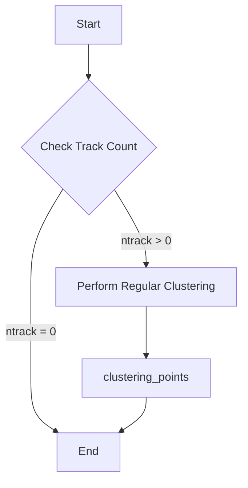
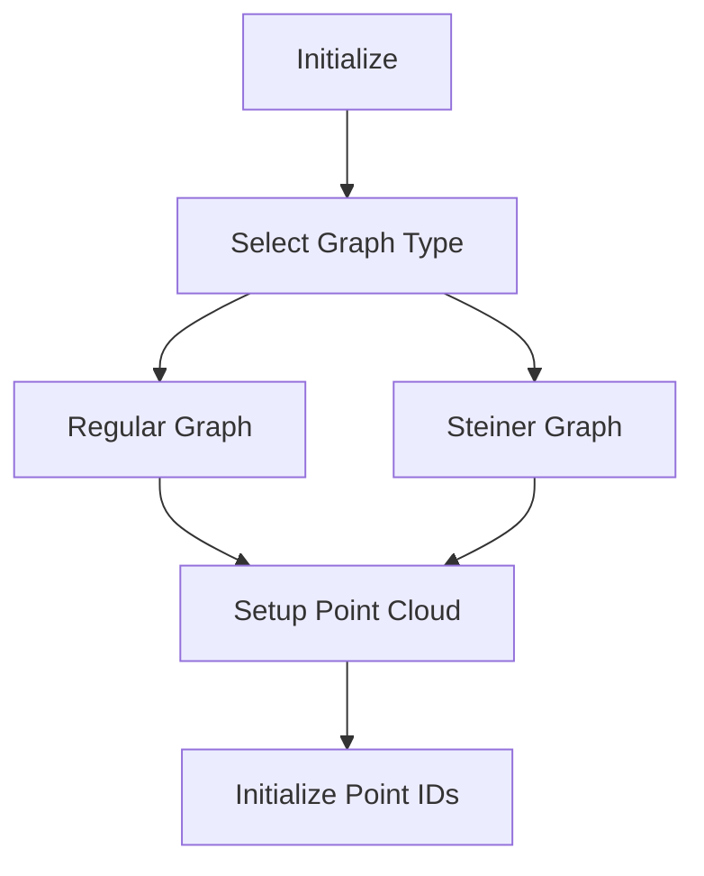
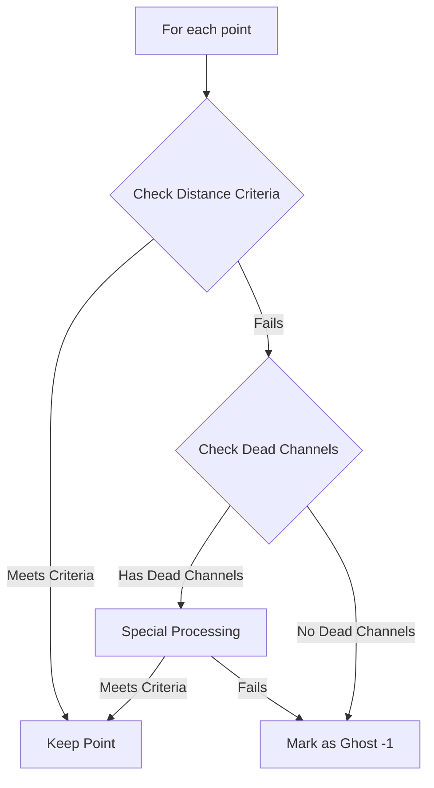

# Point Clustering Functions Analysis

## Data Structures

### Key Internal Data
```cpp
// Point cloud representation
struct WCPointCloud {
    std::vector<Point> pts;  // 3D points
    KDTree* kd_tree;        // For efficient nearest neighbor search
};

// Graph representation
using MCUGraph = boost::adjacency_list<...>;  // Undirected graph
struct GraphData {
    std::vector<int> point_sub_cluster_ids;   // Point-to-segment mapping
    std::vector<Vertex> nearest_terminal;      // Nearest terminal for Voronoi
};

// Segment data
struct ProtoSegment {
    std::vector<Point> point_vec;     // Points forming segment
    int cluster_id;                   // Parent cluster ID
    int id;                          // Segment ID
};
```

## Example Usage Flow

```cpp
// 1. Initialize clustering with segments
void example_clustering() {
    Map_Proto_Vertex_Segments map_vertex_segments;
    Map_Proto_Segment_Vertices map_segment_vertices;
    
    // Create point cloud
    ToyCTPointCloud ct_point_cloud;
    double search_range = 0.5;  // cm
    double scaling_2d = 1.2;    // 2D projection scaling
    
    // Perform clustering
    clustering_points_master(map_vertex_segments, 
                           map_segment_vertices,
                           ct_point_cloud,
                           search_range, 
                           scaling_2d);
}

// 2. Point assignment example
void point_assignment_example() {
    // Get closest segment in 3D
    Point p(x, y, z);
    auto closest_dis_point = main_sg->get_closest_point(p);
    
    // Get 2D projections distances
    auto closest_2d_dis = main_sg->get_closest_2d_dis(p);
    // Returns: tuple<u_dist, v_dist, w_dist>
    
    // Check if point belongs to segment
    bool belongs_to_segment = false;
    if (closest_dis_point.first < search_range ||
        (std::get<0>(closest_2d_dis) < scaling_2d * search_range &&
         std::get<1>(closest_2d_dis) < scaling_2d * search_range &&
         std::get<2>(closest_2d_dis) < scaling_2d * search_range)) {
        belongs_to_segment = true;
    }
}
```

## Algorithm Details

### 1. Voronoi Region Construction
```cpp
// Simplified version of how Voronoi regions are built
void build_voronoi_regions() {
    // 1. Select terminal points from segments
    for (auto segment : segments) {
        if (segment.points.size() > 2) {
            // Use middle points as terminals
            for (int i = 1; i < segment.points.size()-1; i++) {
                terminals.push_back(segment.points[i]);
            }
        } else {
            // Use midpoint as terminal
            Point mid = (segment.points.front() + segment.points.back()) / 2;
            terminals.push_back(mid);
        }
    }
    
    // 2. Build Voronoi regions using Dijkstra
    dijkstra_shortest_paths(graph, 
        terminals.begin(), 
        terminals.end(),
        // ... parameters for distance calculation
    );
}
```

### 2. Point Classification
```cpp
// Simplified point classification logic
bool should_assign_point_to_segment(Point p, ProtoSegment* segment) {
    // Get 3D and 2D distances
    auto d3d = segment->get_closest_point(p);
    auto d2d = segment->get_closest_2d_dis(p);
    
    // Basic distance check
    if (d3d.first < search_range) return true;
    
    // 2D projection checks
    bool close_in_two_views = 
        (std::get<0>(d2d) < scaling_2d * search_range &&
         std::get<1>(d2d) < scaling_2d * search_range) ||
        (std::get<1>(d2d) < scaling_2d * search_range &&
         std::get<2>(d2d) < scaling_2d * search_range) ||
        (std::get<0>(d2d) < scaling_2d * search_range &&
         std::get<2>(d2d) < scaling_2d * search_range);
         
    if (close_in_two_views) return true;
    
    // Dead channel handling
    if (ct_point_cloud.get_closest_dead_chs(p,0)) {
        // Special handling for dead channels
        // ...
    }
    
    return false;
}
```

## Performance Considerations

1. **KD-Tree Usage**
   - Efficient nearest neighbor search
   - O(log n) complexity for point queries
   
2. **Graph Operations**
   - Dijkstra's algorithm: O(E log V)
   - Connected components: O(V + E)

3. **Memory Usage**
   - Point cloud: O(n) where n is number of points
   - Graph: O(V + E) where V is vertices, E is edges
   - Voronoi data: O(V) additional storage

## clustering_points_master Function

### Purpose
Controls the high-level point clustering process for segments in a 3D track.

### Process Flow


### Key Steps
1. Counts segments in current cluster
2. If tracks exist, performs regular clustering (choice=1)

## clustering_points Function

### Purpose
Performs detailed point clustering using Voronoi diagram-based approach.

### Key Components

1. **Initialization**


2. **Segment Terminal Definition**
- Maps points to segments
- For segments with >2 points:
  - Uses middle points as terminals
- For segments with ≤2 points:
  - Uses midpoint as terminal

3. **Voronoi Diagram Construction**
```cpp
// Key steps in Voronoi construction:
1. Create terminal points list
2. Run Dijkstra's algorithm
3. Compute nearest terminal for each point
4. Build Voronoi regions
```

4. **Point Classification Algorithm**


### Distance Criteria Checks
1. **3D Distance Check**
- Compares point to closest segment
- Uses search_range parameter

2. **2D Distance Checks**
- Checks projections in U, V, W views
- Uses scaling_2d * search_range threshold
- Special handling for dead channels

3. **Validation Rules**
```python
Point is valid if any of:
- Closest in all 3 views
- Closest in 2 views with good distance
- Closest in 1 view with good distance in others
- Special cases for dead channels
```

### Output
- Updates point_sub_cluster_ids or point_steiner_sub_cluster_ids
- -1: Ghost/rejected points
- segment_id: Valid points assigned to segments

### Key Parameters
- search_range: 3D distance threshold
- scaling_2d: Multiplier for 2D projections
- Choice: 1 for regular, 2 for steiner graph
