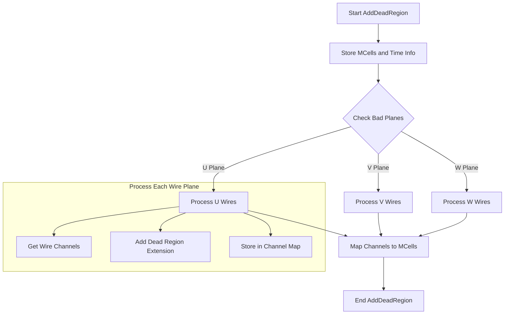

# AddDeadRegion Function Documentation

## Overview

The `AddDeadRegion()` function is part of the WCPPID::ToyFiducial class and is used to register dead/inactive detector regions by mapping merged geometric cells (MCells) to their corresponding time slices and wire channels. This information is used later to determine if reconstruction points fall within dead detector regions.

## Function Signature

```cpp
void AddDeadRegion(WCP::SlimMergeGeomCell* mcell, std::vector<int>& time_slices)
```

### Parameters:
- `mcell`: Pointer to a SlimMergeGeomCell object representing a merged geometric cell
- `time_slices`: Vector of integers representing the time slices when this cell is inactive

## Flow Diagram



## Key Components

1. **Storage of MCells and Time Information**:
```cpp
mcells.push_back(mcell);
int start_time = time_slices.front() - dead_region_ch_ext;
int end_time = time_slices.back() + dead_region_ch_ext;
mcell_time_map[mcell] = std::make_pair(start_time, end_time);
```

2. **Wire Channel Processing**:
```cpp
GeomWireSelection& uwires = mcell->get_uwires();
GeomWireSelection& vwires = mcell->get_vwires();
GeomWireSelection& wwires = mcell->get_wwires();
```

3. **Channel Mapping Example**:
```cpp
// Example for U plane channels
int start_ch = uwires.front()->channel() - dead_region_ch_ext;
if (start_ch < 0) start_ch = 0;
int end_ch = uwires.back()->channel() + dead_region_ch_ext;
if (end_ch >= 2400) end_ch = 2399;

for (int i = start_ch; i <= end_ch; i++) {
    if (ch_mcell_set_map.find(i) == ch_mcell_set_map.end()) {
        std::set<SlimMergeGeomCell*> mcells_set;
        mcells_set.insert(mcell);
        ch_mcell_set_map[i] = mcells_set;
    } else {
        ch_mcell_set_map[i].insert(mcell);
    }
}
```

## Key Data Structures Used

1. **Member Variables**:
- `mcells`: Vector storing all MCells
- `mcell_time_map`: Maps MCells to their time ranges
- `ch_mcell_set_map`: Maps channel numbers to sets of MCells
- `dead_region_ch_ext`: Extension parameter for dead regions

## Function Dependencies

The AddDeadRegion function calls or uses:
1. `WCP::SlimMergeGeomCell` methods:
   - `get_uwires()`
   - `get_vwires()`
   - `get_wwires()`
   - `get_bad_planes()`

2. Standard Library Functions:
   - `std::vector` operations
   - `std::map` operations
   - `std::set` operations
   - `std::find()`

## Example Usage

```cpp
// Create a merged geometric cell and time slices
WCP::SlimMergeGeomCell* mcell = new WCP::SlimMergeGeomCell(...);
std::vector<int> time_slices = {100, 101, 102, 103};

// Add dead region
ToyFiducial fiducial;
fiducial.AddDeadRegion(mcell, time_slices);

// Now the dead region information is stored and can be used
// to check if points fall within dead regions using other methods
// like inside_dead_region()
```

## Main Steps

1. Store the mcell in the internal vector and map its time range
2. Get wire selections for each plane (U, V, W)
3. For each bad plane:
   - Get channel range
   - Apply dead region extension
   - Map channels to the mcell
4. Maintain mappings for later use in dead region checks

## Important Notes

- The function handles three wire planes (U, V, W) with different channel ranges:
  - U plane: 0-2399
  - V plane: 2400-4799
  - W plane: 4800-8255

- Channel ranges are bound-checked to prevent out-of-range values

- Dead regions are extended by `dead_region_ch_ext` in both directions (time and channels)

This information is used by other methods in the class to determine if reconstructed points fall within dead regions of the detector, which is crucial for track reconstruction and analysis.