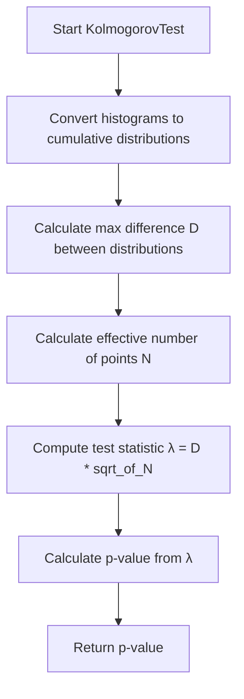

# KolmogorovTest Function Documentation

## Overview

The KolmogorovTest() function is a statistical test implementation used in this codebase to compare two histograms or distributions. It performs the Kolmogorov-Smirnov test, which measures the maximum distance between two cumulative distribution functions to determine if two samples come from the same distribution.

## Main Components

The function appears primarily in the cosmic tagger logic to compare measured and predicted PMT light distributions:

```cpp
// Example usage in the code
double ks_value = h1_meas->KolmogorovTest(h1_pred, "M");
```

## Function Flow



## Function Details

1. **Input Parameters**
   - First histogram (this)
   - Second histogram to compare against
   - Option string ("M" for using histogram contents as is)

2. **Key Steps**

```cpp
// Pseudocode showing main steps
double KolmogorovTest(TH1* h2, Option_t* option) {
    // 1. Convert to cumulative distributions
    vector<double> cumul1 = GetCumulativeDistribution(this);
    vector<double> cumul2 = GetCumulativeDistribution(h2);
    
    // 2. Find maximum difference
    double maxDiff = 0;
    for(int i = 0; i < bins; i++) {
        double diff = abs(cumul1[i] - cumul2[i]);
        maxDiff = max(maxDiff, diff);
    }
    
    // 3. Calculate effective N
    double n1 = this->GetEffectiveEntries();
    double n2 = h2->GetEffectiveEntries();
    double n = (n1 * n2)/(n1 + n2);
    
    // 4. Calculate test statistic
    double lambda = maxDiff * sqrt(n);
    
    // 5. Convert to p-value
    return TMath::KolmogorovProb(lambda);
}
```

## Related Function Calls

The KolmogorovTest function uses several helper functions:

1. `GetEffectiveEntries()`
   - Calculates effective number of entries in histogram accounting for weights

2. `TMath::KolmogorovProb()`
   - Converts test statistic to p-value using Kolmogorov distribution

3. `GetCumulativeDistribution()`
   - Converts histogram into cumulative distribution

## Usage in Cosmic Tagger

In the cosmic tagger code, KolmogorovTest is used to:

1. Compare measured vs predicted PMT light patterns
2. Help identify through-going muons vs contained events
3. Validate flash matching quality

Example from the code:

```cpp
// Create histograms of measured and predicted light
TH1D *h1_meas = new TH1D("h1_meas", "h1_meas", 32, 0, 32);
TH1D *h1_pred = new TH1D("h1_pred", "h1_pred", 32, 0, 32);

// Fill histograms
for(int i=0; i<32; i++) {
    h1_meas->SetBinContent(i+1, flash_pe);
    h1_pred->SetBinContent(i+1, pred_pe);
}

// Perform KS test
double ks_value = h1_meas->KolmogorovTest(h1_pred, "M");

// Use result in cosmic tagging logic
if(ks_value < 0.05) {
    // Distributions are significantly different
    // Handle cosmic muon case
}
```

## Interpretation

- KS test returns a p-value between 0 and 1
- Small p-values (e.g. < 0.05) indicate distributions are significantly different
- Large p-values indicate distributions are compatible
- Used as one component in cosmic muon identification logic

## Notes

- Test is sensitive to both shape and normalization differences
- "M" option uses histogram contents directly without normalization
- Works well for comparing PMT light patterns due to smooth nature of distributions