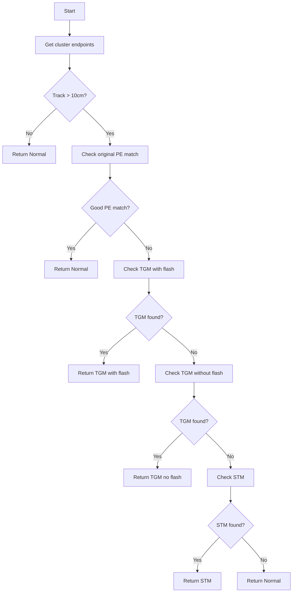

# M2_cosmic_tagger Function Documentation

## Overview
The M2_cosmic_tagger function is a key part of the cosmic ray tagging system. It analyzes clusters of points in a particle detector to identify cosmic rays versus other particle interactions.

## Input Parameters
- `eventTime`: Time of the event
- `flashes`: Collection of optical flashes detected
- `main_cluster`: Primary cluster being analyzed 
- `additional_clusters`: Other nearby clusters
- `main_flash`: Primary flash associated with the cluster
- `bundle_info`: Bundle of info including type, KS test value, chi2, degrees of freedom
- `pl`: Photon library for light yield calculations
- Various timing and geometry parameters

## Return Value
Returns a tuple containing:
- Tag type (0-3):
  - 0: Normal event (not cosmic)
  - 1: Through-going muon (TGM) with flash
  - 2: TGM without flash 
  - 3: Stopping muon (STM) with flash
- The analyzed cluster
- The associated flash

## Key Helper Functions Called
1. [`check_tgm()`](check_tgm.md): Checks if cluster matches through-going muon pattern 
2. [`check_stm()`](check_stm.md): Checks if cluster matches stopping muon pattern 
3. [`inside_fiducial_volume()`](inside_fiducial_volume.md): Checks if point is within detector bounds
4. [`calculate_pred_pe()`](calculate_pred_pe.md): Calculates predicted photoelectron response
5. [`inside1_outside0_SCB()`](inside1_outside0_SCB.md): Boundary checking function
6. [`check_dead_volume()`](check_dead_region.md): Checks for detector dead regions
7. [`check_signal_processing()`](check_signal_processing.md): Verifies signal quality
8. [`check_boundary()`](check_boundary.md): Analyzes cluster boundary points

## Algorithm Flow



## Example Usage

```cpp
// Example setup
PR3DCluster* cluster = new PR3DCluster(1); 
WCP::OpflashSelection flashes;
std::vector<PR3DCluster*> additional_clusters;
WCP::Opflash* main_flash;
std::tuple<int,double,double,int> bundle_info;

// Call cosmic tagger
auto result = M2_cosmic_tagger(
    eventTime,
    flashes, 
    cluster,
    additional_clusters,
    main_flash,
    bundle_info,
    photon_lib,
    time_offset,
    nrebin,
    unit_dis,
    ct_point_cloud,
    run_no,
    subrun_no,
    event_no,
    flag_data,
    global_wc_map
);

// Check result
int tag_type = std::get<0>(result);
if(tag_type == 0) {
    std::cout << "Normal event" << std::endl;
} else if(tag_type == 1) {
    std::cout << "Through-going muon with flash" << std::endl;
} else if(tag_type == 2) {
    std::cout << "Through-going muon without flash" << std::endl;
} else if(tag_type == 3) {
    std::cout << "Stopping muon" << std::endl;
}
```

## Key Algorithm Steps

1. **Initial checks**:
   - Verify track length > 10cm
   - Check original PE matching quality

2. **TGM with flash check**:
   ```cpp
   // Check for TGM pattern with flash
   for(auto flash : flashes) {
       if(flash->get_time() == main_flash->get_time()) continue;
       
       // Calculate offset
       double offset_x = (flash->get_time() - time_offset)*2./nrebin*time_slice_width;
       
       // Check boundaries
       if(check_boundary(extreme_points, offset_x)) {
           // Verify TGM pattern
           if(check_tgm(main_cluster, flash, offset_x, ct_point_cloud)) {
               return {1, main_cluster, flash}; // TGM with flash
           }
       }
   }
   ```

3. **TGM without flash check**:
   ```cpp 
   // Check if could be TGM without associated flash
   double user_offset = M2_offset_YX_x(p0);
   if(!inside_fiducial_volume(p0, user_offset) && 
      !inside_fiducial_volume(p1, user_offset)) {
       if(check_tgm(main_cluster, user_offset, ct_point_cloud)) {
           return {2, main_cluster, nullptr}; // TGM without flash
       }
   }
   ```

4. **STM check**:
   ```cpp
   // Check for stopping muon pattern
   for(auto flash : flashes) {
       double offset_x = calculate_offset(flash);
       if(check_stm(main_cluster, offset_x, ct_point_cloud)) {
           return {3, main_cluster, flash}; // STM with flash
       }
   }
   ```

## Performance Considerations

- Function uses multiple geometric checks to reduce false positives
- Light pattern matching helps confirm cosmic ray identification
- Dead channel and signal quality checks prevent misidentification
- Various thresholds and cuts are tuned based on detector geometry

## Common Issues

1. False positives from:
   - Overlapping tracks
   - Dead channels
   - Edge effects

2. False negatives from:
   - Short tracks
   - Poor light collection
   - Noisy channels

## Best Practices

1. Always verify input cluster quality
2. Check flash timing matches
3. Consider multiple geometric views
4. Account for detector specific effects
5. Validate results with other methods