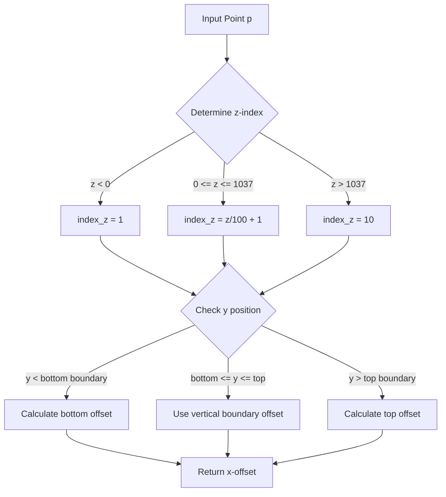

# M2_offset_YX_x Function Analysis

## Purpose
The `M2_offset_YX_x()` function calculates a positional offset in the x-direction based on where a given point intersects with the detector boundaries in the Y-X plane. This is used as part of the fiducial volume calculations in the detector.

## Key Components

### Input
- A `WCP::Point& p` parameter containing (x,y,z) coordinates

### Class Member Variables Used
- `SCB_YX_BOT_y2_array`: Array defining bottom Y boundary positions
- `SCB_YX_TOP_y2_array`: Array defining top Y boundary positions 
- `SCB_YX_BOT_x1_array`, `SCB_YX_BOT_x2_array`: Arrays defining bottom X boundary positions
- `SCB_YX_TOP_x1_array`, `SCB_YX_TOP_x2_array`: Arrays defining top X boundary positions

## Logic Flow



## Implementation Details

The function handles three main regions in the Y-X plane:

1. Bottom Region (y < SCB_YX_BOT_y2_array[index_z])
```cpp
if (eff_y/units::cm < SCB_YX_BOT_y2_array[index_z]/units::cm) {
    double y1 = SCB_YX_BOT_y1_array[index_z];
    double x1 = SCB_YX_BOT_x1_array[index_z];
    double y2 = SCB_YX_BOT_y2_array[index_z]; 
    double x2 = SCB_YX_BOT_x2_array[index_z];
    double xx = (x2-x1)/(y2-y1) * (eff_y-y2) + x2;
    result = eff_x - xx;
}
```

2. Middle Region (between bottom and top boundaries)
```cpp
else if (eff_y/units::cm < SCB_YX_TOP_y2_array[index_z]/units::cm) {
    double xx = SCB_YX_TOP_x2_array[index_z];
    result = eff_x - xx;
}
```

3. Top Region (y > SCB_YX_TOP_y2_array[index_z])
```cpp
else {
    double y1 = SCB_YX_TOP_y1_array[index_z];
    double x1 = SCB_YX_TOP_x1_array[index_z];
    double y2 = SCB_YX_TOP_y2_array[index_z];
    double x2 = SCB_YX_TOP_x2_array[index_z];
    double xx = (x2-x1)/(y2-y1) * (eff_y-y2) + x2;
    result = eff_x - xx;
}
```

## Example Usage

```cpp
// Create a test point
WCP::Point test_point;
test_point.x = 100 * units::cm;
test_point.y = 50 * units::cm;
test_point.z = 500 * units::cm;

// Calculate the x-offset for this point
double x_offset = fid.M2_offset_YX_x(test_point);
```

## Functions Called By M2_offset_YX_x

The function is remarkably self-contained and doesn't directly call other functions. However, it does:

1. Access class member arrays:
   - SCB_YX_BOT_y2_array[]
   - SCB_YX_TOP_y2_array[]
   - SCB_YX_BOT_x1_array[]
   - SCB_YX_BOT_x2_array[]
   - SCB_YX_TOP_x1_array[]
   - SCB_YX_TOP_x2_array[]

2. Use the units::cm constant for unit conversions

## Key Calculations

1. Z-index calculation:
```cpp
index_z = (int)(eff_z/units::cm/100)+1;
```

2. Linear interpolation for boundary positions:
```cpp
xx = (x2-x1)/(y2-y1) * (eff_y-y2) + x2;
```

3. Final offset calculation:
```cpp
result = eff_x - xx;
```

This function is primarily used within the wire-cell reconstruction framework for determining spatial offsets relative to detector boundaries.