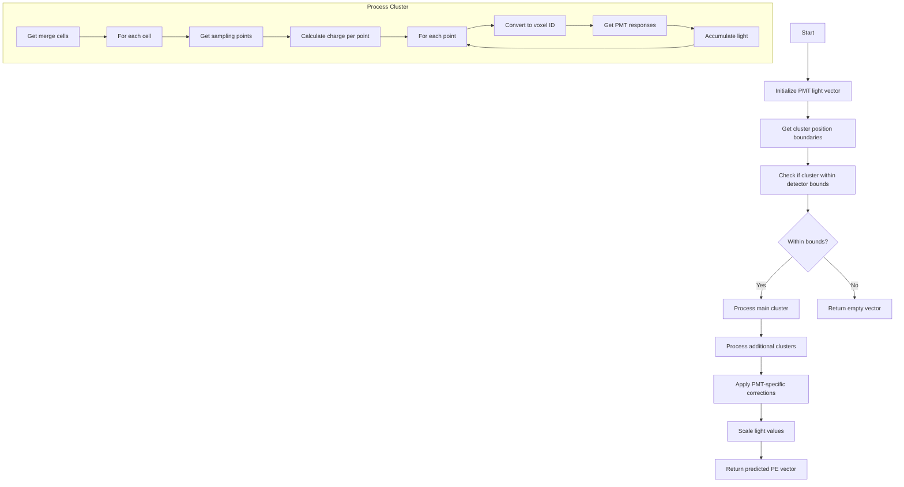

# Calculate Predicted PE Function Analysis

## Overview
The `calculate_pred_pe()` function calculates the predicted photoelectron (PE) response for PMTs in a liquid argon TPC detector. This function is critical for comparing the predicted light pattern from reconstructed 3D clusters with observed flash patterns.

## Function Signature
```cpp
std::vector<double> calculate_pred_pe(
    double eventTime,
    int run_no, 
    double offset_x,
    WCP::Photon_Library *pl,
    WCPPID::PR3DCluster* main_cluster,
    std::vector<WCPPID::PR3DCluster*> additional_clusters,
    WCP::Opflash* flash,
    bool flag_match_data,
    bool flag_timestamp = false
)
```

## Core Logic Flow



## Key Components

### 1. Initialization
```cpp
// Initialize vector for 32 PMTs
std::vector<double> pred_pmt_light(32,0);

// Get scaling factors from photon library
double rel_light_yield_err = pl->rel_light_yield_err;
double scaling_light_mag = pl->scaling_light_mag;
```

### 2. Boundary Checks
The function performs several boundary checks to ensure the cluster is within the detector's active volume:

```cpp
double high_x_cut = 256 * units::cm;
double high_x_cut_ext1 = + 1.2*units::cm;
double high_x_cut_ext2 = - 2.0*units::cm;
double low_x_cut = 0*units::cm;
double low_x_cut_ext1 = - 2*units::cm;
double low_x_cut_ext2 = + 4.0*units::cm;

// Check first and last positions
double first_pos_x = (*((main_cluster->get_time_cells_set_map().begin())->second.begin()))->get_sampling_points().front().x;
double last_pos_x = (*((main_cluster->get_time_cells_set_map().rbegin())->second.begin()))->get_sampling_points().front().x;
```

### 3. Cluster Processing
For each valid cluster:
```cpp
for (auto it4 = mcells.begin(); it4!=mcells.end(); it4++){
    SlimMergeGeomCell *mcell = (*it4);
    if (mcell->get_q()>0){
        PointVector& pts = mcell->get_sampling_points();
        float charge = mcell->get_q()/pts.size();
        
        // Process each point
        for (size_t i=0;i!=pts.size();i++){
            Point p;
            p.x = pts.at(i).x - offset_x;
            p.y = pts.at(i).y;
            p.z = pts.at(i).z;
            
            // Convert to voxel ID and get PMT response
            int voxel_id = convert_xyz_voxel_id(p);
            std::list<std::pair<int,float>>& pmt_list = photon_library->at(voxel_id);
            
            // Accumulate light response
            for (auto it5 = pmt_list.begin(); it5!=pmt_list.end(); it5++){
                pred_pmt_light[(*map_lib_pmt)[it5->first]] += charge * it5->second;
            }
        }
    }
}
```

## Called Functions

1. `convert_xyz_voxel_id(Point& p)`: Converts 3D position to voxel ID
2. `inside_fiducial_volume(Point& p, double offset_x)`: Checks if point is within detector bounds [detailed documentation](./inside_fiducial_volume.md)
3. `get_sampling_points()`: Gets spatial points from merge cells
4. `get_time_cells_set_map()`: Retrieves time-ordered cell map
5. `get_q()`: Gets charge value for a cell

## Key Data Structures Used

1. `std::vector<double>`: Stores predicted PE values for each PMT
2. `WCP::Point`: 3D position representation
3. `SlimMergeGeomCell`: Represents merged detector cells
4. `std::map<int,std::map<const WCP::GeomWire*, WCP::SMGCSelection>>`: Maps time slices to wire selections

## Special Considerations

1. **PMT Veto**: PMT 18 is vetoed for certain run conditions:
```cpp
if (flag_match_data){
    if ((run_no >= 12809 && (!flag_timestamp)) || 
        (flag_timestamp && eventTime >= 1505170407))
        norm_factor[17] = 0;
}
```

2. **Data vs MC**: Different scaling factors are applied depending on whether processing real data or Monte Carlo

3. **Boundary Handling**: Special logic exists for handling cluster boundaries and dead regions

## Return Value

Returns a vector of 32 doubles representing the predicted PE response for each PMT in the detector. Values are scaled and corrected based on detector conditions and calibrations.