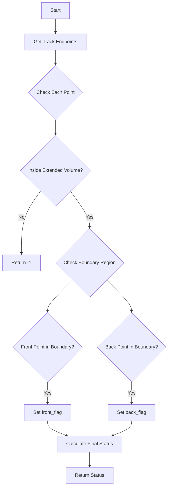

# Understanding the check_boundary() Function

## Overview

The `check_boundary()` function is designed to determine how a track or cluster of points interacts with detector boundaries, accounting for various tolerances. It's particularly used for identifying through-going muons (TGM) and stopping muons (STM) in particle physics detectors.

## Function Signature

```cpp
int check_boundary(std::vector<std::vector<WCPointCloud<double>::WCPoint>> extreme_points, 
                  double offset_x, 
                  std::vector<double>* tol_vec)
```

## Return Values

The function returns an integer that indicates the boundary interaction type:
- `-2`: Short track
- `-1`: Outside boundary
- `0`: Inside boundary
- `1`: STM (Stopping muon)
- `2`: TGM (Through-going muon)

## Core Logic Flow

1. **Input Processing**:
   - Takes extreme points (endpoints) of a track
   - Considers drift offset (offset_x)
   - Applies tolerance vectors for boundary checks

2. **Boundary Check Logic**:
   ```cpp
   bool front_flag = false;
   bool back_flag = false;
   
   // For each set of extreme points
   for(int i=0; i<int(extreme_points.size()); i++) {
       for(int ii=0; ii<int(extreme_points[i].size()); ii++) {
           WCP::Point p(extreme_points[i][ii].x,
                       extreme_points[i][ii].y,
                       extreme_points[i][ii].z);
           
           // Check if point is inside extended fiducial volume
           if(!inside_fiducial_volume(p,offset_x,tol_vec)) {
               return -1;  // Outside boundary
           }
           
           // Check if point is near boundary
           if(!inside_fiducial_volume(p,offset_x,neg_tol_vec)) {
               if(i==0) front_flag = true;
               if(i==1) back_flag = true;
           }
       }
   }
   
   return front_flag + back_flag;  // Returns sum of flags (0, 1, or 2)
   ```

3. **Boundary Categories**:
   - **Extended Fiducial Volume**: Larger volume including tolerance region
   - **Regular Fiducial Volume**: Standard detector volume
   - **Boundary Region**: Area between regular and extended volumes

## Flow Diagram



## Example Usage

```cpp
// Example track points
std::vector<std::vector<WCPointCloud<double>::WCPoint>> track_points;
// ... populate track points ...

// Define tolerances (in cm)
std::vector<double> tolerances = {2.2, 2.8, 2.8, 2.8, 2.8};  // x_ano, x_cat, ybot, ytop, z

// Check boundary status
int boundary_status = check_boundary(track_points, drift_offset, &tolerances);

switch(boundary_status) {
    case -1:
        std::cout << "Track is outside fiducial volume" << std::endl;
        break;
    case 1:
        std::cout << "Potential stopping muon detected" << std::endl;
        break;
    case 2:
        std::cout << "Potential through-going muon detected" << std::endl;
        break;
    default:
        std::cout << "Track is fully contained" << std::endl;
}
```

## Key Implementation Details

1. **Tolerance Handling**:
   ```cpp
   // Creating negative tolerance vector for inner boundary
   std::vector<double> temp_neg_tol_vec = {
       -1*tol_vec->at(0),  // x anode
       -1*tol_vec->at(1),  // x cathode
       -1*tol_vec->at(2),  // y bottom
       -1*tol_vec->at(3),  // y top
       -1*tol_vec->at(4)   // z
   };
   ```

2. **Boundary Region Detection**:
   - Points are checked against both extended and regular volumes
   - A point in the boundary region is outside regular volume but inside extended volume
   - This helps identify tracks that are entering or exiting the detector

3. **Track Classification**:
   - Sum of flags (front_flag + back_flag) determines track type
   - 0: Fully contained
   - 1: One end in boundary (potential STM)
   - 2: Both ends in boundary (potential TGM)

## Common Applications

1. **Cosmic Ray Muon Identification**:
   - TGMs typically enter through top and exit bottom
   - STMs enter detector but stop within fiducial volume

2. **Neutrino Interaction Selection**:
   - Helps eliminate cosmic background
   - Identifies contained events

3. **Detector Volume Studies**:
   - Helps understand edge effects
   - Maps active detector regions

## Optimization Considerations

1. Early termination on invalid tracks
2. Efficient point containment checks
3. Reuse of calculated values
4. Vectorized operations where possible

The function is a critical component in particle track analysis, providing essential information about how particles interact with detector boundaries.