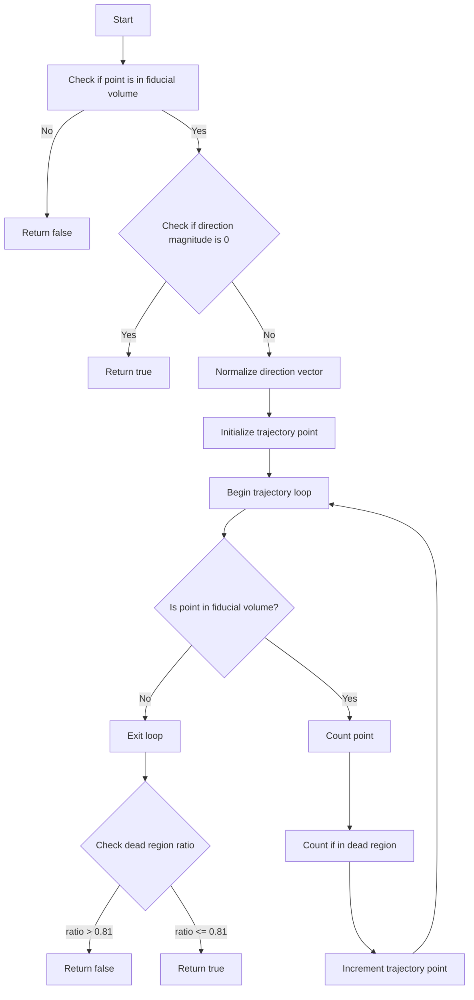

# Understanding the check_dead_region() Function

## Function Signature
```cpp
bool check_dead_volume(WCP::Point& p, TVector3& dir, double step = 1.0*units::cm, double offset_x=0)
```

## Overview

The `check_dead_region()` function is a sophisticated detector analysis tool that examines not just a single point, but rather analyzes a trajectory through the detector volume to determine if it passes through dead regions. The function takes into account:

- Starting point (p)
- Direction vector (dir)
- Step size for trajectory sampling
- X-axis offset for drift time corrections

## Function Logic Flow



## Key Components

1. **Initial Checks**
```cpp
if (!inside_fiducial_volume(p, offset_x)) {
    return false;
}
if (dir.Mag() == 0) {
    return true;
}
```

2. **Trajectory Analysis**
```cpp
dir *= 1./dir.Mag();  // Normalize direction
Point temp_p = p;     // Starting point
int num_points = 0;       // Total points checked
int num_points_dead = 0;  // Points in dead regions

while(inside_fiducial_volume(temp_p, offset_x)) {
    num_points++;
    if (inside_dead_region(temp_p))
        num_points_dead++;
    
    temp_p.x += dir.X() * step;
    temp_p.y += dir.Y() * step;
    temp_p.z += dir.Z() * step;
}
```

3. **Dead Region Ratio Check**
```cpp
if (num_points_dead > 0.81 * num_points) {
    return false;
} else {
    return true;
}
```

## Parameters Explained

### Required Parameters
- `p` (WCP::Point&): The starting point in 3D space
- `dir` (TVector3&): Direction vector indicating trajectory

### Optional Parameters
- `step` (double): Distance between sampling points along trajectory (default: 1.0 cm)
- `offset_x` (double): Drift time correction offset (default: 0)

## Example Usage

```cpp
// Example checking a trajectory
Point start_point(x, y, z);
TVector3 direction(dx, dy, dz);
double step_size = 0.5 * units::cm;
double drift_offset = 10.0;

bool is_clean_path = check_dead_region(start_point, direction, 
                                     step_size, drift_offset);

if (is_clean_path) {
    std::cout << "Trajectory avoids major dead regions" << std::endl;
} else {
    std::cout << "Trajectory passes through significant dead regions" << std::endl;
}
```

## Common Use Cases

1. **Track Quality Assessment**:
```cpp
// Check if track segment passes through dead regions
bool assess_track_segment(Track& track) {
    Point p1 = track.get_start_point();
    TVector3 dir = track.get_direction();
    return check_dead_region(p1, dir);
}
```

2. **Vertex-Direction Analysis**:
```cpp
// Check multiple directions from vertex
bool check_vertex_directions(Point& vertex, 
                           std::vector<TVector3>& directions) {
    for (auto& dir : directions) {
        if (!check_dead_region(vertex, dir)) {
            return false;  // Found problematic direction
        }
    }
    return true;
}
```

3. **Path Planning**:
```cpp
// Check if proposed path is viable
bool validate_path(Point& start, Point& end) {
    TVector3 dir(end.x - start.x, 
                 end.y - start.y, 
                 end.z - start.z);
    return check_dead_region(start, dir);
}
```

## Key Decision Points

1. **Initial Fiducial Volume Check**
- Ensures starting point is within detector bounds
- Returns false if point is outside fiducial volume

2. **Direction Vector Validation**
- Handles zero-magnitude direction vectors
- Normalizes non-zero direction vectors

3. **Trajectory Sampling**
- Steps through space along direction vector
- Accumulates statistics about dead regions

4. **Dead Region Ratio Threshold**
- Uses 0.81 (81%) as critical threshold
- Determines if trajectory passes through too many dead regions

## Implementation Details

1. **Point Sampling**:
```cpp
while(inside_fiducial_volume(temp_p, offset_x)) {
    // Sample current point
    num_points++;
    
    // Check if current point is in dead region
    if (inside_dead_region(temp_p))
        num_points_dead++;
    
    // Move to next point
    temp_p.x += dir.X() * step;
    temp_p.y += dir.Y() * step;
    temp_p.z += dir.Z() * step;
}
```

2. **Ratio Calculation and Decision**:
```cpp
// Calculate ratio of dead points to total points
double dead_ratio = num_points_dead / (double)num_points;

// Make decision based on threshold
return (dead_ratio <= 0.81);
```

## Return Value Interpretation

- `true`: Trajectory is acceptable (less than 81% in dead regions)
- `false`: Trajectory is problematic (more than 81% in dead regions)

## Notes

- The function is essential for track and event reconstruction
- Used to validate particle trajectories and vertex directions
- Critical for understanding detector acceptance
- Part of larger track fitting and reconstruction framework
- The 81% threshold is a tuned parameter based on detector performance