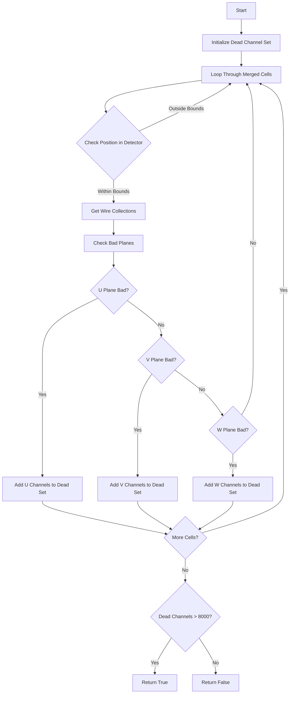

# Understanding check_full_detector_dead() Function

## Overview

The `check_full_detector_dead()` function is designed to detect if a large portion of the detector is "dead" or non-functional by analyzing dead channels across different wire planes. This is important for determining if the detector data is reliable enough for physics analysis.

## Key Components

1. Dead Channel Collection
2. Channel Threshold Analysis 
3. Dead Region Assessment

## Detailed Function Logic

### 1. Dead Channel Collection

The function starts by collecting all dead channels across each wire plane (U, V, W):

```cpp
std::set<int> dead_chs;
for (auto it = mcell_time_map.begin(); it!=mcell_time_map.end(); it++){
    SlimMergeGeomCell *mcell = it->first;
    double start_x = (it->second.first-offset_t)/slope_t;
    double end_x = (it->second.second-offset_t)/slope_t;
    
    // Get wire collections for each plane
    GeomWireSelection& uwires = mcell->get_uwires();
    GeomWireSelection& vwires = mcell->get_vwires();
    GeomWireSelection& wwires = mcell->get_wwires();

    // Skip if outside detector active volume
    if (end_x < -10*units::cm || start_x > 266*units::cm) continue;
```

### 2. Identifying Dead Planes

The function checks each plane for bad/dead regions:

```cpp
std::vector<WirePlaneType_t> bad_planes = mcell->get_bad_planes();

// Check U plane
if (find(bad_planes.begin(), bad_planes.end(), WirePlaneType_t(0))!=bad_planes.end()){
    for (auto it1 = uwires.begin(); it1!=uwires.end(); it1++){
        int ch = (*it1)->channel();
        dead_chs.insert(ch);
    }
}

// Similar checks for V and W planes
```

### 3. Final Assessment

The function makes its determination based on total number of dead channels:

```cpp
if (dead_chs.size()>8000) return true;
return false;
```

## Logic Flow Diagram



## Example Usage

Here's how you might use this function in practice:

```cpp
WCPPID::ToyFiducial detector;
// Initialize detector with necessary parameters...

bool is_detector_dead = detector.check_full_detector_dead();
if (is_detector_dead) {
    std::cout << "Detector has too many dead channels for reliable data!" << std::endl;
    // Handle dead detector case
} else {
    std::cout << "Detector functioning within acceptable parameters" << std::endl;
    // Proceed with normal data processing
}
```

## Threshold Logic

The function uses a threshold of 8000 dead channels as a cutoff point. This number appears to be calibrated based on the detector geometry and physics requirements:

- Total channels: ~8,256 channels
- Threshold: ~8,000 dead channels
- Represents: ~97% of total channels

## Key Points to Remember

1. The function considers a channel "dead" if it's in a bad plane region
2. Position checks ensure only relevant detector regions are considered
3. The 8000 channel threshold is a hard-coded value based on detector specifications
4. All wire planes (U, V, W) are checked independently
5. Uses merge cell geometry to identify problematic regions

## Performance Considerations

The function's performance scales with:
- Number of merged cells
- Number of wires in each plane
- Size of the active detector region

The use of sets for dead channel collection ensures no duplicate counting of channels.