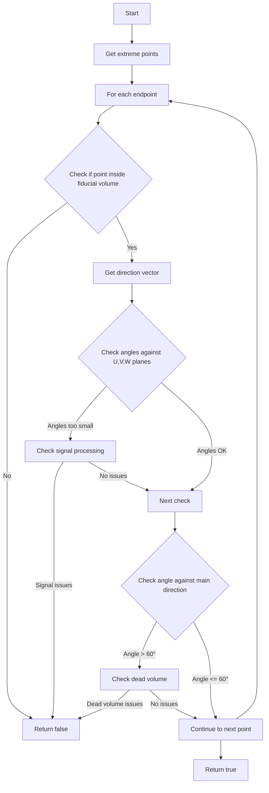

# Understanding check_fully_contained() Function

## Overview
The `check_fully_contained()` function is designed to verify whether a particle track is fully contained within the detector's fiducial volume. It checks if any endpoints of the track are near or crossing detector boundaries, dead regions, or have potential signal processing issues.

## Function Flow


## Core Logic

1. **Endpoint Collection**
   - Gets extreme points of the track using `get_extreme_wcps()`
   - These points represent the track endpoints and key vertices

2. **Boundary Checks**
   - For each endpoint, verifies if it's inside the fiducial volume
   - Uses `inside_fiducial_volume()` to check against detector boundaries

3. **Direction Analysis**
   - Calculates track direction at endpoints using `VHoughTrans()`
   - Checks angles relative to three wire planes (U, V, W)
   - Compares against drift direction

4. **Signal Quality Checks**
   - If angles with wire planes are small (indicating parallel tracks):
     - Checks signal processing quality
     - Verifies against dead regions

## Example Code

Here's a simplified version demonstrating the key concepts:

```cpp
bool check_track_containment(Track* track) {
    // Get track endpoints
    auto endpoints = track->get_extreme_points();
    
    // Check each endpoint
    for (const auto& point : endpoints) {
        // Fiducial volume check
        if (!inside_fiducial_volume(point)) {
            return false;
        }
        
        // Get direction at endpoint
        Vector dir = calculate_direction(point);
        
        // Check angles with wire planes
        double angle_U = calculate_angle(dir, U_PLANE_DIR);
        double angle_V = calculate_angle(dir, V_PLANE_DIR);
        double angle_W = calculate_angle(dir, W_PLANE_DIR);
        
        // Check for problematic angles
        if (angle_U < 10 || angle_V < 10 || angle_W < 5) {
            // Additional signal processing checks
            if (!check_signal_quality(point, dir)) {
                return false;
            }
        }
        
        // Check angle with main track direction
        if (angle_with_main_direction > 60) {
            if (!check_dead_volume(point, dir)) {
                return false;
            }
        }
    }
    
    return true;
}
```

## Key Functions Called

1. **Track Analysis Functions:**
   - `get_extreme_wcps()`: Gets track endpoints
   - `VHoughTrans()`: Calculates track direction
   - `get_PCA_axis()`: Gets principal component axis

2. **Geometry Check Functions:**
   - `inside_fiducial_volume()`: Checks if point is within detector bounds [detailed documentation](./inside_fiducial_volume.md)
   - `check_dead_volume()`: Verifies against dead detector regions [detailed documentation](./check_dead_region.md)

3. **Signal Processing Functions:**
   - `check_signal_processing()`: Validates signal quality [detailed documentation](./check_signal_processing.md)
   - `inside_dead_region()`: Checks if point is in dead region [detailed documentation](./inside_dead_region.md)

4. **Vector/Direction Functions:**
   - `Angle()`: Calculates angles between vectors
   - `Mag()`: Gets vector magnitude

## Common Use Cases

1. **Contained Track**
```cpp
// Track entirely within fiducial volume
// All endpoints pass boundary checks
// No signal processing issues
// Returns: true
```

2. **Escaping Track**
```cpp
// Track endpoint outside fiducial volume
// Or endpoint near boundary with suspicious direction
// Returns: false
```

3. **Track Near Dead Region**
```cpp
// Track near dead region with large angle
// Additional checks for signal quality
// Returns: based on signal processing checks
```

## Important Considerations

1. **Angle Thresholds**
   - < 10° for U, V planes
   - < 5° for W plane
   - 60° threshold for main direction comparison

2. **Dead Region Handling**
   - More stringent checks when track angles > 60°
   - Combines both position and direction information

3. **Signal Processing**
   - Additional checks when track might be parallel to wire planes
   - Helps avoid misidentification due to reconstruction issues