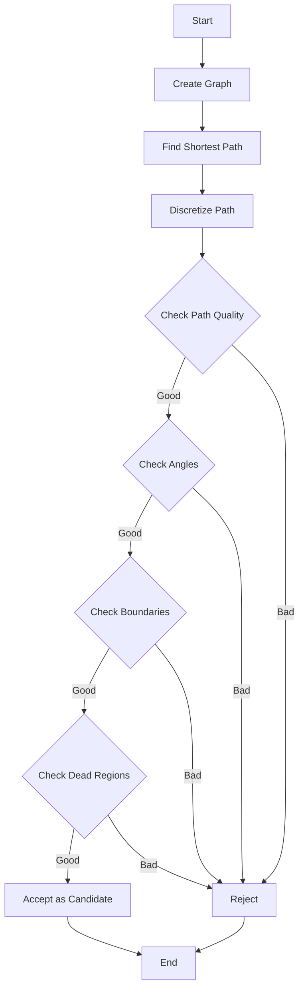

# Understanding check_neutrino_candidate()

## Overview

The `check_neutrino_candidate()` function in WireCell is used to determine whether a cluster of points could represent a neutrino interaction based on its topology and characteristics. The function analyzes the paths between two points in 3D space and checks various properties like track angles, distances, and proximity to dead regions.

## Function Signature

```cpp
bool check_neutrino_candidate(
    WCPPID::PR3DCluster *main_cluster,
    WCP::WCPointCloud<double>::WCPoint& wcp1,
    WCP::WCPointCloud<double>::WCPoint& wcp2, 
    double offset_x,
    WCP::ToyCTPointCloud& ct_point_cloud,
    bool flag_2view_check = false
)
```

## Key Components Called

1. Graph Creation and Path Finding:
```cpp
// Creates Dijkstra graph from cluster points
main_cluster->Create_graph(ct_point_cloud);

// Find shortest path between points using Dijkstra's algorithm
main_cluster->dijkstra_shortest_paths(wcp1);
main_cluster->cal_shortest_path(wcp2);
```

2. Path Analysis Functions:
```cpp
// Checks if point is inside fiducial volume
inside_fiducial_volume(point, offset_x)

// Checks if point is in dead detector region
inside_dead_region(point)

// Analyzes signal processing near point
check_signal_processing(point, direction, ct_point_cloud, step_size, offset_x)

// Checks dead volume around point
check_dead_volume(point, direction, step_size, offset_x)

// Gets direction using Hough transform
main_cluster->VHoughTrans(point, search_distance)
```

## Logic Flow

1. **Path Creation**
   - Creates graph from cluster points
   - Finds shortest path between two points
   - Discretizes path into regular segments

2. **Path Quality Check**
   - Analyzes regular intervals along path
   - Checks signal quality in multiple views
   - Counts number of "bad" points
   - Evaluates path continuity 

3. **Angle Analysis**
   - Calculates angles relative to drift direction
   - Checks angles relative to wire planes
   - Evaluates track straightness

4. **Boundary Conditions**
   - Checks proximity to detector edges
   - Analyzes behavior near dead regions
   - Evaluates points near collection planes

## Example Code Using the Function

```cpp
// Create cluster points
WCP::WCPointCloud<double>::WCPoint start_point, end_point;
start_point.x = 10 * units::cm;
start_point.y = 20 * units::cm; 
start_point.z = 30 * units::cm;

end_point.x = 50 * units::cm;
end_point.y = 60 * units::cm;
end_point.z = 70 * units::cm;

// Check if could be neutrino
bool is_neutrino = check_neutrino_candidate(
    cluster,
    start_point, 
    end_point,
    0.0, // No x offset
    ct_point_cloud,
    true  // Use 2 view check
);

if (is_neutrino) {
    std::cout << "Cluster has neutrino-like features" << std::endl;
} else {
    std::cout << "Cluster rejected as neutrino candidate" << std::endl;
}
```

## Key Parameters

- `main_cluster`: The 3D cluster of points to analyze
- `wcp1, wcp2`: The two points defining the path to check
- `offset_x`: X-position offset for fiducial volume
- `ct_point_cloud`: Point cloud for signal analysis
- `flag_2view_check`: Whether to require signals in 2 views

## Flow Diagram



## Return Value

Returns `true` if the path between the points exhibits characteristics consistent with a neutrino interaction:

- Reasonable track angles
- Good signal quality
- Not obviously cosmic ray
- Appropriate boundary conditions
- Limited dead region effects

Returns `false` if any checks fail, indicating the cluster is likely not from a neutrino interaction.

## Common Uses

1. Cosmic ray rejection
2. Neutrino event selection
3. Track quality assessment
4. Detector boundary analysis

## Additional Functions Called

A complete list of functions called by `check_neutrino_candidate()`:

| Function | Purpose |
|----------|----------|
| `Create_graph()` | Creates graph for path finding |
| `dijkstra_shortest_paths()` | Finds shortest paths |
| `cal_shortest_path()` | Calculates specific path |
| `inside_fiducial_volume()` | Checks detector boundaries |
| `inside_dead_region()` | Checks dead regions |
| `check_signal_processing()` | Analyzes signal quality |
| `check_dead_volume()` | Checks dead volume impacts |
| `VHoughTrans()` | Gets track direction |
| `calc_PCA_dir()` | Principal component analysis |