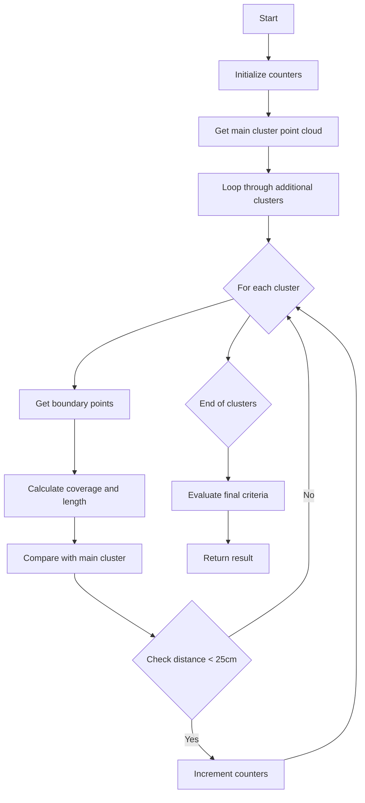

# Analysis of check_other_clusters() Function

## Overview

The `check_other_clusters()` function is part of the WCPPID::ToyFiducial class and is used to analyze relationships between a main cluster and additional clusters in particle tracking data. Its primary purpose is to determine if there are significant neighboring clusters that could indicate specific particle interaction patterns.

## Function Signature

```cpp
bool check_other_clusters(WCPPID::PR3DCluster* main_cluster, 
                         std::vector<WCPPID::PR3DCluster*>& clusters)
```

## Key Components and Logic Flow



## Core Logic Breakdown

1. **Initial Setup**:
   ```cpp
   Int_t ncount = 0;
   Int_t number_clusters = 0;
   Double_t total_length = 0;
   ```

2. **Main Processing Loop**:
   ```cpp
   for (auto it = clusters.begin(); it!=clusters.end(); it++){
     WCPPID::PR3DCluster *cluster = *it;
     
     // Get boundary points
     std::pair<WCP::WCPointCloud<double>::WCPoint,WCP::WCPointCloud<double>::WCPoint> wcps 
         = cluster->get_two_boundary_wcps();
     
     // Calculate coverage and length
     double coverage_x = wcps.first.x - wcps.second.x;
     double length = sqrt(pow(wcps.first.x-wcps.second.x,2) + 
                        pow(wcps.first.y-wcps.second.y,2) + 
                        pow(wcps.first.z-wcps.second.z,2));
     
     // Get closest points between clusters
     std::tuple<int,int,double> results = main_pcloud->get_closest_points(pcloud);
   ```

3. **Decision Criteria**:
   ```cpp
   if (std::get<2>(results) < 25*units::cm && 
       fabs(coverage_x)>0.75*units::cm && 
       length > 5*units::cm) {
     number_clusters ++;
     total_length += length;
   }
   ```

4. **Final Evaluation**:
   ```cpp
   if (number_clusters >0 && 
       (number_clusters/3. + total_length/(35*units::cm)/number_clusters) >=1){
     return true;
   }
   return false;
   ```

## Function Dependencies

The function relies on several other methods and classes:

1. `get_point_cloud()`: Gets point cloud data from cluster
2. `get_closest_points()`: Calculates distances between point clouds
3. `get_two_boundary_wcps()`: Returns boundary points of a cluster

## Example Usage

```cpp
WCPPID::PR3DCluster* main_cluster = /* initialize main cluster */;
std::vector<WCPPID::PR3DCluster*> additional_clusters = /* initialize additional clusters */;

bool has_significant_neighbors = check_other_clusters(main_cluster, additional_clusters);

if (has_significant_neighbors) {
    // Handle case with significant neighboring clusters
} else {
    // Handle case without significant neighboring clusters
}
```

## Key Metrics and Thresholds

- Distance threshold: 25 cm 
- Coverage threshold: 0.75 cm
- Minimum length: 5 cm
- Cluster ratio formula: number_clusters/3. + total_length/(35*cm)/number_clusters >= 1

## Purpose and Significance

The function plays a crucial role in particle tracking by:
1. Identifying nearby cluster patterns
2. Measuring spatial relationships between clusters
3. Determining if the arrangement of clusters matches certain physical patterns

This information helps in distinguishing between different types of particle interactions and tracking scenarios.