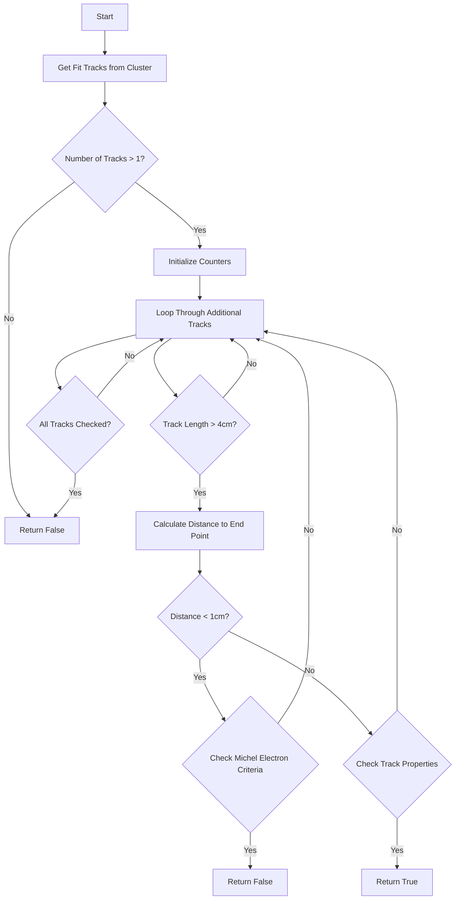

# check_other_tracks() Function Documentation

## Overview

The `check_other_tracks()` function is part of the WCPPID namespace and is used to analyze tracks in a particle detector to identify potential cosmic rays or other background tracks. It examines additional tracks associated with the main cluster to determine if there are any characteristics that would indicate it's not a neutrino interaction.

## Function Signature

```cpp
bool check_other_tracks(WCPPID::PR3DCluster* main_cluster, double offset_x)
```

## Key Components

1. Track Properties Analysis:
   - Examines track length
   - Studies track direction (especially in relation to drift direction)
   - Analyzes charge deposition (dQ/dx)
   - Checks track distances and angles

2. Parameters:
   - `main_cluster`: The primary 3D cluster being analyzed
   - `offset_x`: X-coordinate offset for position calculations
   
## Logic Flow



## Detailed Analysis

### 1. Track Selection
```cpp
WCP::TrackInfoSelection& tracks = main_cluster->get_fit_tracks();
if (tracks.size()<=1) return false;
```
- Function first gets all tracks from the cluster
- Returns false if there is only one track

### 2. Track Analysis
The function examines each additional track for several criteria:

```cpp
double track_length1 = tracks.at(i)->get_track_length()/units::cm;
double track_medium_dQ_dx = tracks.at(i)->get_medium_dQ_dx()*units::cm/50000.;
double track_length_threshold = tracks.at(i)->get_track_length_threshold()/units::cm;
```

Key checks include:
- Track length
- Energy deposition (dQ/dx)
- Distance to cluster endpoints
- Angle relative to drift direction

### 3. Special Cases

#### Michel Electron Detection:
```cpp
if (dis < 1*units::cm && 
    main_cluster->get_fit_tracks().at(i)->get_track_length()>4*units::cm && 
    main_cluster->get_fit_tracks().at(i)->get_medium_dQ_dx()*units::cm/50000 > 0.5)
    return false;
```

#### Long Track Detection:
```cpp
if (dis > 10*units::cm && 
    main_cluster->get_fit_tracks().at(i)->get_track_length() > 4*units::cm)
{
    // Direction analysis
}
```

## Function Dependencies

The function relies on several other methods:

1. From PR3DCluster class:
   - `get_fit_tracks()`
   - `get_tracking_path()`
   - `get_closest_point()`
   - `get_track_length()`
   - `get_medium_dQ_dx()`
   - `get_track_length_threshold()`

2. From TrackInfo class:
   - `get_tracking_path()`
   - `get_track_length()`
   - `get_medium_dQ_dx()`

## Example Usage

```cpp
WCPPID::PR3DCluster* cluster = /* initialize cluster */;
double offset = 0.0;

bool has_other_tracks = check_other_tracks(cluster, offset);
if (has_other_tracks) {
    // Handle case where additional significant tracks are found
    // This might indicate cosmic ray or other background
} else {
    // Proceed with neutrino interaction analysis
}
```

## Return Value

- Returns `true` if significant additional tracks are found that suggest the cluster is not a neutrino interaction
- Returns `false` if no significant additional tracks are found or if the tracks match expected patterns for neutrino interactions

## Key Thresholds

- Track length > 4 cm for consideration
- Distance threshold of 1 cm for Michel electron check
- Distance threshold of 10 cm for long track analysis
- dQ/dx threshold of 0.5 for Michel electron identification
- Angle threshold of 20° for track direction analysis