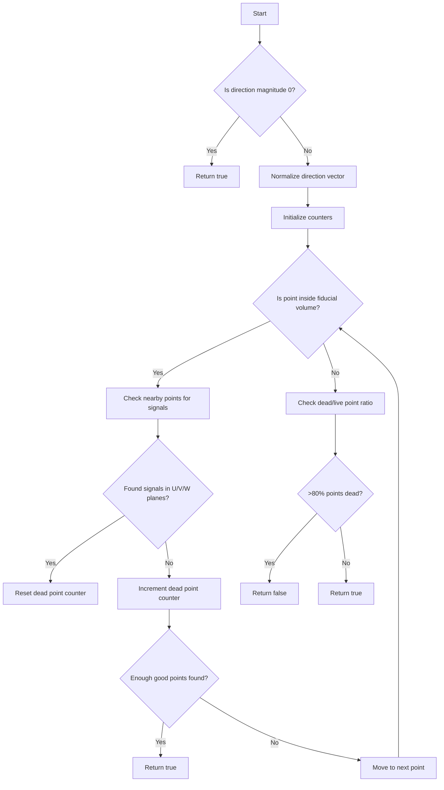

# Understanding the check_signal_processing() Function

## Overview
The `check_signal_processing()` function is designed to verify if a point in a 3D space has valid signal processing by checking nearby points for signal presence in the detector channels. It's particularly useful in particle tracking applications to determine if a track's trajectory passes through regions with valid detector signals.

## Function Signature
```cpp
bool check_signal_processing(
    WCP::Point& p,           // Input point to check
    TVector3& dir,           // Direction vector
    WCP::ToyCTPointCloud& ct_point_cloud,  // Point cloud containing detector signals
    double step,             // Step size for checking points
    double offset_x          // X-coordinate offset
)
```

## Logic Flow



## Detailed Explanation

1. **Initial Direction Check**
   ```cpp
   if (dir.Mag()==0) {
       return true;
   }
   ```
   - If the direction vector has zero magnitude, return true (considered valid)
   - Otherwise, normalize the direction vector

2. **Point Checking Loop**
   ```cpp
   Point temp_p = p;
   int num_points = 0;
   int num_points_dead = 0;
   
   while(inside_fiducial_volume(temp_p,offset_x)) {
       num_points++;
       // Check for signals...
   }
   ```
   - Starts at initial point and moves in direction vector
   - Counts total points checked and points without signals

3. **Signal Detection**
   ```cpp
   WCP::CTPointCloud<double> cloud_u = ct_point_cloud.get_closest_points(temp_p, 1.2*units::cm, 0);
   WCP::CTPointCloud<double> cloud_v = ct_point_cloud.get_closest_points(temp_p, 1.2*units::cm, 1);
   WCP::CTPointCloud<double> cloud_w = ct_point_cloud.get_closest_points(temp_p, 1.2*units::cm, 2);
   ```
   - Checks for signals in all three wire planes (U, V, W)
   - Search radius is 1.2 cm around point
   - Point considered "dead" if no signals found in any plane

4. **Early Exit Condition**
   ```cpp
   if (num_points - num_points_dead >= 5) {
       return true;
   }
   ```
   - If 5 or more points with signals are found, return true
   - This indicates sufficient signal coverage

5. **Final Evaluation**
   ```cpp
   if (num_points_dead > 0.8 * num_points) {
       return false;
   }
   return true;
   ```
   - If more than 80% of points are dead, return false
   - Otherwise, return true

## Example Usage

```cpp
// Example checking if a track point has valid signals
Point track_point(10.0, 20.0, 30.0);
TVector3 track_direction(1.0, 0.0, 0.0);
double step_size = 1.0 * units::cm;
double x_offset = 0.0;

bool has_valid_signals = check_signal_processing(
    track_point,
    track_direction, 
    detector_point_cloud,
    step_size,
    x_offset
);
```

## Key Considerations

1. **Fiducial Volume**: Points must be within the detector's fiducial volume
2. **Signal Coverage**: Requires signals in at least one wire plane
3. **Dead Channel Handling**: Accounts for dead detector channels
4. **Direction Importance**: Uses track direction to check multiple points along trajectory
5. **Threshold Values**: 
   - 80% dead point threshold
   - 5 good points minimum requirement
   - 1.2 cm signal search radius

## Common Use Cases

1. **Track Validation**
   - Verifying if reconstructed particle tracks have detector signals
   - Identifying track segments in dead regions

2. **Boundary Detection**
   - Finding where tracks enter/exit active detector regions
   - Identifying tracks near dead channels

3. **Quality Assurance**
   - Validating reconstruction algorithms
   - Checking detector performance