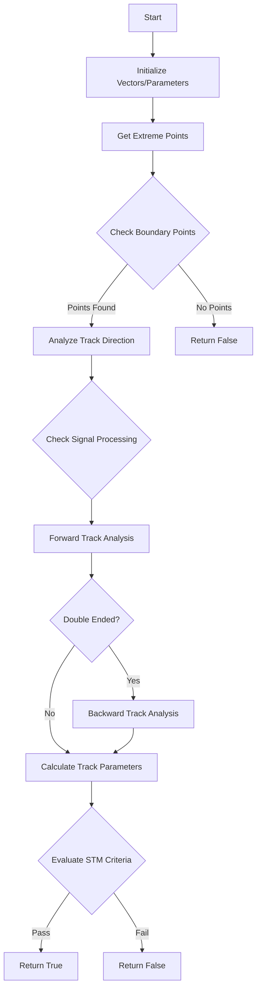

# Analysis of check_stm() Function

## Overview
The `check_stm()` function is designed to identify stopping muons (STM) in a particle detector by analyzing track characteristics and patterns. A stopping muon is a muon that enters the detector and comes to a stop within the fiducial volume.

## Detailed Logic Flow Analysis

### 1. Initialization Phase
```cpp
// Initialize direction vectors
TVector3 drift_dir(1,0,0);
TVector3 U_dir(0,cos(60./180.*3.1415926),sin(60./180.*3.1415926));
TVector3 V_dir(0,cos(60./180.*3.1415926),-sin(60./180.*3.1415926));
TVector3 W_dir(0,1,0);

// Get main cluster direction
Vector main_dir = main_cluster->get_PCA_axis(0);
```

### 2. Point Cloud Validation
- Check if point cloud exists
```cpp
if (main_cluster->get_point_cloud_steiner()->get_cloud().pts.size()==0)
    return false;
```

### 3. First Round Boundary Analysis
#### 3.1 Get Extreme Points
```cpp
wcps = main_cluster->get_two_boundary_wcps(2,true);
out_vec_wcps = main_cluster->get_extreme_wcps();
```

#### 3.2 Boundary Point Analysis
For each point in extreme points:
1. Check if point is outside fiducial volume
2. If inside fiducial volume:
   - Check direction using VHoughTrans
   - Analyze signal processing
   - Check dead volume

```cpp
for (size_t i=0; i!=out_vec_wcps.size(); i++) {
    bool flag_save = false;
    // Point checks
    for (size_t j=0; j!=out_vec_wcps.at(i).size(); j++) {
        if (!inside_fiducial_volume(p1,offset_x)) {
            candidate_exit_wcps.push_back(out_vec_wcps.at(i).at(0));
            flag_save = true;
            break;
        }
    }
    // Direction and volume checks if needed
    if (!flag_save) {
        // Direction checks
        TVector3 dir = main_cluster->VHoughTrans(p1,30*units::cm);
        // Signal processing checks
        if (!check_signal_processing(p1,dir,ct_point_cloud,1*units::cm,offset_x)) {
            flag_save = true;
        }
        // Dead volume checks
        if (!check_dead_volume(p1,dir,1*units::cm,offset_x)) {
            flag_save = true;
        }
    }
}
```

### 4. Track Analysis Setup
#### 4.1 Determine Track Points
```cpp
if (temp_set.size()!=0) {
    // Set first and last points based on boundary analysis
    if (*temp_set.begin()==0) {
        first_wcp = wcps.first;
        last_wcp = wcps.second;
    } else {
        first_wcp = wcps.second;
        last_wcp = wcps.first;
    }
}
```

#### 4.2 Track Path Creation
```cpp
main_cluster->do_rough_path(first_wcp, last_wcp);
main_cluster->collect_charge_trajectory(ct_point_cloud);
main_cluster->do_tracking(ct_point_cloud, global_wc_map, flash_time*units::microsecond, false);
```

### 5. Forward Analysis Phase
#### 5.1 Track Measurement
```cpp
// Get track vectors
WCP::PointVector& pts = main_cluster->get_fine_tracking_path();
std::vector<double>& dQ = main_cluster->get_dQ();
std::vector<double>& dx = main_cluster->get_dx();

// Find kink
int kink_num = find_first_kink(main_cluster);
```

#### 5.2 Length and Charge Calculations
```cpp
double left_L = 0, left_Q = 0;
double exit_L = 0, exit_Q = 0;
// Calculate segment properties
for (size_t i=0; i!=kink_num; i++) {
    exit_L += dx.at(i);
    exit_Q += dQ.at(i);
}
```

### 6. Track Classification Checks
#### 6.1 TGM (Through-Going Muon) Check
```cpp
if ((!inside_fiducial_volume(pts.front(),offset_x)) && 
    (!inside_fiducial_volume(pts.back(),offset_x))) {
    if (exit_L < 3*units::cm || left_L < 3*units::cm) {
        return false;  // TGM identified
    }
}
```

#### 6.2 STM Evaluation
```cpp
if (left_L < 40*units::cm) {
    bool flag_pass = eval_stm(main_cluster, kink_num, 
                            40*units::cm - left_L, 0., 35*units::cm);
    if (flag_pass) {
        // Additional validation
        main_cluster->search_other_tracks();
        if (!detect_proton(main_cluster, kink_num)) 
            return true;  // STM identified
    }
}
```

### 7. Backward Analysis Phase (if double-ended)
- Repeats steps 5-6 in reverse direction
- Only executed if flag_double_end is true
```cpp
if (flag_double_end) {
    main_cluster->do_rough_path(last_wcp, first_wcp);
    // Repeat analysis steps...
}
```

### 8. Final Decision
- Returns true if all criteria are met for STM
- Returns false if:
  - Track is identified as TGM
  - Track fails STM criteria
  - Track has characteristics of other particles
  - Track is in dead/noisy region

## Key Code Examples

### Initial Direction Setup
```cpp
TVector3 drift_dir(1,0,0);
TVector3 U_dir(0,cos(60./180.*3.1415926),sin(60./180.*3.1415926));
TVector3 V_dir(0,cos(60./180.*3.1415926),-sin(60./180.*3.1415926));
TVector3 W_dir(0,1,0);

Vector main_dir = main_cluster->get_PCA_axis(0);
TVector3 dir_main(main_dir.x,main_dir.y,main_dir.z);
```

### Boundary Point Analysis
```cpp
// Get extreme points
wcps = main_cluster->get_two_boundary_wcps(2,true);

// Check boundary conditions
for (size_t i=0; i!=out_vec_wcps.size(); i++) {
    for (size_t j=0; j!=out_vec_wcps.at(i).size(); j++) {
        Point p1(out_vec_wcps.at(i).at(j).x,
                out_vec_wcps.at(i).at(j).y,
                out_vec_wcps.at(i).at(j).z);
        if (!inside_fiducial_volume(p1,offset_x)) {
            candidate_exit_wcps.push_back(out_vec_wcps.at(i).at(0));
            flag_save = true;
            break;
        }
    }
}
```

### Track Analysis
```cpp
// Calculate track lengths and charges
double left_L = 0; 
double left_Q = 0;
double exit_L = 0; 
double exit_Q = 0;
for (size_t i=0; i!=kink_num; i++) {
    exit_L += dx.at(i);
    exit_Q += dQ.at(i);
}
for (size_t i = kink_num; i!=dx.size(); i++) {
    left_L += dx.at(i);
    left_Q += dQ.at(i);
}
```

## Function Dependencies

### Major Functions Called:
1. **Track Analysis Functions**
   - `get_two_boundary_wcps()`
   - `get_extreme_wcps()`
   - `VHoughTrans()`
   - `do_tracking()`
   - `collect_charge_trajectory()`

2. **Geometry Functions**
   - `inside_fiducial_volume()`
   - `check_dead_volume()`
   - `check_signal_processing()`

3. **Pattern Recognition**
   - `find_first_kink()`
   - `eval_stm()`
   - `detect_proton()`
   - `check_other_tracks()`

4. **Cluster Analysis**
   - `get_PCA_axis()`
   - `get_point_cloud_steiner()`

## Flow Diagram



## Detailed STM Criteria

### 1. Track Length Criteria

#### Basic Length Requirements
- **Minimum Track Length**: > 3 cm
  - Ensures sufficient track information for analysis
  - Helps eliminate noise and fragments
- **Maximum Residual Length**: < 40 cm
  - Limits the length of track after stopping point
  - Helps distinguish from through-going muons

#### Length-Based Classifications
```cpp
if (left_L < 40*units::cm) {
    // Short track analysis
    if (flag_fix_end) {
        flag_pass = eval_stm(main_cluster, kink_num, 5*units::cm, 0., 35*units::cm);
    }
} else if (left_L < 20*units::cm) {
    // Very short track analysis
    flag_pass = eval_stm(main_cluster, kink_num, 20*units::cm - left_L, 0., 15*units::cm);
}
```

### 2. Charge Deposition (dQ/dx) Analysis

#### Basic Charge Criteria
- **Minimum dQ/dx**: 1.5 PE/cm
  - Ensures sufficient ionization
  - Helps identify muon-like particles
- **Maximum dQ/dx**: 2.0 PE/cm
  - Upper limit for muon-like tracks
  - Helps distinguish from heavily ionizing particles

#### Charge Pattern Recognition
```cpp
double left_Q = 0;
double exit_Q = 0;
// Calculate charge ratios
double charge_ratio = (left_Q/(left_L/units::cm+1e-9))/50e3;
if (charge_ratio > 2.0 && left_L > 2*units::cm) {
    flag_fix_end = true;
}
```

### 3. Angular Analysis

#### Wire Plane Angular Cuts
- **U/V Wire Planes**: < 10°
  - Ensures good track reconstruction in U/V views
  - Helps eliminate tracks parallel to wire planes
- **W Wire Plane**: < 5°
  - Stricter requirement for collection plane
  - Critical for accurate charge measurement

#### Direction Analysis
```cpp
TVector3 dir_1(0,dir.Y(),dir.Z());
double angle1 = dir_1.Angle(U_dir);
double angle2 = dir_1.Angle(V_dir);
double angle3 = dir_1.Angle(W_dir);

if (angle1_1 < 10 || angle2_1 < 10 || angle3_1 < 5) {
    // Check signal processing
    flag_signal = check_signal_processing(p1,dir,ct_point_cloud,1*units::cm,offset_x);
}
```

### 4. Fiducial Volume Requirements

#### Boundary Conditions
- Track must start outside fiducial volume
- Stopping point must be inside fiducial volume
- Must not be near dead regions

#### Volume Check Implementation
```cpp
bool inside = inside_fiducial_volume(p1,offset_x);
if (!inside) {
    // Check if this is entry point
    candidate_exit_wcps.push_back(wcpoint);
}
```

### 5. Kinematic Features

#### Kink Analysis
- Identifies characteristic muon decay kink
- Analyzes trajectory changes near stopping point
```cpp
int kink_num = find_first_kink(main_cluster);
if (kink_num < pts.size()) {
    // Analyze track segments before/after kink
    analyze_kink_region(kink_num);
}
```

#### Energy Loss Pattern
- Must show characteristic Bragg peak
- Higher ionization near stopping point
- Consistent with muon energy loss profile

### 6. Additional Checks

#### Dead Region Analysis
```cpp
if (fabs((3.1415926/2.-dir.Angle(dir_main))/3.1415926*180.)>60) {
    flag_dead = check_dead_volume(p1,dir,1*units::cm,offset_x);
}
```

#### Multiple Track Checks
- Ensures no other tracks near stopping point
- Checks for Michel electron signature
- Verifies track isolation

The combination of these criteria helps identify true stopping muons while rejecting:
- Through-going muons
- Cosmic rays
- Protons
- Track fragments
- Noise or reconstruction artifacts

## Return Values

The function returns a boolean:
- `true`: Track identified as stopping muon
- `false`: Track does not meet STM criteria

The decision is based on:
1. Track geometry (lengths, angles)
2. Charge deposition patterns
3. Boundary conditions
4. Signal processing checks
5. Dead volume analysis