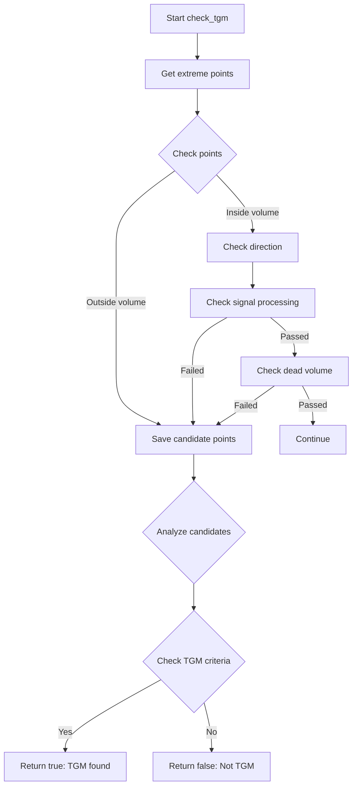
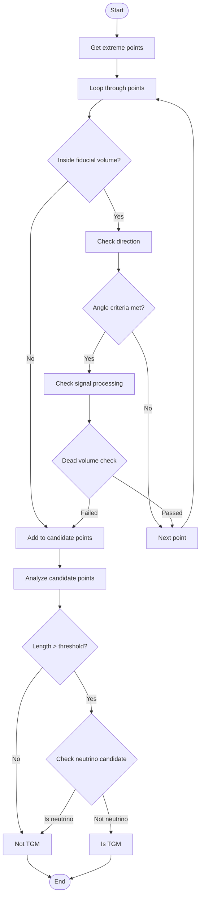

# Through-Going Muon (TGM) Detection Functions Analysis

## Overview
The check_tgm() function is designed to identify through-going muons (TGMs) in particle detector data. TGMs are muons that enter and exit the detector volume, passing completely through it. The function analyzes particle clusters to determine if they exhibit characteristics of a TGM.

## Main Function Dependencies
The check_tgm() function relies on several other functions:

1. `get_extreme_wcps()` - Gets extreme points of the cluster
2. `VHoughTrans()` - Performs Hough transformation on points 
3. `inside_fiducial_volume()` - Checks if points are within detector volume [detailed documentation](./inside_fiducial_volume.md)
4. `check_signal_processing()` - Verifies signal processing quality [detailed documentation](./check_signal_processing.md)
5. `check_dead_volume()` - Checks for dead detector regions [detailed documentation](./check_dead_region.md)
6. `check_neutrino_candidate()` - Evaluates if cluster could be a neutrino [detailed documentation](./check_neutrino_candidate.md)

## Flow Diagram



## Key Logic Steps

1. **Get Extreme Points**
```cpp
std::vector<std::vector<WCPointCloud<double>::WCPoint>> out_vec_wcps = 
    main_cluster->get_extreme_wcps();
```

2. **Point Analysis Loop**
```cpp
for (size_t i=0; i!=out_vec_wcps.size(); i++) {
    bool flag_save = false;
    for (size_t j=0; j!=out_vec_wcps.at(i).size(); j++) {
        Point p1(out_vec_wcps.at(i).at(j).x,
                out_vec_wcps.at(i).at(j).y,
                out_vec_wcps.at(i).at(j).z);
        if (!inside_fiducial_volume(p1,offset_x)) {
            candidate_exit_wcps.push_back(out_vec_wcps.at(i).at(0));
            flag_save = true;
            break;
        }
    }
    // Additional checks...
}
```

3. **Direction Checks**
```cpp
TVector3 dir = main_cluster->VHoughTrans(p1,30*units::cm);
dir *= (-1);

// Check angles with detector planes
TVector3 dir_1(0,dir.Y(),dir.Z());
double angle1 = dir_1.Angle(U_dir);
TVector3 tempV1(fabs(dir.X()), 
                sqrt(dir.Y()*dir.Y()+dir.Z()*dir.Z())*sin(angle1),0);
double angle1_1 = tempV1.Angle(drift_dir)/3.1415926*180.;
```

## TGM Criteria

The function considers a cluster to be a TGM if:

1. The cluster has points that exit the detector volume
2. The path between entry and exit points is reasonably straight
3. The angles relative to detector planes meet specific criteria
4. The points don't indicate a neutrino interaction
5. The length of the track meets minimum requirements

## Example Usage

```cpp
WCPPID::PR3DCluster* cluster = /* ... */;
WCP::Opflash* flash = /* ... */;
double offset_x = /* ... */;
WCP::ToyCTPointCloud& ct_point_cloud = /* ... */;

bool is_tgm = check_tgm(cluster, flash, offset_x, ct_point_cloud);
if (is_tgm) {
    // Handle TGM case
} else {
    // Handle non-TGM case
}
```

## Key Parameters

- `cluster`: The 3D cluster being analyzed
- `flash`: Associated optical flash
- `offset_x`: X-axis offset for time drift
- `ct_point_cloud`: Point cloud for trajectory analysis

## Important Thresholds

- Angle thresholds: 10° for U/V planes, 5° for W plane
- Length threshold: 45% of total cluster length
- Distance thresholds: Various, typically 1-3cm
- Dead volume tolerance: 1cm


# Flow diagram
