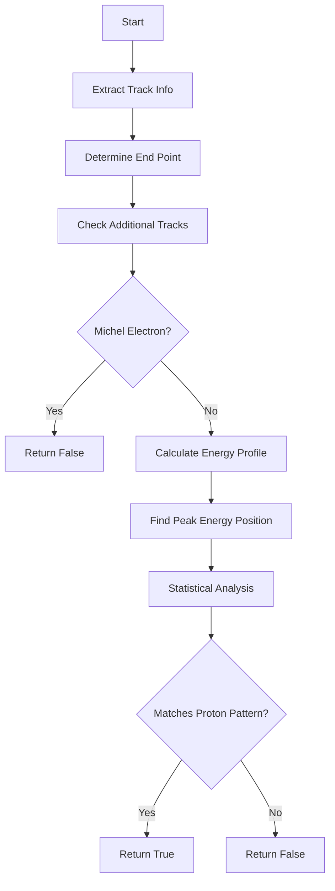

# Proton Detection Function Documentation

## Overview

The `detect_proton()` function is part of a larger particle tracking system and is specifically designed to identify proton tracks in a detector. The function analyzes trajectory and energy deposition patterns to differentiate protons from other particles.

## Function Signature

```cpp
bool detect_proton(WCPPID::PR3DCluster* main_cluster, int kink_num)
```

Parameters:
- `main_cluster`: Contains track information including trajectory points, energy deposits (dQ/dx), etc.
- `kink_num`: Index identifying a point where the track potentially "kinks" or changes direction

## Key Logic

### 1. Track Property Access
The function first extracts key tracking information:
```cpp
WCP::PointVector& pts = main_cluster->get_fine_tracking_path();
std::vector<double>& dQ = main_cluster->get_dQ();
std::vector<double>& dx = main_cluster->get_dx();
```

### 2. End Point Determination
Determines the endpoint based on the kink_num parameter:
```cpp
Point end_p;
if (kink_num == pts.size()) {
    end_p = pts.back();
} else {
    end_p = pts.at(kink_num);
}
```

### 3. Additional Track Analysis
Examines other tracks in the cluster to rule out scenarios like Michel electrons:
```cpp
for (size_t i=1; i<main_cluster->get_fit_tracks().size(); i++) {
    double dis = sqrt(pow(end_p.x - main_cluster->get_fit_tracks().at(i)->get_tracking_path().front().x,2) +
                     pow(end_p.y - main_cluster->get_fit_tracks().at(i)->get_tracking_path().front().y,2) +
                     pow(end_p.z - main_cluster->get_fit_tracks().at(i)->get_tracking_path().front().z,2));
    
    // Michel electron check
    if (dis < 1*units::cm && 
        main_cluster->get_fit_tracks().at(i)->get_track_length()>4*units::cm && 
        main_cluster->get_fit_tracks().at(i)->get_medium_dQ_dx()*units::cm/50000 > 0.5)
        return false;
}
```

### 4. Energy Deposition Analysis
Analyzes the energy deposition pattern (dQ/dx) along the track:
```cpp
std::vector<double> L(pts.size(),0);
std::vector<double> dQ_dx(pts.size(),0);
double dis = 0;
L.at(0) = dis;
dQ_dx.at(0) = dQ.at(0)/(dx.at(0)/units::cm+1e-9);

for (size_t i=1; i!=pts.size(); i++) {
    dis += sqrt(pow(pts.at(i).x-pts.at(i-1).x,2) + 
                pow(pts.at(i).y-pts.at(i-1).y,2) + 
                pow(pts.at(i).z-pts.at(i-1).z,2));
    L.at(i) = dis;
    dQ_dx.at(i) = dQ.at(i)/(dx.at(i)/units::cm+1e-9);
}
```

### 5. Statistical Analysis
Performs statistical tests using Kolmogorov-Smirnov test to compare measured dQ/dx distribution with expected proton stopping pattern:
```cpp
TH1F *h1 = new TH1F("h1","h1",ncount,0,ncount);
TH1F *h2 = new TH1F("h2","h2",ncount,0,ncount);
// Fill histograms and compute KS test
double ks1 = h2->KolmogorovTest(h1,"M");
double ratio1 = h2->GetSum()/(h1->GetSum()+1e-9);
```

## Function Dependencies

The function relies on several other functions and classes:

1. **Track Information Functions:**
   - `get_fine_tracking_path()`
   - `get_dQ()`
   - `get_dx()`
   - `get_fit_tracks()`

2. **Statistical Functions:**
   - `KolmogorovTest()`
   - `GetSum()`

3. **Support Functions:**
   - `sqrt()`
   - `pow()`
   - `fabs()`

4. **External Classes/Types:**
   - `PR3DCluster`
   - `TH1F` (ROOT histogram class)
   - `WCP::PointVector`

## Flow Diagram



## Key Decision Points

1. **Michel Electron Rejection:**
   - Distance to other tracks < 1 cm
   - Track length > 4 cm
   - Medium dQ/dx > 0.5

2. **Proton Identification:**
   - Track length constraints
   - dQ/dx pattern analysis
   - Statistical comparison with expected proton stopping pattern
   - Directionality checks

## Common Usage Example

```cpp
WCPPID::PR3DCluster* cluster = /* ... */;
int kink_point = find_first_kink(cluster);

bool is_proton = detect_proton(cluster, kink_point);
if (is_proton) {
    // Handle proton track
} else {
    // Handle other particle type
}
```

## Notes

- The function is part of a cosmic ray tagger system
- Uses statistical methods to compare energy deposition patterns
- Relies heavily on track properties and geometry
- Returns false for cases that match Michel electron patterns
- Uses both spatial and energy information for identification


# Proton identification

Let me explain the key criteria used to judge if a track is consistent with a proton. This comes from the physics of how protons interact with matter - they have a characteristic stopping pattern called the Bragg peak where they deposit more energy near the end of their track.

Here are the main checks from the code:

1. First, certain ratios are calculated from the track characteristics:
```cpp
double ks1 = h2->KolmogorovTest(h1,"M");  // Statistical match to stopping pattern
double ratio1 = h2->GetSum()/(h1->GetSum()+1e-9);  // Total energy ratio
double ks2 = h3->KolmogorovTest(h1,"M");   // Comparison to flat distribution
double ratio2 = h3->GetSum()/(h1->GetSum()+1e-9);  // Another energy ratio
```

2. Then there are several key criteria that need to be satisfied:

```cpp
// Main proton identification criteria
if (ks1-ks2 + (fabs(ratio1-1)-fabs(ratio2-1))/1.5*0.3 > 0.02 && 
    dQ_dx.at(max_bin)/50e3 > 2.3 && 
    (dQ_dx.size() - max_bin <= 3 || ks2 < 0.05 && dQ_dx.size() - max_bin <= 12)) {

    // Additional checks for high dQ/dx cases
    if (dQ_dx.size()-max_bin<=1 && 
        dQ_dx.at(max_bin)/50e3 > 2.5 && 
        ks2 < 0.035 && 
        fabs(ratio2-1)<0.1) 
        return true;

    // More stringent criteria for certain cases
    if (ks1-ks2 + (fabs(ratio1-1)-fabs(ratio2-1))/1.5*0.3 > 0.027)
        return true;
}
```

The key physics points being checked are:

1. **Energy Deposition Pattern (dQ/dx)**:
   - The maximum energy deposition (dQ_dx.at(max_bin)) should be > 2.3 MeV/cm (after unit conversion)
   - This is consistent with the Bragg peak of a stopping proton

2. **Track Length**:
   - The track shouldn't extend too far beyond the maximum energy deposit point
   - Checked via dQ_dx.size() - max_bin conditions

3. **Statistical Tests**:
   - KS tests (ks1, ks2) compare the energy deposition pattern to:
     - Expected proton stopping pattern (ks1)
     - Flat distribution (ks2)
   - The difference (ks1-ks2) helps distinguish proton-like stopping patterns

4. **Energy Ratios**:
   - ratio1 and ratio2 check if the total energy deposition is consistent with proton expectations
   - fabs(ratio2-1)<0.1 ensures the energy matches within 10%

5. **Special Cases for Very High Energy Deposition**:
```cpp
if (track_medium_dQ_dx < 1.0 && dQ_dx.at(max_bin)/50e3 > 3.5) {
    if ((ks3 > 0.06 && ratio3 > 1.1 && ks1 > 0.045 || 
         ks3 > 0.1 && ks2 < 0.19 || ratio3 > 1.3)) 
        return true;
}
```
This handles cases of very high energy deposition characteristic of protons stopping very quickly.

The logic essentially looks for the characteristic Bragg peak of a stopping proton while ruling out other particles through:
- Energy deposition magnitude
- Pattern of energy deposition
- Track length characteristics
- Statistical comparison to expected patterns

The multiple criteria and thresholds have been tuned based on detector response and physics expectations for proton interactions in liquid argon.

Would you like me to elaborate on any of these criteria or the physics behind them?