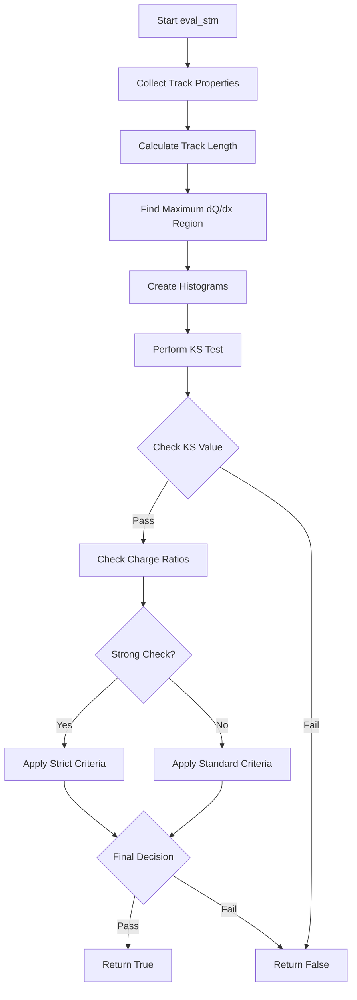

# Understanding the eval_stm() Function

The `eval_stm()` function is part of the Wire-Cell cosmic ray tagging system, specifically designed to evaluate Stopping Muon (STM) candidates. It analyzes track properties to determine if a particle track exhibits characteristics of a stopping muon.

## Function Signature
```cpp
bool eval_stm(WCPPID::PR3DCluster* main_cluster, 
              int kink_num, 
              double peak_range, 
              double offset_length, 
              double com_range, 
              bool flag_strong_check = false)
```

## Parameters

- **main_cluster**: The primary cluster being analyzed
- **kink_num**: Index indicating where there's a significant bend/kink in the track
- **peak_range**: Range to search for peak dQ/dx values (maximum charge deposition)
- **offset_length**: Offset distance for comparative analysis
- **com_range**: Range for center of mass calculations
- **flag_strong_check**: Boolean to enable stricter evaluation criteria

## Core Logic Flow

1. **Track Properties Collection**
   - Gets track points and charge deposition (dQ/dx) data
   - Calculates cumulative track length (L)
   - Determines end point based on kink position

2. **Peak Analysis**
   - Searches for maximum charge deposition region
   - Uses sliding window averaging over multiple points
   - Identifies the position of maximum energy deposition

3. **Statistical Analysis**
   - Creates histograms for measured vs predicted charge patterns
   - Performs Kolmogorov-Smirnov (KS) test comparisons
   - Calculates chi-squared values for fit quality

4. **Decision Making**
   - Compares KS test results against thresholds
   - Evaluates charge ratio consistency
   - Applies more stringent criteria if flag_strong_check is true

## Example Code Showing Core Analysis
```cpp
// Example demonstrating key analysis steps
void analyze_track_section() {
    // Calculate cumulative length and charge
    double left_L = 0, left_Q = 0;
    for (size_t i = kink_num; i < dx.size(); i++) {
        left_L += dx.at(i);
        left_Q += dQ.at(i);
    }
    
    // Find maximum charge region
    double max_sum = 0;
    for (size_t i = 0; i < L.size(); i++) {
        double sum = 0;
        double nsum = 0;
        
        // Sliding window average
        for (int j = -2; j <= 2; j++) {
            if (i+j >= 0 && i+j < dQ_dx.size()) {
                sum += dQ_dx.at(i+j);
                nsum++;
            }
        }
        sum /= nsum;
        
        if (sum > max_sum) {
            max_sum = sum;
            max_bin = i;
        }
    }
    
    // Statistical comparisons
    double ks_test_result = compare_distributions();
    double chi2_test_result = calculate_chi2_fit();
    
    // Decision logic
    bool is_stopping_muon = (ks_test_result < threshold && 
                           chi2_test_result < chi2_limit);
}
```

## Functions Called

1. **KolmogorovTest**
   - From ROOT framework
   - Compares charge distribution shapes
   - Returns statistical similarity measure

2. **get_dQ**, **get_dx**
   - Cluster member functions
   - Retrieve charge deposition and distance data

3. **SetBinContent**
   - ROOT histogram function
   - Used for statistical comparison

4. **g_muon->Eval**
   - Evaluates expected muon behavior
   - Used for comparing with measured values

## Flow Diagram



## Stopping Muon Characteristics

The function looks for these key characteristics of stopping muons:

1. **Bragg Peak**: Increased energy deposition near the end of the track
2. **Track Length**: Consistent with muon stopping range
3. **Charge Pattern**: Matches expected muon energy loss profile
4. **Spatial Consistency**: Track behavior in detector coordinates

## Additional Considerations

- **Strong Check Mode**: When enabled, applies more stringent criteria for classification
- **Edge Cases**: Special handling for tracks near detector boundaries
- **Noise Handling**: Averaging and smoothing techniques for robust analysis

The key functions it calls include:

KolmogorovTest (ROOT framework)
get_dQ and get_dx (cluster member functions)
SetBinContent (ROOT histogram function)
g_muon->Eval (muon behavior evaluation)