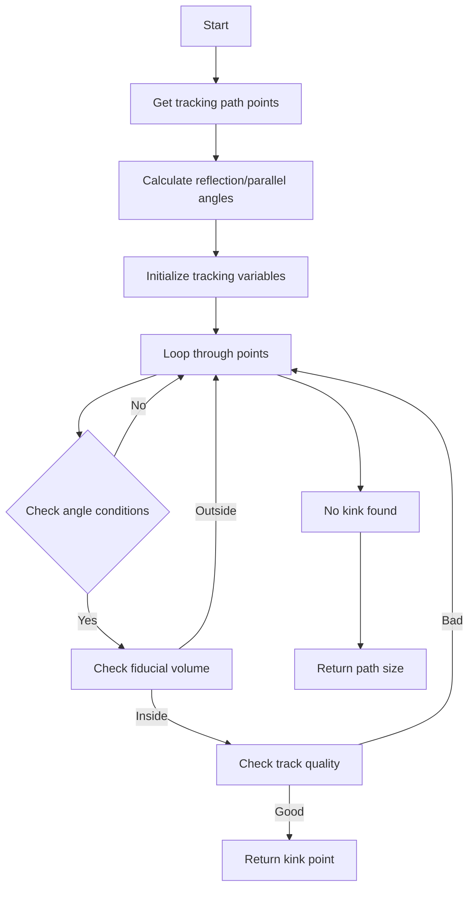

# Find First Kink Function Explanation

## Overview

The `find_first_kink()` function is designed to identify the first significant "kink" or bend in a particle track within a 3D detector space. A kink can indicate important physics events like particle decay or scattering.

## Function Purpose

This function analyzes trajectory points to find where a particle track notably changes direction. It's particularly important for:
- Identifying particle interactions
- Finding decay vertices
- Distinguishing between straight tracks and tracks with significant deflections

## Key Components & Helper Functions Called

The function relies on several helper functions and utilities:

1. **VHoughTrans**
   - Used to get direction vectors at points along the track
   - Returns a TVector3 representing local track direction

2. **inside_fiducial_volume**
   - Checks if a point is within the detector's fiducial volume
   - Takes a Point and offset as parameters

3. **inside_dead_region**
   - Determines if a point is in a dead/inactive detector region
   - Important for validating track segments

4. **check_dead_volume**
   - More comprehensive dead volume check
   - Takes into account direction and step size

## Algorithm Flow



## Core Algorithm Steps

1. **Angle Calculations**
   ```cpp
   // Calculate reflection angles between track segments
   for (size_t i=0;i!=fine_tracking_path.size(); i++){
       TVector3 dir1(path_points[i].x - path_points[i-5].x,
                    path_points[i].y - path_points[i-5].y,
                    path_points[i].z - path_points[i-5].z);
       TVector3 dir2(path_points[i].x - path_points[i+5].x,
                    path_points[i].y - path_points[i+5].y,
                    path_points[i].z - path_points[i+5].z);
       // Calculate angle between directions
       refl_angles[i] = dir1.Angle(dir2);
   }
   ```

2. **Track Quality Metrics**
   ```cpp
   // Example of track quality check
   double sum_fQ = 0;
   double sum_fx = 0;
   for (int k=0;k!=10;k++){
       if (i>=k+1){
           sum_fQ += dQ[i-k-1];
           sum_fx += dx[i-k-1];
       }
   }
   sum_fQ /= (sum_fx/units::cm+1e-9)*50e3;
   ```

## Key Parameters

- **Angle Thresholds**
  - Reflection angle > 20°
  - Average angles > 10°
  - Drift direction angle checks

- **Track Quality**
  - Minimum track lengths (3-5 cm)
  - Charge deposit thresholds
  - Position within fiducial volume

## Example Usage

```cpp
WCPPID::PR3DCluster* cluster = /* ... */;
int kink_index = cluster->find_first_kink();

if (kink_index < cluster->get_fine_tracking_path().size()) {
    // Kink found at this index
    auto kink_point = cluster->get_fine_tracking_path()[kink_index];
    // Process kink...
} else {
    // No significant kink found
}
```

## Important Considerations

1. **Multiple Checks**
   - The function performs multiple passes with different criteria
   - Each pass has increasingly stringent requirements

2. **Validation Steps**
   - Checks for dead regions
   - Validates track quality
   - Confirms point is in fiducial volume

3. **Return Values**
   - Returns index of kink point
   - Returns path size if no kink found

## Failure Cases

The function can fail to find a kink when:
1. Track is too short
2. Angle changes are too gradual
3. Track quality is poor
4. Points are in dead regions

These cases are handled by returning the path size, indicating no kink was found.