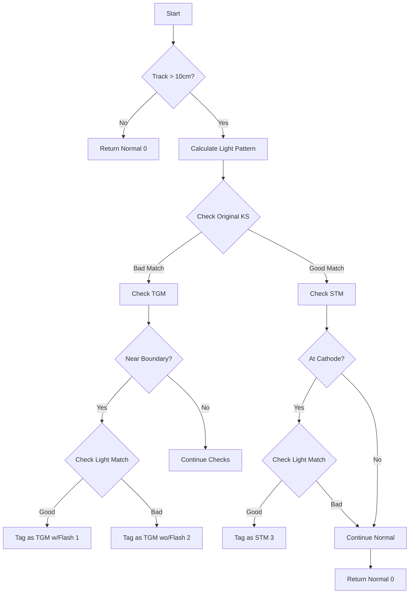

# GLM Tagger Function Explanation

The `glm_tagger()` function is a cosmic ray tagging algorithm that analyzes particle tracks in a liquid argon time projection chamber (TPC) detector. Its main purpose is to identify and classify different types of cosmic ray tracks.

## Overview

The function takes inputs like:
- Flash/light information from photon detectors
- 3D reconstructed particle tracks/clusters
- Detector geometry information
- Timing information

And outputs:
- Tag type (0-3 indicating track classification)
- Main cluster pointer
- Associated flash pointer

## Key Track Classifications

1. **Normal Track (0)**: Tracks that don't meet special criteria
2. **TGM with Flash (1)**: Through-going muon with associated light flash
3. **TGM without Flash (2)**: Through-going muon without associated light flash  
4. **STM (3)**: Stopping muon candidate

## Main Algorithm Steps

1. Initial Checks:
```cpp
// Check if track is long enough to analyze
Point p0(extreme_points[0][0].x, extreme_points[0][0].y, extreme_points[0][0].z);
Point p1(extreme_points[1][0].x, extreme_points[1][0].y, extreme_points[1][0].z);
double distance = sqrt(pow(p0.x-p1.x,2) + pow(p0.y-p1.y,2) + pow(p0.z-p1.z,2));

if(distance <= 10*units::cm) {
    return std::make_tuple(0, main_cluster, main_flash); // Too short to analyze
}
```

2. Flash Matching Analysis:
```cpp
// Analyze predicted vs measured light patterns
std::vector<double> pred_pmt_light = calculate_pred_pe(
    eventTime, run_no, offset_x, pl, 
    main_cluster, additional_clusters, 
    flash, flag_match_data, flag_timestamp
);

// Compare predicted and measured light patterns
double chi2_user = 0;
int ndf_user = 0;
for(int i=0; i<pred_pmt_light.size(); i++) {
    double flash_pe = flash->get_PE(i);
    double pred_pe = pred_pmt_light[i];
    double pe_err = flash->get_PE_err(i);
    
    chi2_user += pow(pred_pe - flash_pe,2)/pow(pe_err,2);
    if(pred_pe!=0 || flash_pe!=0) {
        ndf_user++;
    }
}
```

3. Boundary Checks:
```cpp
// Check if track endpoints are near detector boundaries
bool inside_boundary = inside_fiducial_volume(point, offset_x, tolerance_vec);

// Check specific regions like anode
bool near_anode = false;
if(point.x - offset_x < dist2anode_cut) {
    near_anode = true;
}
```

4. Track Classification:
```cpp
// Example of TGM classification
if(flag_small_SCB_p0==false && flag_small_SCB_p1==false && 
   flag_large_SCB_p0==true && flag_large_SCB_p1==true) {
    
    if(flag_NotNear_anode && chi2_user < bundle_chi2) {
        bool flag_tgm = check_tgm(main_cluster, flash, offset_x, ct_point_cloud);
        if(flag_tgm) {
            flag_M2 = 1; // TGM with flash
            new_flash = flash;
        }
    }
}
```

5. Final Output:
```cpp
return std::make_tuple(flag_M2, main_cluster, new_flash);
```

## Key Tolerances and Parameters

The algorithm uses several key parameters to tune its sensitivity:

```cpp
// Example tolerance parameters
double chi2_stm_tol = 1;        // Chi2 tolerance for STM
double chi2_tgm_tol = 3;        // Chi2 tolerance for TGM
double bundle_ks_stm_tol = 0.04;  // KS test tolerance for STM
double bundle_ks_tgm_tol = 0.03;  // KS test tolerance for TGM
double stm_flash_tol = 1.2*units::m;  // Flash position tolerance for STM
double tgm_flash_tol = 1.6*units::m;  // Flash position tolerance for TGM
```

## Mermaid Flow Diagram



## Important Notes

1. The function uses multiple criteria to make classifications:
   - Track geometry
   - Light pattern matching
   - Detector boundary proximity
   - Track behavior (stopping vs through-going)

2. The tolerances and parameters can be tuned based on detector conditions

3. The algorithm prioritizes classifications in this order:
   - TGM with flash
   - TGM without flash 
   - STM
   - Normal tracks

4. Flash matching quality is assessed using both:
   - Chi-square comparison
   - Kolmogorov-Smirnov test

5. Multiple boundary checks are performed to ensure track classifications are robust

## Called Functions Reference

The glm_tagger calls several helper functions to perform its analysis. Here are the key functions and their purposes:

1. **Track Analysis Functions**
   - `get_extreme_wcps()`: Gets endpoints of the track cluster
   - `inside_fiducial_volume()`: Checks if a point is within detector active volume [detailed documentation](./inside_fiducial_volume.md)
   - `inside_x_region()`: Checks if track is within specified x coordinates
   - `check_tgm()`: Performs Through-Going Muon analysis [detailed documentation](./check_tgm.md)
   - `check_stm()`: Performs Stopping Muon analysis [detailed documentation](./check_stm.md)
   - `check_other_tracks()`: Analyzes additional tracks in the event [detailed documentation](./check_other_tracks.md)
   - `check_other_clusters()`: Examines nearby particle clusters [detailed documentation](./check_other_clusters.md)

2. **Light Pattern Analysis**
   - `calculate_pred_pe()`: Calculates predicted photoelectrons for given track [detailed documentation](./calculate_pred_pe.md)
   - `get_PE()`: Gets actual photoelectron measurements
   - `get_PE_err()`: Gets measurement uncertainties
   - `KolmogorovTest()`: Performs KS test between predicted and measured light patterns [detailed documentation](./KolmogorovTest.md)

3. **Geometry Functions**
   - `inside1_outside0_SCB()`: Checks space charge boundary conditions [detailed documentation](./inside1_outside0_SCB.md)
   - `M2_offset_YX_x()`: Calculates offsets in YX projection [detailed documentation](./M2_offset_YX_x.md)
   - `M2_check_stm()`: Performs STM checks with updated space charge boundary [detailed documentation](./M2_check_stm.md)
   - `M2_check_tgm()`: Performs TGM checks with updated space charge boundary [detailed documentation](./M2_check_tgm.md)

4. **Signal Processing Functions**
   - `check_signal_processing()`: Analyzes signal characteristics [detailed documentation](./check_signal_processing.md)
   - `check_dead_volume()`: Checks for detector dead regions [detailed documentation](./check_dead_region.md)
   - `inside_dead_region()`: Tests if point is in known dead region [detailed documentation](./inside_dead_region.md)

5. **Event/Flash Related Functions**
   - `get_time()`: Gets timing information for flash
   - `get_flash_id()`: Gets unique identifier for flash
   - `get_type()`: Gets flash classification type

6. **Data Structure Functions**
   - `get_point_cloud()`: Retrieves 3D points making up track
   - `get_cluster_id()`: Gets unique identifier for cluster
   - `get_num_mcells()`: Gets number of merged cells in cluster

Example usage pattern:

```cpp
// Example showing typical function call sequence
bool GlmAnalysis(PR3DCluster* cluster, Opflash* flash) {
    // Get track endpoints
    auto extreme_points = cluster->get_extreme_wcps();
    
    // Check geometry
    if (!inside_fiducial_volume(point, offset)) {
        return false;
    }
    
    // Calculate predicted light
    auto pred_light = calculate_pred_pe(...);
    
    // Compare with measurement
    double ks_test = h1_meas->KolmogorovTest(h1_pred,"M");
    
    // Check track characteristics
    bool is_tgm = check_tgm(cluster, flash, offset, cloud);
    bool is_stm = check_stm(cluster, offset, time);
    
    // Make final decision based on results
    return DetermineTrackType(is_tgm, is_stm, ks_test);
}
```

Each of these functions plays a specific role in helping determine the correct classification of tracks in the detector. The interplay between geometry checks, light pattern analysis, and track characteristics allows the tagger to make robust decisions about particle track classifications.