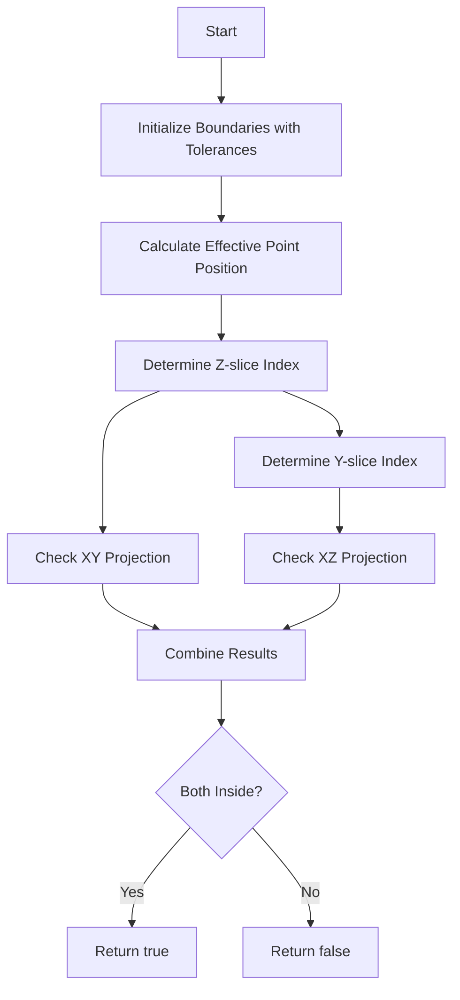

# Understanding the inside1_outside0_SCB() Function

## Overview

The `inside1_outside0_SCB()` function is used to determine whether a given 3D point lies inside or outside a defined space charge boundary (SCB) region in a particle detector. The function returns:
- `true` (1) if the point is inside the boundary
- `false` (0) if the point is outside the boundary

## Key Components

1. **Input Parameters**:
   - `Point& p`: 3D point coordinates (x,y,z)
   - `offset_x`: X-axis offset for drift correction
   - `tolerence_x`, `tolerence_y`, `tolerence_z`: Tolerance values in cm for boundary checks

2. **Boundary Definition**:
   - Uses separate XY and XZ projections to define the boundary
   - Boundaries are defined by arrays of points forming polygons
   - Different boundary definitions for different Z and Y slices

## Function Logic Flow

1. **Initialize Boundaries**:
```cpp
std::vector<double> user_SCB_YX_x_array[11], user_SCB_YX_y_array[11];
std::vector<double> user_SCB_ZX_x_array[11], user_SCB_ZX_z_array[11];
double space_xx = tolerence_x * units::cm;
double space_yy = tolerence_y * units::cm;
double space_zz = tolerence_z * units::cm;
```

2. **Apply Tolerances to Boundary Points**:
```cpp
// Example for one boundary point set
user_SCB_YX_x_array[idx].push_back(m_anode + space_xx); 
user_SCB_YX_y_array[idx].push_back(m_bottom + space_yy);
```

3. **Check Point Location**:
```cpp
double eff_x = p.x-offset_x;
double eff_y = p.y;
double eff_z = p.z;

bool flag_YX = false;  // XY projection check
bool flag_ZX = false;  // XZ projection check
```

4. **Determine Y-Z Index and Check Both Projections**:
```cpp
// Z-slice index determination
if(eff_z/units::cm < 0) {
    index_z = 1;
}
else if(eff_z/units::cm <= 1037) {
    index_z = (int)(eff_z/units::cm/100)+1;
    if(index_z > 10) index_z = 10;
}
else {
    index_z = 10;
}

// Check if point is inside XY projection polygon
flag_YX = pnpoly(user_SCB_YX_x_array[index_z], 
                 user_SCB_YX_y_array[index_z], 
                 eff_x, eff_y);

// Similar check for XZ projection
flag_ZX = pnpoly(user_SCB_ZX_x_array[index_y], 
                 user_SCB_ZX_z_array[index_y], 
                 eff_x, eff_z);
```

5. **Final Result**:
```cpp
// Point must be inside both projections to be considered inside the boundary
return (flag_YX && flag_ZX);
```

## Example Usage

```cpp
// Create test point
WCP::Point test_point(100*units::cm, 0*units::cm, 500*units::cm);

// Set tolerances
double tol_x = 2.0;  // cm
double tol_y = 2.0;  // cm
double tol_z = 2.0;  // cm

// Check if point is inside boundary
bool is_inside = inside1_outside0_SCB(test_point, 
                                    offset_x,
                                    tol_x, 
                                    tol_y, 
                                    tol_z);
```

## Flow Diagram



## Key Considerations

1. **Boundary Segmentation**:
   - The detector volume is divided into slices
   - Different boundary definitions for different regions
   - Handles edge cases at boundaries of slices

2. **Tolerance Handling**:
   - Tolerances expand/contract boundary definition
   - Applied uniformly to all boundary points
   - Helps handle edge cases and measurement uncertainties

3. **Projection Method**:
   - Uses two 2D projections (XY and XZ)
   - Point must be inside both projections
   - Reduces 3D problem to two 2D checks

4. **Space Charge Effects**:
   - Accounts for space charge effects through boundary definitions
   - Different boundaries for different detector regions
   - Critical for accurate particle tracking

## Common Applications

1. **Particle Tracking**:
   - Determine if particles are within detector active volume
   - Track containment checks
   - Fiducial volume definition

2. **Event Selection**:
   - Filter events based on interaction location
   - Define analysis regions
   - Quality control checks

3. **Detector Calibration**:
   - Define calibration volumes
   - Account for edge effects
   - Space charge corrections

<svg viewBox="0 0 800 600" xmlns="http://www.w3.org/2000/svg">
    <!-- XY Projection -->
    <g transform="translate(50,50)">
        <rect x="0" y="0" width="300" height="200" fill="none" stroke="black" stroke-width="2"/>
        <path d="M 0,0 L 250,0 L 300,50 L 300,150 L 250,200 L 0,200 Z" 
              fill="rgba(135,206,235,0.3)" stroke="blue" stroke-width="2"/>
        <text x="150" y="230" text-anchor="middle">XY Projection</text>
        <circle cx="150" cy="100" r="5" fill="red"/>
        <text x="170" y="100">Test Point</text>
    </g>
    <!-- XZ Projection -->
    <g transform="translate(450,50)">
        <rect x="0" y="0" width="300" height="200" fill="none" stroke="black" stroke-width="2"/>
        <path d="M 0,0 L 250,0 L 300,50 L 300,150 L 250,200 L 0,200 Z"
              fill="rgba(135,206,235,0.3)" stroke="blue" stroke-width="2"/>
        <text x="150" y="230" text-anchor="middle">XZ Projection</text>
        <circle cx="150" cy="100" r="5" fill="red"/>
    </g>
    <!-- Tolerance Visualization -->
    <g transform="translate(50,350)">
        <rect x="0" y="0" width="300" height="200" fill="none" stroke="black" stroke-width="2"/>
        <path d="M 20,20 L 270,20 L 280,50 L 280,150 L 270,180 L 20,180 Z"
              fill="rgba(135,206,235,0.3)" stroke="blue" stroke-width="2"/>
        <path d="M 0,0 L 250,0 L 300,50 L 300,150 L 250,200 L 0,200 Z"
              fill="none" stroke="blue" stroke-width="1" stroke-dasharray="5,5"/>
        <text x="150" y="230" text-anchor="middle">Boundary with Tolerance</text>
    </g>
    <!-- Legend -->
    <g transform="translate(450,350)">
        <rect x="0" y="0" width="300" height="200" fill="none" stroke="black" stroke-width="2"/>
        <text x="20" y="30">Legend:</text>
        <rect x="20" y="50" width="20" height="20" fill="rgba(135,206,235,0.3)" stroke="blue"/>
        <text x="50" y="65">Active Region</text>
        <circle cx="30" cy="100" r="5" fill="red"/>
        <text x="50" y="105">Test Point</text>
        <line x1="20" y1="130" x2="40" y2="130" stroke="blue" stroke-width="1" stroke-dasharray="5,5"/>
        <text x="50" y="135">Original Boundary</text>
        <line x1="20" y1="160" x2="40" y2="160" stroke="blue" stroke-width="2"/>
        <text x="50" y="165">Tolerance-adjusted Boundary</text>
    </g>
</svg>