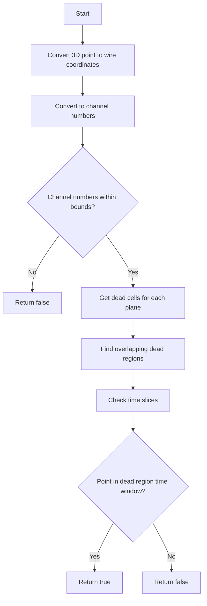

# Understanding the inside_dead_region() Function

The `inside_dead_region()` function in WireCell determines whether a given 3D point lies within a dead region of the detector. A dead region is an area where detector channels are not functioning properly, leading to potential loss of signal.

## Function Overview

```cpp
bool WCPPID::ToyFiducial::inside_dead_region(WCP::Point& p) {
    // Convert the position into U, V, W, and T number ...
    int time_slice = p.x * slope_t + offset_t;
    double pos_u = cos(angle_u) * p.z - sin(angle_u) * p.y;
    double pos_v = cos(angle_v) * p.z - sin(angle_v) * p.y;
    double pos_w = cos(angle_w) * p.z - sin(angle_w) * p.y;
    int ch_u = pos_u * slope_u + offset_u;
    int ch_v = pos_v * slope_v + offset_v + 2400;
    int ch_w = pos_w * slope_w + offset_w + 4800;

    // Boundary checks
    if (time_slice < 0 || time_slice >= 2398) return false;
    if (ch_u < 0 || ch_u >= 2400)  return false;
    if (ch_v < 2400 || ch_v >= 4800)  return false;
    if (ch_w < 4800 || ch_w >= 8256)  return false;

    // Get dead cells for each wire plane
    std::set<SlimMergeGeomCell*> dead_u_mcells;
    std::set<SlimMergeGeomCell*> dead_v_mcells;
    std::set<SlimMergeGeomCell*> dead_w_mcells;

    if (ch_mcell_set_map.find(ch_u) != ch_mcell_set_map.end())
        dead_u_mcells = ch_mcell_set_map[ch_u];
    if (ch_mcell_set_map.find(ch_v) != ch_mcell_set_map.end())
        dead_v_mcells = ch_mcell_set_map[ch_v];
    if (ch_mcell_set_map.find(ch_w) != ch_mcell_set_map.end())
        dead_w_mcells = ch_mcell_set_map[ch_w];

    // Find overlapping dead regions
    std::set<SlimMergeGeomCell*> results;
    for (auto it = dead_u_mcells.begin(); it != dead_u_mcells.end(); it++) {
        if (dead_v_mcells.find(*it) != dead_v_mcells.end() || 
            dead_w_mcells.find(*it) != dead_w_mcells.end()) {
            results.insert(*it);
        }
    }
    
    for (auto it = dead_v_mcells.begin(); it != dead_v_mcells.end(); it++) {
        if (dead_w_mcells.find(*it) != dead_w_mcells.end()) {
            results.insert(*it);
        }
    }

    // Check time slice for remaining cells
    for (auto it = results.begin(); it != results.end(); it++) {
        if (mcell_time_map[*it].first <= time_slice &&
            time_slice <= mcell_time_map[*it].second)
            return true;
    }
    
    return false;
}
```

## Function Flow



## Key Steps

1. **Coordinate Conversion**
   - The input 3D point (x,y,z) is converted to:
     - Time slice number from x coordinate
     - U, V, W wire coordinates using angular projections
     - Channel numbers for each wire plane

2. **Boundary Checks**
   - Verifies channel numbers are within valid ranges:
     - Time slice: 0-2397
     - U channels: 0-2399
     - V channels: 2400-4799
     - W channels: 4800-8255

3. **Dead Cell Lookup**
   - Retrieves sets of dead cells for each wire plane
   - Uses a map (ch_mcell_set_map) that associates channel numbers with dead cells

4. **Overlap Detection**
   - Finds dead cells that appear in multiple wire planes
   - Checks for matches between:
     - U and V planes
     - U and W planes
     - V and W planes

5. **Time Check**
   - For overlapping dead regions, checks if the point's time slice falls within the dead cell's time window
   - Returns true if at least one match is found

## Example Usage

```cpp
// Create a point to test
WCP::Point test_point(10.5 * units::cm,  // x coordinate
                     25.0 * units::cm,   // y coordinate
                     100.0 * units::cm); // z coordinate

// Check if point is in dead region
bool is_dead = inside_dead_region(test_point);

if (is_dead) {
    std::cout << "Point is in dead region" << std::endl;
} else {
    std::cout << "Point is in active region" << std::endl;
}
```

## Common Dead Region Patterns

Dead regions typically occur in patterns:

1. **Single Wire Dead Regions**
   - Only one wire plane affected
   - Usually least severe case
   - May still allow some signal reconstruction

2. **Double Wire Dead Regions**
   - Two wire planes affected
   - More severe signal loss
   - Limited reconstruction possible

3. **Triple Wire Dead Regions**
   - All three wire planes affected
   - Complete signal loss
   - No reconstruction possible

The function prioritizes finding these overlapping regions as they represent the most problematic areas for signal reconstruction.