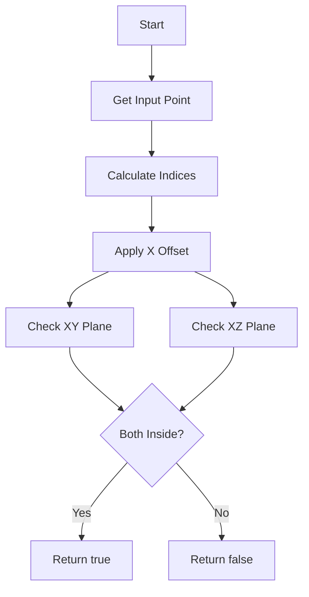

# Understanding the inside_fiducial_volume() Function

## Overview
The `inside_fiducial_volume()` function is used to determine whether a given point in 3D space lies within a predefined fiducial volume of a particle detector. The fiducial volume is defined by boundary surfaces in both the XY and XZ planes.

## Function Signature
```cpp
bool inside_fiducial_volume(WCP::Point& p, double offset_x, std::vector<double>* tolerance_vec=NULL)
```

## Key Components

### 1. Input Parameters
- `p`: A 3D point with (x,y,z) coordinates to check
- `offset_x`: An x-axis offset to apply to the point
- `tolerance_vec`: Optional vector of tolerances for boundary conditions

### 2. Boundary Arrays
The function uses two sets of boundary points that define the fiducial volume:
- `boundary_xy_x_array` and `boundary_xy_y_array`: Define boundaries in XY plane
- `boundary_xz_x_array` and `boundary_xz_z_array`: Define boundaries in XZ plane

These arrays are organized into segments to handle different regions of the detector.

### 3. Index Calculation
The function first determines which segment of the boundary to use based on the point's position:

```cpp
int index_y = floor((p.y/units::cm+116)/24);  // For XY plane
int index_z = floor(p.z/units::m);            // For XZ plane

// Bounds checking
if(index_y<0){index_y=0;} else if(index_y>9){index_y=9;}
if(index_z<0){index_z=0;} else if(index_z>9){index_z=9;}
```

### 4. Point-in-Polygon Check
The function uses the point-in-polygon (PnPoly) algorithm to check if the point lies within the boundaries:

```cpp
int c1 = pnpoly(boundary_xy_x, boundary_xy_y, p.x-offset_x, p.y);
int c2 = pnpoly(boundary_xz_x, boundary_xz_z, p.x-offset_x, p.z);
```

## Flow Diagram



## Detailed Algorithm Steps

1. **Input Processing**
   - Take input point p(x,y,z)
   - Apply x-offset to x coordinate
   
2. **Index Calculation**
   - Calculate appropriate boundary segment indices based on y and z coordinates
   - Apply bounds checking to ensure valid indices

3. **Boundary Checks**
   - Perform point-in-polygon test for XY projection
   - Perform point-in-polygon test for XZ projection
   - Both tests must pass for point to be inside volume

4. **Tolerance Handling**
   - If tolerance vector provided, adjust boundary points by tolerance values
   - Allows for "fuzzy" boundary checking

## Example Usage

```cpp
WCP::Point test_point(100*units::cm, 0*units::cm, 500*units::cm);
double offset = 10*units::cm;

bool is_inside = inside_fiducial_volume(test_point, offset);

if (is_inside) {
    std::cout << "Point is inside fiducial volume" << std::endl;
} else {
    std::cout << "Point is outside fiducial volume" << std::endl;
}
```

## Key Implementation Details

1. The function uses a segmented approach to handle different regions of the detector, improving accuracy of boundary definitions.

2. The point-in-polygon algorithm uses ray casting to determine if a point lies within a closed polygon:
```cpp
int pnpoly(std::vector<double>& vertx, std::vector<double>& verty, double testx, double testy) {
    int i, j, c = 0;
    for (i = 0, j = vertx.size()-1; i < vertx.size(); j = i++) {
        if ( ((verty[i]>testy) != (verty[j]>testy)) &&
             (testx < (vertx[j]-vertx[i]) * (testy-verty[i]) / (verty[j]-verty[i]) + vertx[i]) )
            c = !c;
    }
    return c;
}
```

3. The tolerance vector allows for flexible boundary definitions:
   - `tolerance_vec[0]`: Anode tolerance
   - `tolerance_vec[1]`: Cathode tolerance 
   - `tolerance_vec[2]`: Bottom tolerance
   - `tolerance_vec[3]`: Top tolerance
   - `tolerance_vec[4]`: Z-direction tolerance

## Performance Considerations

- The function uses lookup tables and pre-calculated boundaries to avoid expensive computations
- Boundary checks are performed only in 2D projections rather than full 3D space
- Index calculations use integer arithmetic where possible