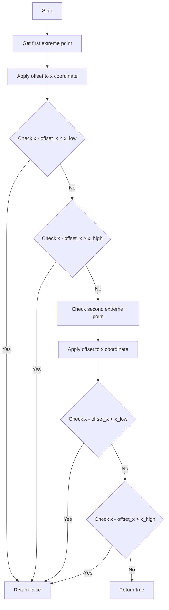

# Inside X Region Function Analysis

## Overview
The `inside_x_region()` function in the cosmic tagger codebase determines whether a set of 3D points (called extreme points) falls within a specified x-coordinate range, accounting for a drift offset. This is used as part of determining whether particle tracks are contained within certain detector boundaries.

## Function Signature
```cpp
bool inside_x_region(std::vector<std::vector<WCP::WCPointCloud<double>::WCPoint>> extreme_points, 
                    double offset_x, 
                    double x_low, 
                    double x_high)
```

### Parameters
- `extreme_points`: 2D vector containing sets of 3D points representing track endpoints
- `offset_x`: Drift offset to apply to x-coordinates 
- `x_low`: Lower x boundary
- `x_high`: Upper x boundary

## Logic Flow



## Function Operation

1. The function examines the first point (extreme_points[0][0]) and second point (extreme_points[1][0]) of the track

2. For each point, it:
   - Subtracts the drift offset (offset_x) from the x coordinate
   - Checks if the adjusted x position is below x_low or above x_high

3. Returns:
   - `false` if either point falls outside the [x_low, x_high] range
   - `true` if both points are within range

## Example Code Usage

```cpp
// Example track points
std::vector<std::vector<WCP::WCPointCloud<double>::WCPoint>> track_points;
// First endpoint
track_points[0][0].x = 100 * units::cm;  
// Second endpoint 
track_points[1][0].x = 150 * units::cm;

double drift_offset = 10 * units::cm;
double low_bound = 0 * units::cm;
double high_bound = 256 * units::cm;

// Check if track is within bounds
bool is_contained = inside_x_region(track_points, 
                                  drift_offset,
                                  low_bound, 
                                  high_bound);
```

## Function Dependencies

The function calls/uses:
- No external function calls
- Accesses WCPointCloud's x coordinate member
- Units handling (units::cm)

## Key Points

1. The function provides a simple boundary check in the x dimension

2. It accounts for drift effects by applying an x offset before comparison 

3. Used as part of larger cosmic ray tagging logic to determine track containment

4. Only examines endpoints of tracks (not intermediate points)

5. Returns false early if any boundary violation is found (short-circuit evaluation)

## Usage Context

This function is typically used in:

1. Cosmic ray muon identification
2. Track containment verification
3. Detector fiducial volume checks
4. Flash matching algorithms

The function helps determine if particle tracks could potentially enter/exit the detector volume, which is crucial for distinguishing cosmic rays from neutrino interactions.