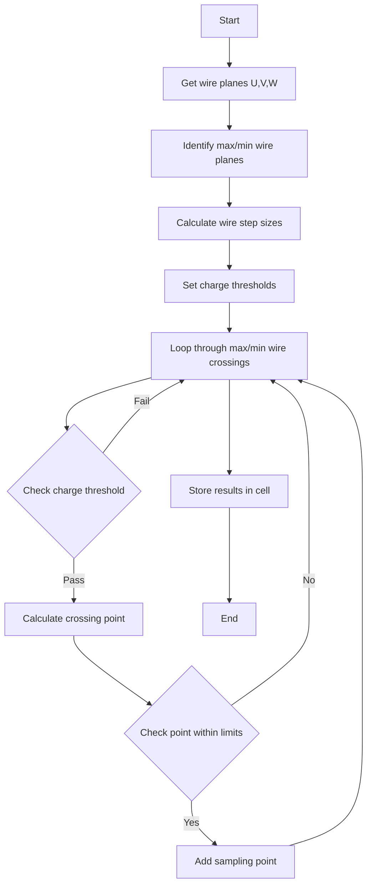
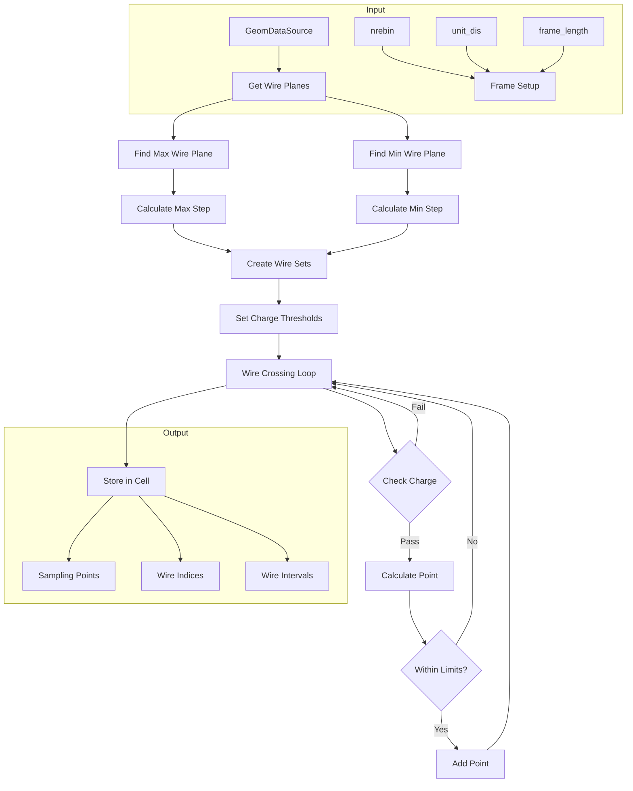

# calc_sampling_points Documentation

## Overview

The `calc_sampling_points()` functions are responsible for calculating sampling points within wire cells in a wire chamber detector. There are two overloads:

1. For clusters of cells:
```cpp
void calc_sampling_points(WCP::GeomDataSource& gds, 
                         WCPPID::PR3DCluster* cluster, 
                         int nrebin, 
                         int frame_length, 
                         double unit_dis,
                         bool disable_mix_dead_cell)
```

2. For individual cells:
```cpp 
void calc_sampling_points(WCP::GeomDataSource& gds,
                         WCP::SlimMergeGeomCell* mcell, 
                         int nrebin,
                         int frame_length, 
                         double unit_dis,
                         bool disable_mix_dead_cell)
```

## Input Parameters

- `gds`: GeomDataSource - Contains detector geometry information
- `cluster`: PR3DCluster* - A cluster of merged cells
- `mcell`: SlimMergeGeomCell* - A single merged cell
- `nrebin`: int - Number of time bins to rebin
- `frame_length`: int - Total frame length in time ticks
- `unit_dis`: double - Unit distance for spacing
- `disable_mix_dead_cell`: bool - Flag to disable mixed dead cells

## Core Logic Flow



## Detailed Algorithm Steps

1. Wire Plane Selection
```cpp
// Get wires from each plane 
GeomWireSelection wires_u = mcell->get_uwires();
GeomWireSelection wires_v = mcell->get_vwires(); 
GeomWireSelection wires_w = mcell->get_wwires();

// Find plane with most wires (max) and least wires (min)
GeomWireSelection max_wires = wires_u;
GeomWireSelection min_wires = wires_v;
```

2. Calculate Step Sizes
```cpp
// Step size based on wire count
int max_step = std::max(3.0, max_wires.size()/12.);
int min_step = std::max(3.0, min_wires.size()/12.);

// Create wire sets with step sizes
GeomWireSetp max_wires_set;
for (size_t i=0; i<max_wires.size(); i+=max_step) {
    max_wires_set.insert(max_wires.at(i));
}
```

3. Point Calculation and Validation
```cpp
// For each wire crossing
for (auto it = max_wires1.begin(); it!=max_wires1.end(); it++) {
    for (auto it1 = min_wires1.begin(); it1!=min_wires1.end(); it1++) {
        // Calculate crossing point
        Vector point;
        gds.crossing_point(*(*it),*(*it1), point);
        
        // Check if point is within limits
        float dis = gds.wire_dist(point, other_wire_plane_type);
        if (dis >= dis_limit[0] && dis <= dis_limit[1]) {
            // Add valid point
            sampling_points.push_back(point);
        }
    }
}
```

## Example Usage

Here's an example of how to use the function:

```cpp
// Create geometry data source
WCP::GeomDataSource gds;

// Create a merged cell
WCP::SlimMergeGeomCell* mcell = new WCP::SlimMergeGeomCell();

// Calculate sampling points
calc_sampling_points(gds, mcell, 
                    2,      // nrebin
                    6000,   // frame_length 
                    0.5,    // unit_dis
                    false); // disable_mix_dead_cell

// Access results
PointVector points = mcell->GetSamplingPoints();
```

## Key Features

1. **Wire Plane Handling**:
   - Identifies planes with most/least wires
   - Handles U, V, W wire planes

2. **Charge Thresholds**:
   - Default threshold of 4000
   - Adjusts for bad planes

3. **Sampling Point Requirements**:
   - Must be within distance limits
   - Must meet charge thresholds
   - Must have valid wire crossings

## Output

The function populates the merged cell (mcell) with:

1. Sampling points (3D coordinates)
2. Wire indices for each point
3. Wire interval information

## Performance Considerations

- Optimizes processing by using step sizes for large wire counts
- Has special handling for small cells (< 2500 wire crossings)
- Includes charge threshold checks to filter invalid points

## Common Use Cases

1. **Track Reconstruction**:
   - Finding points along particle tracks
   - Determining crossing locations

2. **Detector Calibration**:
   - Mapping detector response
   - Characterizing dead regions

3. **Event Analysis**:
   - Building 3D representations
   - Pattern recognition

# A detailed flow diagram showing the logic flow from inputs through the various processing steps to outputs

