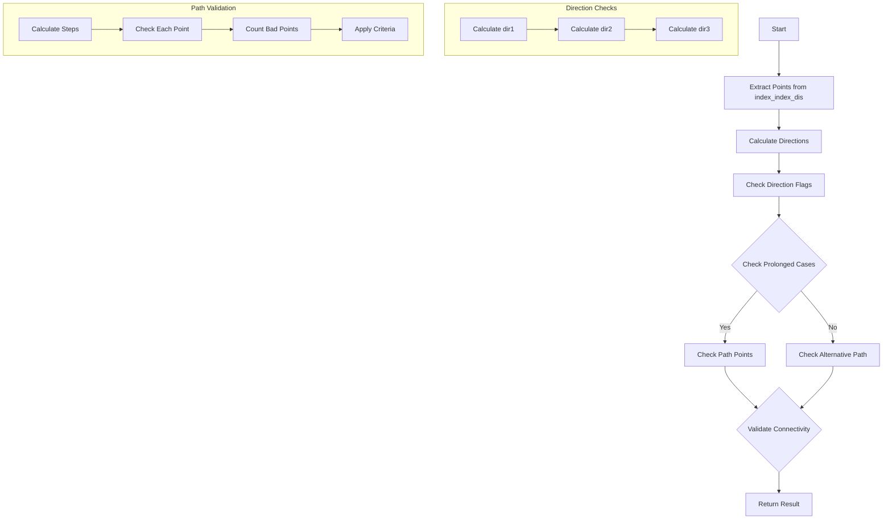

# check_connectivity() Function Documentation

## Overview
The `check_connectivity()` function is part of the WCPPID namespace and is used to validate whether two point clusters should be connected based on various geometric and physical criteria. It's primarily used in particle tracking to prevent over-clustering of particle tracks.

## Function Signature
```cpp
bool check_connectivity(
    std::tuple<int, int, double>& index_index_dis,
    WCP::WCPointCloud<double>& cloud, 
    WCP::ToyCTPointCloud& ct_point_cloud,
    WCP::ToyPointCloud* pc1,
    WCP::ToyPointCloud* pc2,
    double step_size = 0.6*units::cm,
    bool flag_strong_check = false
)
```

## Key Dependencies
The function calls the following methods:
1. `VHoughTrans()` - For calculating directional vectors
2. `check_direction()` - For validating directional alignments [more details](./check_direction.md)
3. `test_good_point()` - From ToyCTPointCloud class to validate points
4. `get_closest_wcpoint()` - For finding nearest points in point clouds

## Logic Flow



## Detailed Logic Breakdown

### 1. Initial Point Extraction and Direction Calculation
```cpp
// Extract points from tuple
WCPointCloud<double>::WCPoint wp1 = cloud.pts.at(std::get<0>(index_index_dis));
WCPointCloud<double>::WCPoint wp2 = cloud.pts.at(std::get<1>(index_index_dis));
Point p1(wp1.x, wp1.y, wp1.z);
Point p2(wp2.x, wp2.y, wp2.z);

// Calculate directions using VHoughTrans
TVector3 dir1 = VHoughTrans(p1, 15*units::cm, pc1);
dir1 *= -1;
TVector3 dir2 = VHoughTrans(p2, 15*units::cm, pc2);
dir2 *= -1;
TVector3 dir3(p1.x - p2.x, p1.y - p2.y, p1.z - p2.z);
```

### 2. Direction Flags
The function checks various directional alignments:
- Prolonged U direction
- Prolonged V direction
- Prolonged W direction
- Parallel case

```cpp
std::vector<bool> flag_1 = check_direction(dir1);
std::vector<bool> flag_2 = check_direction(dir2);
std::vector<bool> flag_3 = check_direction(dir3);

bool flag_prolonged_u = flag_3.at(0) && (flag_1.at(0) || flag_2.at(0));
bool flag_prolonged_v = flag_3.at(1) && (flag_1.at(1) || flag_2.at(1));
bool flag_prolonged_w = flag_3.at(2) && (flag_1.at(2) || flag_2.at(2));
bool flag_parallel = flag_3.at(3) && (flag_1.at(3) && flag_2.at(3));
```

### 3. Path Validation
The function checks points along the path between p1 and p2:

```cpp
double dis = sqrt(pow(p1.x-p2.x,2) + pow(p1.y-p2.y,2) + pow(p1.z-p2.z,2));
int num_steps = std::round(dis/step_size);

for (int i=0; i!=num_steps; i++) {
    Point test_p;
    test_p.x = p1.x + (p2.x-p1.x)/(num_steps+1.)*(i+1);
    test_p.y = p1.y + (p2.y-p1.y)/(num_steps+1.)*(i+1);
    test_p.z = p1.z + (p2.z-p1.z)/(num_steps+1.)*(i+1);
    
    std::vector<int> scores = ct_point_cloud.test_good_point(test_p, radius_cut);
    // Count bad points based on scores
}
```

### 4. Connectivity Criteria
The function applies different criteria based on the number of bad points and the configuration:

```cpp
// Example of prolonged case criteria
if (num_bad[0] <= 2 && num_bad[1] <= 2 && num_bad[2] <= 2 &&
    (num_bad[0] + num_bad[1] + num_bad[2] <= 3) &&
    num_bad[0] < 0.1 * num_steps && 
    num_bad[1] < 0.1 * num_steps && 
    num_bad[2] < 0.1 * num_steps &&
    (num_bad[0] + num_bad[1] + num_bad[2]) < 0.15 * num_steps) {
    return true;
}

// Alternative criteria
if (num_bad[3] <= 2 && num_bad[3] < 0.1*num_steps) {
    return true;
}
```

## Key Parameters and Their Meanings

- `index_index_dis`: Tuple containing indices of points to check and their distance
- `cloud`: Point cloud containing all points
- `ct_point_cloud`: Point cloud used for validation
- `pc1`, `pc2`: Point clouds representing the two clusters being checked
- `step_size`: Distance between points to check along the path
- `flag_strong_check`: Boolean to enable stricter validation criteria

## Return Value
Returns `true` if the points should be connected, `false` otherwise based on:
- Direction alignment
- Path quality
- Number of bad points encountered
- Strong/weak check criteria