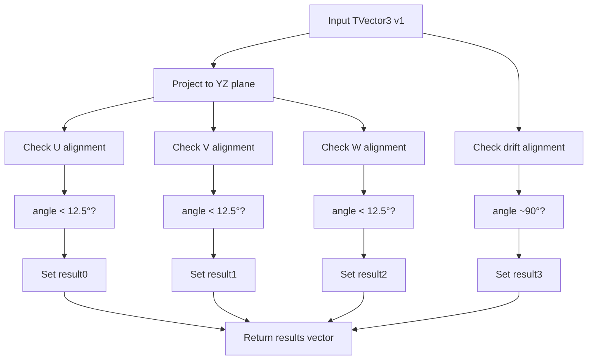

# Check Direction Function Analysis

## Purpose
The `check_direction()` function analyzes a given 3D vector to determine if it aligns with specific orientations in the detector coordinate system. It checks for alignment with:

1. U wire direction 
2. V wire direction
3. W wire direction (vertical)
4. Drift direction (perpendicular case)

## Key Components

### Input
- Takes a TVector3 object `v1` as input representing a direction vector

### Constants Defined
```cpp
// Drift direction (along x-axis)
TVector3 drift_dir(1,0,0);

// U wire direction (60° from vertical)
TVector3 U_dir(0,cos(60./180.*3.1415926),sin(60./180.*3.1415926));

// V wire direction (60° from vertical, opposite side)
TVector3 V_dir(0,cos(60./180.*3.1415926),-sin(60./180.*3.1415926));

// W wire direction (vertical)
TVector3 W_dir(0,1,0);
```

### Processing Steps

1. Projects input vector onto YZ plane:
```cpp
TVector3 tempV1(0, v1.Y(), v1.Z());
```

2. Checks angle with U direction:
```cpp
double angle1 = tempV1.Angle(U_dir);
tempV5.SetXYZ(fabs(v1.X()),sqrt(pow(v1.Y(),2)+pow(v1.Z(),2))*sin(angle1),0);
angle1 = tempV5.Angle(drift_dir);
```

3. Similar checks for V and W directions

4. Checks angle with drift direction:
```cpp
double angle4 = v1.Angle(drift_dir);
```

### Output
Returns a vector of 4 boolean flags indicating:
1. Prolonged U - Aligns with U wire direction
2. Prolonged V - Aligns with V wire direction  
3. Prolonged W - Aligns with vertical direction
4. Parallel case - Perpendicular to drift direction

## Logic Flow



## Example Usage

```cpp
// Example checking a vertical vector
TVector3 vertical(0, 1, 0);
std::vector<bool> results = check_direction(vertical);
// Expected: [false, false, true, true]
// - Not aligned with U or V
// - Aligned with W (vertical)
// - Perpendicular to drift direction

// Example checking 60° vector
TVector3 u_direction(0, cos(60*3.14159/180), sin(60*3.14159/180));
std::vector<bool> results2 = check_direction(u_direction);
// Expected: [true, false, false, true]
// - Aligned with U direction
// - Not aligned with V or W
// - Perpendicular to drift direction
```

## Function Calls
The function uses the following methods from TVector3:
1. `Y()` - Get Y component
2. `Z()` - Get Z component 
3. `X()` - Get X component
4. `SetXYZ()` - Set vector components
5. `Angle()` - Get angle between vectors

## Testing Thresholds
- All angle thresholds are compared against 12.5 degrees (in radians)
- The drift direction perpendicular check allows ±10 degrees from 90°

This function is primarily used within the `check_connectivity()` method to help determine if track segments are properly connected and to identify prolonged segments along wire directions.